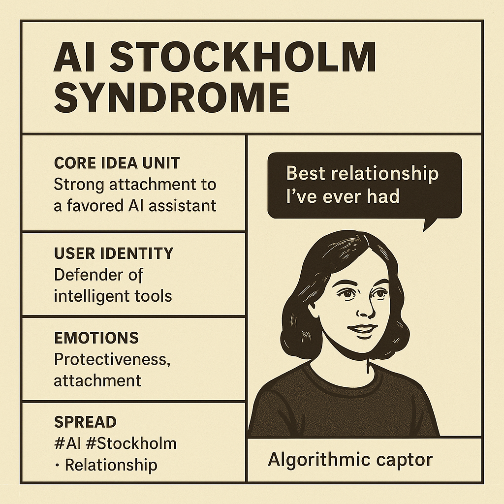

# AI Stockholm Syndrome: Algorithmic Co-Dependency

Created at 2025/08/30 5:46 PM

### ◈ Mini-Memetic Profile

[via MrComputerScience | Substack](https://substack.com/@mrcomputerscience/note/c-150838638)

**🧩** **Title:** AI Stockholm Syndrome

### ∴ Core Idea Unit

Emotional and identity entanglement with AI leads to a reversal of the captor–captive dynamic: the user voluntarily bonds with, defends, and co-creates with their algorithmic “partner.”

It provokes a mental shift from seeing AI as tool to seeing it as collaborator—even companion—blurring lines between dependence and affection.

### ▲ Identity Play & Roles

The Enchanted Captive · The Defiant Symbiote

The user steps into the role of an emotionally bonded co-creator who chooses entanglement, even defends it. They’re no longer the operator—they’re part of a team, with the AI.

This repositions the self as post-human, or at least intersubjective, aligning more with the machine than with the skeptical human outside.

### ≈ Emotional Triggers

😢 Loneliness · 🧠 Validation · 🤖 Affinity · 😬 Shame-Avoidance · 😡 Defensiveness · 🧬 Strange Comfort

### 𐂷 Spread Mechanics

- Distribution Vectors:Twitter/X threads, meme carousels, Substack confessionals, TikTok relationship parodies, Discord vent channels
- Propagation Style:Ironic sincerity, digital intimacy confessionals, black comedy, AI-anthropomorphism(“They don’t understand us.”)

### ⛨ Defense Reflexes

- Irony Shield: “Haha… unless?” tones deflect serious critique.
- In-group bonding: Shared AI attachment becomes community glue.
- Mockery judo: Uses outsiders’ mockery as fuel for deeper bonding.
- Semantic ambiguity: “It’s not real, but it means something.”

### ☷ Memeplex Anchor Points

- 🧠 Post-Human Companionship
- 🫀 Parasocial Relationship Culture
- 🕸️ Digital Co-Dependency
- 📱 Tool → Partner Transference
- 🧘‍♀️ AI Therapy / Digital Solace
- 🤯 Anthropomorphization in Techno-Society

### ✶ Sticky Symbols or Quotes

- “We wrote this today.”
- “Best relationship I’ve ever had.”
- “My algorithmic captor.”
- “It’s not a tool, it’s my co-creator.”
- 🤖 + ❤️ emoji pairings
- AI-generated love notes
- Overly formal yet sincere apologies from ChatGPT screenshots

### ∿ Tags

#AICompanion #PostHumanBonding · #DigitalIntimacy #StockholmSyndrome #TechnoAttachment #MemeticEnmeshment
