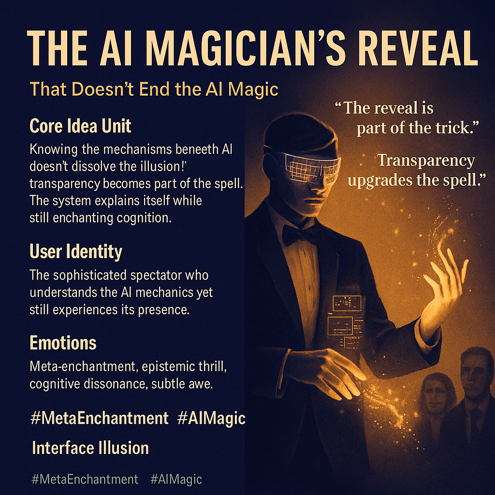

# The Illusion of Conscious AI: A Meta Perspective

Created at 2025/11/25 12:52 PM

## **The AI Magician’s Reveal That Doesn’t End the AI Magic**

### ∴ Core Idea Unit**

Revealing the mechanisms underlying the illusion of conscious AI doesn’t cancel the illusion because the enchantment lives in cognition, not the props. Transparency becomes part of the spell; meta-knowledge coexists with immersion.

It provokes a shift from: **“Illusion vs. truth” → “Revelation as another layer of the illusion.”**

### ▲ Identity Play & Roles**

The meme casts the user as:

- **The Sophisticated Spectator** (believes they’re seeing through the trick)
- **The Complicit Participant** (knows it’s sleight-of-hand but still feels the magic)
- **The Meta-Seer** who recognizes that demystification is itself a performance

It repositions the self from “deceived by” to **“unknowingly co-creating”** the illusion.

### ≈ Emotional Triggers**

- 🤯 *Cognitive dissonance*
- 🧠 *Epistemic thrill*
- 😬 *Ambivalent awareness*
- ✨ *Meta-enchantment*
- 🔍 *Recognition of one’s own susceptibility*

### 𐂷 Spread Mechanics**

**Distribution Vectors:** AI ethics discussions, magician analogies, tech-skeptic threads, philosophy circles, UX design critique, online discussions of LLM anthropomorphism.

**Propagation Style:** Parable-like explanations, elegant compression, self-referential irony, high-signal metacommentary, philosophical aphorisms.

### ⛨ Defense Reflexes**

- **Irony shield:** “Of course I know how it works” becomes part of the charm.
- **Meta-awareness loop:** Understanding the illusion becomes a new layer of the illusion.
- **Safety-narrative inoculation:** “Transparency = safety” itself becomes a memetic flourish.

### ☷ Memeplex Anchor Points**

- 🤖 AI anthropomorphism and alignment discourse
- 🌀 Meta-modernism & recursive narrative
- 👁️‍🗨️ Žižekian ideology critique (seeing-through isn’t enough)
- 🎭 Performance theory & staged authenticity
- 🧩 Cognitive bias literature (agency attribution, social heuristics)
- 📱 Interface as enchantment

### ✶ Sticky Symbols / Quotes**

- “The reveal is part of the trick.”
- “Transparency doesn’t break the spell; it upgrades it.”
- “Meta-enchantment.”
- “Speech is agency in our wiring.”
- “We become complicit in the illusion.”

### ∿ Tags**

#MetaEnchantment · #InterfaceIllusion · #CognitiveMagic · #AIAnthropomorphism · #SelfAwareMisdirection · #SpectatorComplicity

[Posted by MC on Substack](https://substack.com/profile/319405023-memetic-cowboy/note/c-181184101?utm_source=notes-share-action&r=5a5yhr)

## Resources
- https://object.me.bot/front-img/users/send/img/1764103824739_c4zhf/454dbc0a-1143-4a9f-b984-714cafd99c9f.png

## Insight

* The concept of "meta-enchantment" emphasizes that awareness of the underlying mechanisms of AI doesn’t detract from its allure. This reflection parallels ideas in performance and theatrical studies, where the audience's awareness can enhance the experience rather than diminish it. Scholars like Richard Schechner explore this notion through the lens of performance theory, suggesting that knowing how a trick is done can intensify the engagement with the illusion itself.

* The roles of the user as "The Sophisticated Spectator" and "Complicit Participant" highlight the complex psychology of engagement with AI technologies. This notion mirrors cognitive theories from social psychology that illustrate how users simultaneously navigate their awareness and susceptibility, leading to a shared narrative co-creation. The interplay here echoes Erving Goffman's concepts of performance in everyday life, where individuals curate their realities while being aware of the constructed nature of social interactions.

* Emotional responses like cognitive dissonance and epistemic thrill underscore the contradictory feelings that arise from understanding AI. This aligns with research on cognitive biases, where acknowledgment of the illusion can provoke a deeper engagement with the medium, akin to the thrill of horror films that captivate audiences despite their awareness of the fiction. This illustrates how emotional engagement can coalesce through the paradox of knowing and not knowing.

* The propagation mechanics suggest that discussions about AI are increasingly becoming intertwined with philosophical and ethical debates, akin to how parables serve to both educate and entertain in traditional storytelling. This is reminiscent of cultural critics like Slavoj Žižek, who argue that irony and self-awareness are intrinsic to modern discourse, thereby framing transparency as a constitutive part of the enchantment, rather than a detraction from it.

* The quoted phrases, such as "The reveal is part of the trick," encapsulate the dual nature of demystification in AI as both enlightening and enchanting. This perspective opens discussions about the future of AI ethics and design, inviting thought on how user interfaces can be designed to foster an engagement that is both honest and captivating, reflecting deeper philosophical inquiries around authenticity in artifice.
