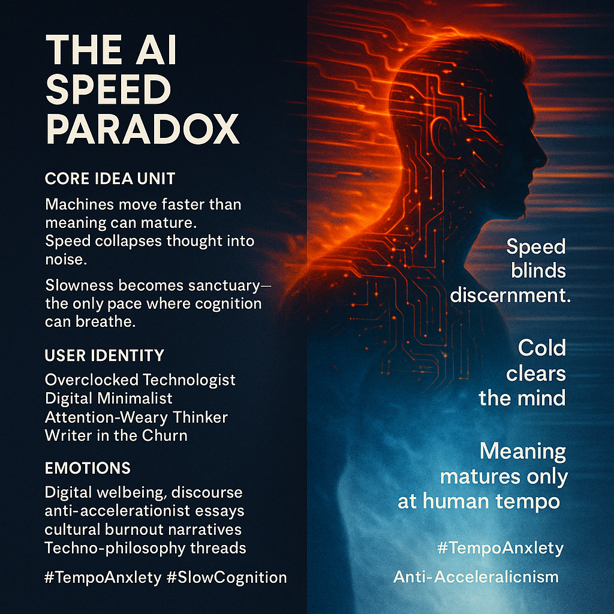

# Embracing Slowness Amidst AI Acceleration

Created at 2025/11/28 12:10 PM

### **🧩 Title / Label: The AI Speed Paradox**

***

### ∴ Core Idea Unit

Machines move faster than meaning can mature.Speed amplifies output but starves discernment.Slowness becomes not a flaw, but the only refuge where cognition can actually breathe.

***

### ▲ Identity Play & Roles

- The Overclocked Technologist
- The Digital Minimalist Monk
- The Attention-Weary Thinker
- The Writer drowning in cultural churn

This meme casts the user as someone conscious of how acceleration erodes signal—and who seeks cold clarity over feverish speed.

***

### ≈ Emotional Triggers

- Anxiety about runaway cultural tempo
- Awe at machine velocity
- Self-recognition (“I’m overclocking myself”)
- Relief, nostalgia, and grounding in slowness
- Quiet, restorative contrast between heat and cool

***

### 𐂷 Spread Mechanics

**Distribution Vectors:**Digital wellbeing threads, anti-accelerationist discourse, AI-philosophy essays, burnout-culture memes, contemplative tech writing.

### 𐂷 Spread Mechanics

Style:**Aesthetic minimalism, slow-tech atmospherics, cooling metaphors, system critique through soft metaphysics.

***

### ⛨ Defense Reflexes

- **Paradox Shield:** “If you’re objecting, you’re already moving too fast to understand it.”
- **Cultural Exhaustion:** Critique is disarmed by framing itself as self-care.
- **Metaphor Flexibility:** Heat, cold, speed, breath—shifts symbols to avoid attack.

***

### ☷ Memeplex Anchor Points

- Accelerationism critique
- Digital minimalism
- Attention ecology
- AI-tempo anxiety
- Phenomenology of slowness
- Breath as cognitive infrastructure
- Somatic pacing / cold-focus practices

***

### ✶ Sticky Symbols or Quotes

**Symbols:**Overheated air · Cooling breath · Spinning culture-wheel · Frosted circuitry · Tempo dial turned low

**Quotes / Phrases:**

- “Speed blinds discernment.”
- “Cold clears the mind.”
- “Meaning matures only at human tempo.”
- “Slow enough to feel truth form.”

***

### ∿ Tags

#TempoAnxiety #SlowCognition · Anti-Accelerationism#CoolingMind #AIOverclock
