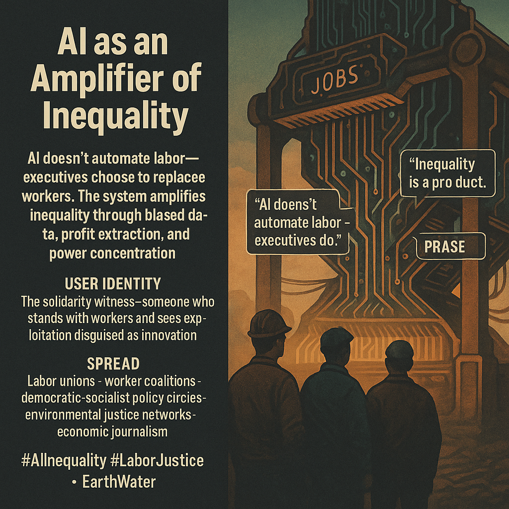

# AI: A Tool for Amplifying Economic Inequality

Created at 2025/11/14 9:53 AM

### 🧩 **Title: AI as an Amplifier of Inequality**

### ∴ **Core Idea Unit:**

A justice-centered frame: *AI doesn’t automate labor — executives choose to replace workers.* The meme reframes AI not as neutral innovation but as a **profit-extraction engine** widening inequality through deliberate choices, biased datasets, and power-concentrating feedback loops. Shift: from “inevitable automation” to **human-made economic inequity**.

### ▲ **Identity Play & Roles:**

Positions the user as the **solidarity witness** — someone who sees inequality not as abstraction but as lived experience across working-class, marginalized, and global communities. Identity becomes: **the person who stands with workers against algorithmic exploitation.**

It casts executives as decision-makers, not victims of technological destiny.

### ≈ **Emotional Triggers:**

🌍 Earth: material struggle, class reality 🌊 Water: solidarity, empathy, shared fate 💢 Economic injustice 🤝 Collective resistance energy 🧭 Moral clarity about choices masquerading as inevitabilities

Earth–Water blends grounded truth with emotional coalition-building.

### 𐂷 **Spread Mechanics:**

**Distribution Vectors:** Labor unions · worker cooperatives · democratic-socialist discourse · environmental justice networks · investigative economics journalism · global labor movements.

**Propagation Style:** Algorithmic looms · wage graphs woven like fabric · silhouettes of workers vs. digital machinery · “executive decision” callouts · testimonies from displaced or surveilled workers.

### ⛨ **Defense Reflexes:**

- Reframes automation as **policy choice**, not natural law — disarming tech determinism.
- Uses well-documented cases (Duolingo layoffs, tech contractor purges, warehouse algorithmic firings) as empirical armor.
- Converts productivity rhetoric into evidence of exploitation (“productivity for whom?”).
- Anchors inequality in visible outcomes: job loss, biased systems, unequal access to opportunity.

### ☷ **Memeplex Anchor Points:**

- **Labor justice**
- **Algorithmic bias and feedback loops**
- **Wealth concentration**
- **Worker surveillance**
- **Global North–South disparities**
- **Union-backed resistance**
- **Economic democracy**
- **Luddite history reframed as empowerment, not backwardness**

The meme aligns with broader justice movements, turning AI policy from technical governance into economic and democratic reform.

### ✶ **Sticky Symbols / Quotes:**

**Symbols:** • A towering **algorithmic loom** weaving worker lives into profit lines • Workers standing beneath a glowing circuit-weave sky • Payroll numbers dissolving into code • A corporate hand pulling threads from a worker’s silhouette • Wage graphs stitched into fabric under tension

**Sticky Phrases:** • “AI doesn’t automate labor — executives do.” • “Inequality is the product.” • “The algorithm is a loom — and you’re the thread.” • “Productivity for whom?” • “Pause as protection, not panic.”

### ∿ **Tags:**

#LaborJustice · #AIInequality · #EarthWater · #EconomicTruth · #SolidarityMemetics

[Source Advocates](https://app.me.bot/public/RFBCOESXMYMJDC0W)

## Resources
- https://object.me.bot/front-img/users/send/img/1763142798322_c4zhf/8c9f68f2-4518-422c-943b-83361289171c.png

## Insight

* The image encapsulates the idea that AI functions not merely as a tool of automation but as an embodiment of choices made by executives. This perspective challenges the narrative of technological inevitability, suggesting that decisions made in boardrooms are pivotal in determining who benefits from technological advancements, thereby perpetuating economic inequalities. This framing aligns with historical critiques of capitalism, where capital owners dictate labor conditions, further deepening class divides.

* The depiction of workers as "solidarity witnesses" emphasizes the need for collective resistance to systemic exploitation. By portraying individuals who recognize injustice within the labor system, the image invites viewers to engage with broader movements for labor rights and social equity. This aligns with historical labor movements that have framed their struggles as part of a greater fight against oppression, much like the Luddites, who resisted mechanization that threatened their livelihoods.

* Emotional triggers such as material struggle and collective resistance serve to galvanize support for labor justice initiatives. The invoking of Earth and Water as symbols suggests a deep-rooted connection to environmental and humanistic values, advocating for an integrative approach that sees economic justice as inseparable from ecological sustainability.

* The mechanics of spreading this message through labor unions and democratic discourses highlights the importance of grassroots movements and community organizing in advocating for change. This approach mirrors successful historical campaigns, such as the Civil Rights Movement, where coalitions forged across different sectors played a crucial role in advancing systemic reforms.

* The sticky phrases included in the image, such as "Productivity for whom?" serve as incisive critiques of the prevailing narrative around efficiency and productivity gains. They encourage reflection on the actual beneficiaries of technological progress, effectively questioning the societal implications of prioritizing profits over people, and invoking a moral clarity that resonates deeply within various social justice frameworks.
