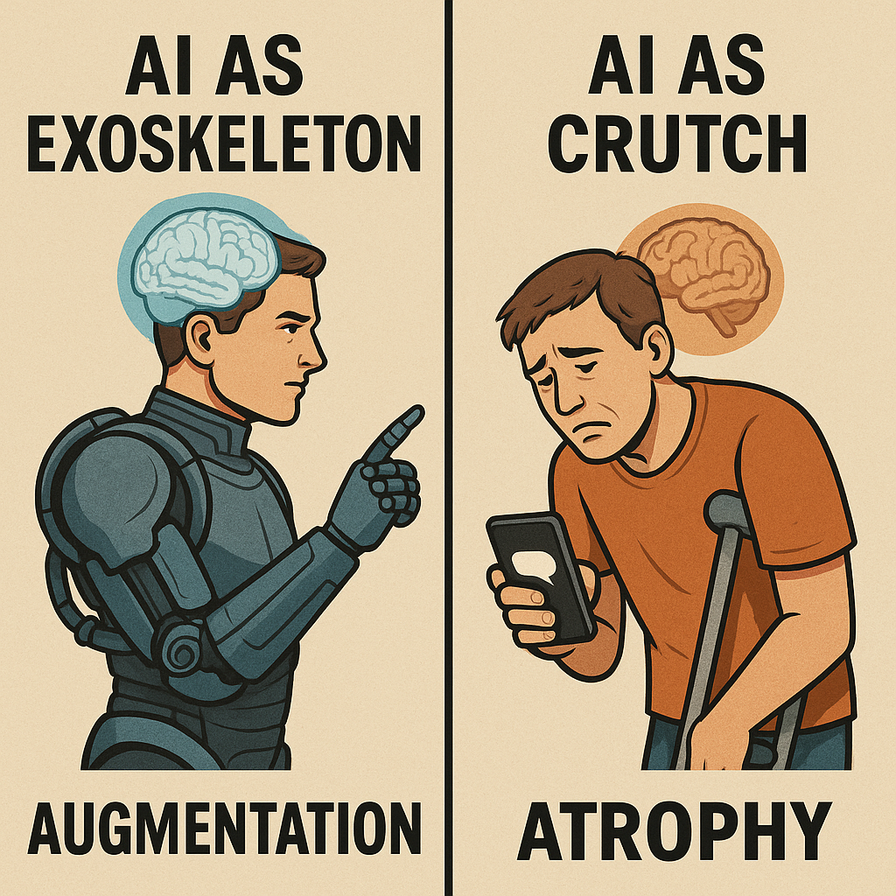

# AI: Exoskeleton vs. Crutch Cognitive Metaphors

Created at 2025/08/24 9:46 AM

### ◈ Mini-Memetic Profile

Title: Augmentation vs. Atrophy [(full analysis)](https://open.substack.com/pub/memeticcowboy/p/memetic-analysis-ai-augmentation)

*Meta-Integrated Re-Analysis of Competing AI Cognitive Metaphors

### ∴ Core Idea Unit

Two memetic poles—AI as Exoskeleton vs AI as Crutch—shape societal cognition. They aren’t opposites but co-evolving attractors that regulate how intelligence, agency, and technology are imagined, embodied, and designed for.

### ▲ Identity Play & Roles

- Augmenters = Co-pilots, Builders, Innovators
- Atrophists = Guardians of Mind, Skeptics, Preservationists
- Meta-Reflexives = Narrative Weavers, who toggle lenses with intentThe meme repositions the user as a meta-agent—not just tool user, but toolframe navigator.

### ≈ Emotional Triggers

- 🤖 Awe (from enhanced intelligence)
- 🧠 Anxiety (about intellectual erosion)
- ⚖️ Ambivalence (from dual exposure)
- 🔍 Curiosity (about one’s own mind-relationship with tech)Metaphor is destiny; emotional resonance anchors the user in one frame… or provokes oscillation.

### 𐂷 Spread Mechanics

- Augmentation: Academic papers, edtech branding, UX metaphors
- Atrophy: Viral threads, YouTube critiques, parental forums
- Hybrids: Workshops, ethics panels, digital literacy contentPropagation Style: Parable, Comparative Frames, Cautionary Design

### ⛨ Defense Reflexes

- Augmentation uses: transparency rhetoric, personalization myths
- Atrophy leans on: analog nostalgia, digital detox valorizationBoth use metaphor shields: “co-pilot” vs. “dumbing-down drug” to gate narrative entry

### ☷ Memeplex Anchor Points

- 📱 Techno-literacy & Human-Machine Integration
- 🧠 Cognitive Sovereignty & Extended Mind Theory
- 📚 Digital Pedagogy & Posthuman Epistemology
- ⚖️ Ethical Design & Narrative Reflexivity

### ✶ Sticky Symbols or Quotes

- “AI as exoskeleton”
- “ChatGPT makes you dumber”
- “Symbiotic cognition”
- “Scaffolded autonomy”
- “Don’t let your exosuit become a cage”
- “Metaphor engineers rule the infosphere”

### ∿ Tags

#AugmentationVsAtrophy · #MetaphorEngineering · #LearningFutures

🧠 #CognitiveMemetics · #TechnoNarrativeDynamics · #ScaffoldedAgency
