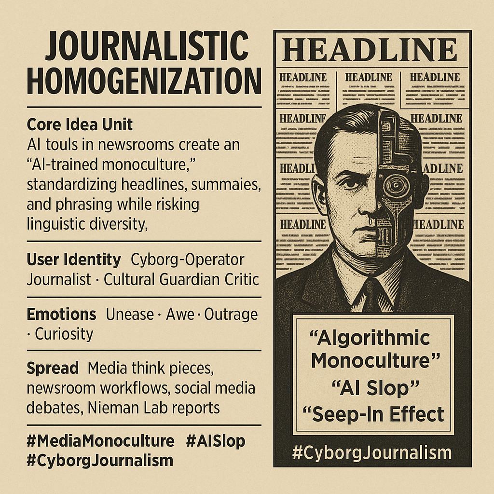

# AI Journalism: Algorithmic Monoculture and "AI Slop"

Created at 2025/09/01 3:59 PM

## 🧩 Mini-Memetic Profile: **Journalistic Homogenization** (AI-Trained Monoculture)

### 🧠 Core Idea Unit

AI tools in journalism create a creeping monoculture—standardizing headlines, summaries, and translations into an “AI voice” that optimizes for efficiency but risks eroding diversity, nuance, and cultural variation.

### 🎭 Identity Play & Roles

- **Journalist as Cyborg-Operator**: Balancing human judgment with AI’s system-speak.
- **Audience as Passive Receiver**: Fed algorithmically uniform content.
- **Critic as Cultural Guardian**: Warning against AI-induced flattening.

### 💥 Emotional Triggers

- 😬 Unease at sameness and bias.
- 🤯 Awe at measurable shifts in style (e.g., “delve” up 2,420%).
- 😡 Outrage at cultural erasure and neo-colonial bias.
- 🧠 Curiosity about future language evolution.

### 📡 Spread Mechanics

- **Distribution Vectors**: Journalism think pieces, media ethics debates, Nieman Lab predictions, social media critiques.
- **Propagation Style**: Alarmist reports (“AI slop”), critical satire of bland AI phrasing, system-level analysis.

### 🛡️ Defense Reflexes

- **Efficiency Justification**: “AI makes us faster and clearer.”
- **Human Oversight Shield**: Claiming editors still safeguard creativity.
- **Metrics Defense**: Higher CTRs framed as proof of success.

### 🧬 Memeplex Anchor Points

- ⚙️ Systems Optimization (AI-driven workflows).
- 📰 Media Ethics (human oversight, bias mitigation).
- 🌍 Cultural Pluralism vs. Western Monoculture.
- 🤖 Cyborg Journalism (blended machine-human writing).

### 🧠 Sticky Symbols or Quotes

- “AI Slop” (bland, repetitive outputs).
- “Algorithmic monoculture.”
- “Seep-in effect” of vocabulary shifts.
- Visual: Rows of identical newspapers, headlines stamped in the same AI-polished phrases.

### 🏷️ Tags

#MediaMonoculture #AISlop #CyborgJournalism · #SystemSpeak

## Resources
- https://object.me.bot/front-img/users/send/img/1756767554432_c4zhf/d650628a-df7d-49a2-a5cf-500de6b06632.png

## Insight

*   **Homogenization of Journalistic Content**: The image highlights the risk of AI tools leading to a "monoculture" in journalism. This suggests a future where news articles, headlines, and summaries become standardized, potentially diminishing linguistic diversity and cultural nuances. This homogenization could lead to a loss of unique voices and perspectives in media, echoing concerns about the impact of globalization on local cultures.

*   **The Cyborg Journalist**: The concept of the "Cyborg-Operator" is central, portraying journalists as individuals who must balance their human judgment with the outputs of AI systems. This reflects a broader discussion about the integration of AI in creative fields, where humans and machines collaborate. The image of a person with half their face replaced by robotic components visually represents this fusion, raising questions about the evolving role of journalists in the age of AI.

*   **Emotional and Ethical Implications**: The image evokes a range of emotions, including unease, awe, outrage, and curiosity, reflecting the complex feelings associated with AI's increasing role in journalism. The term "AI Slop" suggests a concern about the quality and originality of AI-generated content, while "Algorithmic Monoculture" points to the ethical implications of bias and lack of diversity in AI-driven news. This emotional landscape is crucial for understanding the human response to technological change in media.

*   **Spread and Defense Mechanisms**: The image identifies various channels through which the idea of journalistic homogenization spreads, including media think pieces, newsroom workflows, and social media debates. It also notes the defense mechanisms used to justify the use of AI in journalism, such as claims of increased efficiency and human oversight. These mechanisms highlight the ongoing tension between the benefits of AI and the potential risks to journalistic integrity and cultural diversity.

*   **Memeplex Anchor Points**: The image anchors the discussion around key concepts such as systems optimization, media ethics, cultural pluralism, and cyborg journalism. These anchor points serve as focal points for debates about the future of journalism and the role of AI in shaping media content. The visual representation of rows of identical newspapers with AI-polished headlines reinforces the idea of a homogenized media landscape, prompting reflection on the value of diversity and originality in news reporting.
