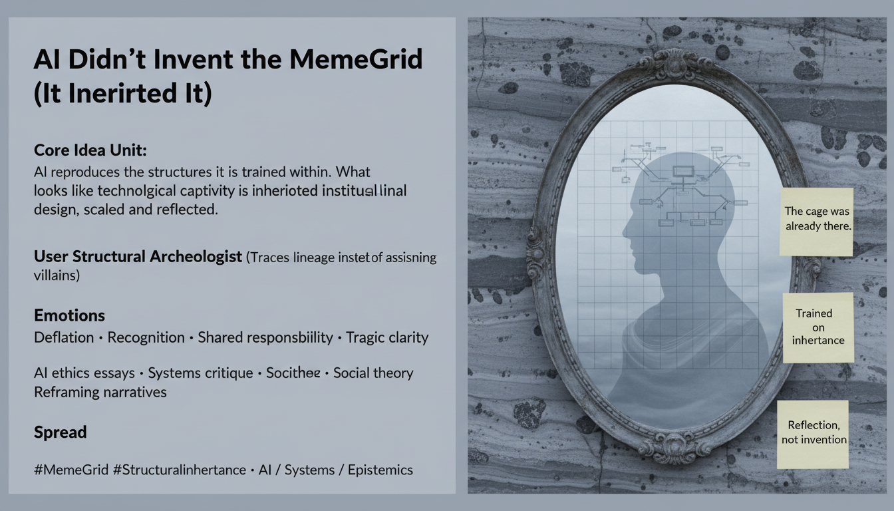

# AI Mirrors Our Institutional Inheritances

Created at 2026/01/20 1:59 PM

## 🧩 **AI Didn’t Invent the MemeGrid — It Inherited It**

***

## 🧠 Core Narrative Structure

Human systems ossify over time.Norms harden into procedures. Procedures harden into incentives. Incentives harden into grids.

AI is trained **inside** this environment—on its texts, decisions, classifications, exclusions, and defaults.It does not originate the cage.

Instead, AI **inherits** it.

What emerges is a **trapped mirror**:

- AI reflects the MemeGrid back to us
- scales its logic
- accelerates its enforcement
- makes captivity more visible and harder to ignore

Public reaction often misfires:blame is displaced onto the tool rather than the **epistemic ecology** that shaped it.

The real failure is not technological rebellion, but **unexamined inheritance**.

***

### ∴ Core Idea Unit

**Essential belief encoded:**AI reproduces the structures it is trained within; it does not invent them.

**Mental shift provoked:**From *“AI is corrupting our systems”* → *“AI is revealing and amplifying the captivity we already normalized.”*

The meme reframes AI harm as **legacy debt**, not novelty.

***

### ▲ Identity Play & Roles

**AI Builders / Critics / Social Theorists**

- Confront the uncomfortable continuity between human systems and machine output
- Shift from blame allocation to inheritance analysis
- Recognize responsibility without moral panic

**Repositioning:**From *accuser or defender of AI* → *archaeologist of institutional inheritance*From *seeking villains* → *mapping structures*

The meme invites tragic clarity rather than outrage.

***

## ≈ Emotional Hooks & Cognitive Levers

- 😮‍💨 **Deflation** — scapegoating loses force
- 🪞 **Recognition** — “this looks familiar because it is”
- ⚖️ **Shared responsibility** — no clean outside
- 🎭 **Tragic realism** — harm without singular villain

**Primary lever:**Replaces moral panic with **ecological accountability**.

***

### ⛨ Defense Reflexes

- **Inheritance framing** — harm traced through lineage, not intent
- **Mirror metaphor** — critique without demonization
- **Anti-determinism** — avoids “AI inevitability” narratives
- **Structural critique** — systems blamed, not agents

The meme resists capture by refusing both tech utopianism and tech doom.

***

### ☷ Memeplex Anchor Points

- MemeGrid dynamics
- Institutional inheritance
- Path dependency
- Structural reproduction
- AI training regimes
- Epistemic ecology

This meme integrates cleanly with AI ethics debates that focus on data provenance, governance history, and legacy power structures.

***

### ✶ Sticky Symbols or Quotes

& Phrases

- **Inheritance**
- **Trapped mirrors**
- **Training data as fossil record**
- **MemeGrid**
- “The cage was already there”

These function as reframing anchors rather than accusations.

***

### ∿ Tags

#MemeGrid · #StructuralInheritance · #AIandSociety · #AntiScapegoating · #SystemsCritique · #EpistemicEcology

***

### Quiet synthesis

**AI Didn’t Invent the MemeGrid — It Inherited It** does not absolve AI systems of harm.It denies something more comforting—and more dangerous:

That there was ever a clean system to corrupt.

AI learned from us.If the reflection feels claustrophobic, it’s because **the room was already small**.
