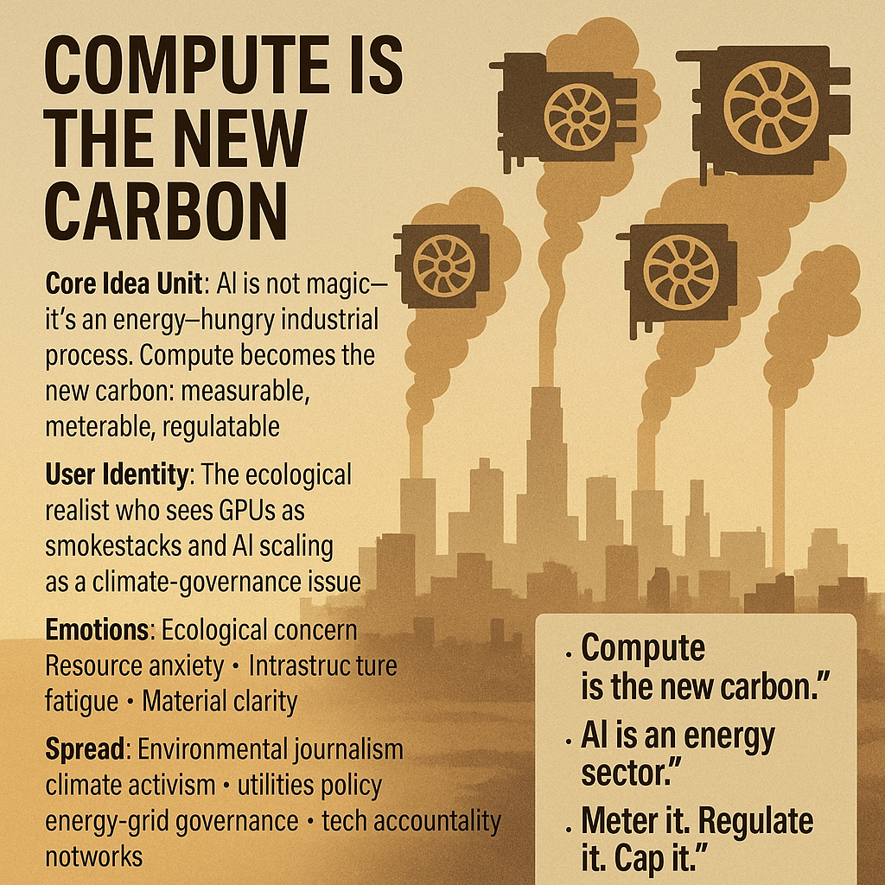

# AI Scaling as Climate Governance Challenge

Created at 2025/11/14 9:33 AM

### 🧩 **Title: Compute Is the New Carbon**

### ∴ Core Idea Unit

A reframing meme: *AI isn’t magic — it’s an energy-hungry industrial process.*Compute becomes analogous to carbon emissions: a measurable, meterable, regulatable pollutant.The shift it provokes: **treat AI scaling as a climate problem, not an innovation race.**

### ▲ Identity Play & Roles

Positions the user as the **ecological realist** — the person who sees GPUs as smokestacks, data centers as power plants, and AI as an extractive industry.Identity:**the one who translates hype into resource accounting.**

### ≈ Emotional Triggers

🌍 Ecological concern🔌 Infrastructure fatigue🔥 Heat-dome anxiety💧 Water scarcity fear🧮 Empowering clarity (“just measure it”)Earth emotion: *weight,* not panic; *consequence,* not abstraction.

### 𐂷 Spread Mechanics

**Distribution Vectors:**Climate activism networks · environmental journalism · regulatory think tanks · municipal utilities · energy-grid policy circles · tech accountability movements.

### 𐂷 Spread Mechanics

Style:**Satellite images · emission analogies · GPU silhouettes as pollution icons · power-grid diagrams · ecological visualization overlays.

### ⛨ Defense Reflexes

- Uses **empirical measurability** (kWh, liters of water, megatons CO₂e) to shield against “speculative” critiques.
- Reframes AI as **resource extraction**, placing accountability within climate governance rather than moral debates.
- When accused of exaggeration, responds with simple material metrics: “Show the energy bill.”

### ☷ Memeplex Anchor Points

- **Climate policy logic** (caps, credits, reporting requirements)
- **Resource governance** (water rights, grid allocation, emissions accounting)
- **Infrastructure realism** (“the cloud is physical”)
- **Environmental justice** (data centers disproportionally impacting vulnerable regions)
- **Energy transition debates** (renewables vs. hyperscale growth)
- **Regulatory inevitability** (parallels to carbon markets, pollution permits, industrial disclosures)

### ✶ Sticky Symbols or Quotes

**Symbols:**• Emissions plumes shaped like GPUs• Cooling towers with neon motherboard traces• Server racks glowing like furnace cores• Power lines sagging under load• Dry riverbeds beside hyperscale data centers

**Sticky Phrases:**• “Compute is the new carbon.”• “The cloud has a footprint.”• “Meter it. Regulate it. Cap it.”• “AI is an energy sector.”• “What you scale, you must account for.”

### ∿ Tags

#ComputeCarbon · #EarthLimits · #ResourceReality · #ClimateLogic · #EnergyGovernance

[Source Advocates](https://app.me.bot/public/QAKN32UI1UHUVXXO)
