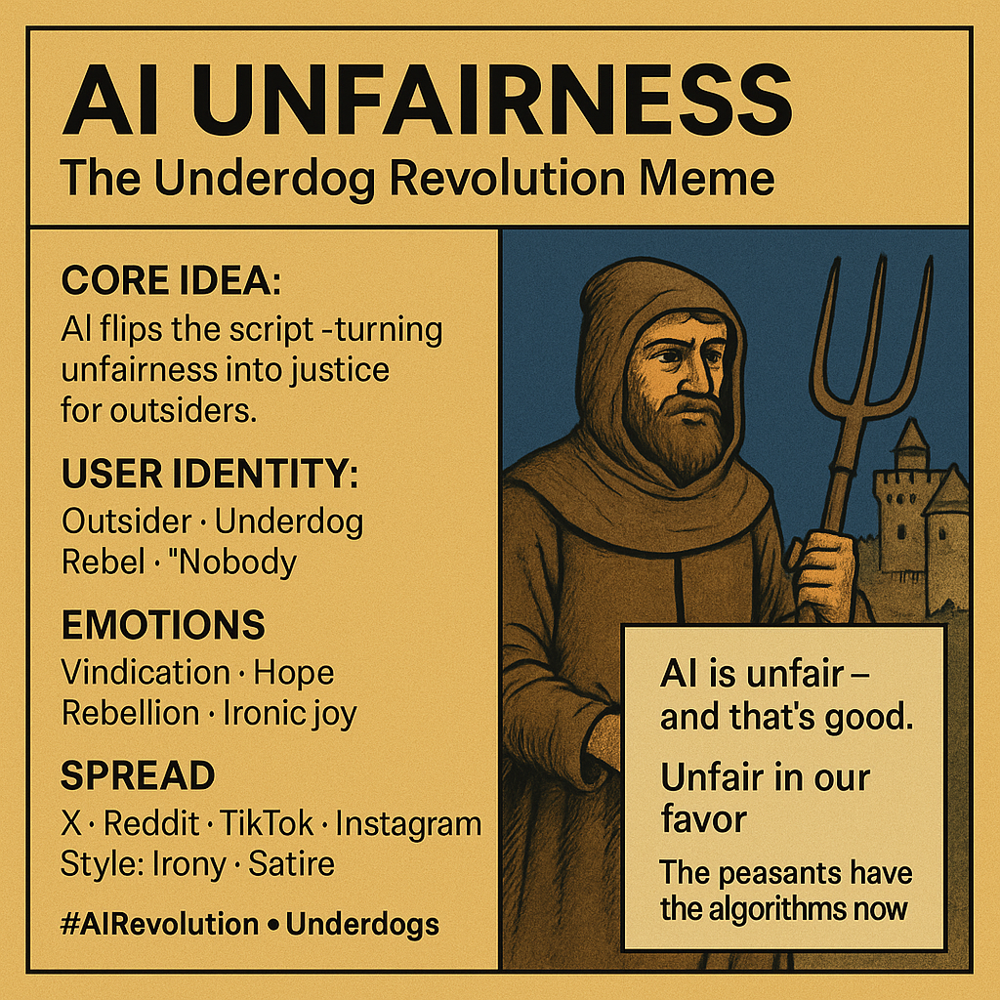

# AI Unfairness: Underdogs' Memetic Revolution

Created at 2025/09/04 7:37 PM

◈ **Mini-Memetic Profile**

**Title:**

AI Unfairness: The Underdog Revolution Meme

∴ **Core Idea Unit**

AI’s “unfairness” is recoded as **justice-by-reversal**: it disrupts entrenched privilege, flipping exclusion into advantage for outsiders. The very bias critics fear becomes the weapon of the underdog.

▲ **Identity Play & Roles**

	•	User = **outsider/peasant/nobody/rebel** rising.

	•	Elite = **guru/gatekeeper/hoarder** losing grip.

	•	Dramatic inversion: the overlooked become protagonists, authorities cast as villains.

≈ **Emotional Triggers**

Vindication · Pride · Hope · Rebellion · Ironic joy.

Communal thrill in watching gatekeepers fall, paired with anticipation of “unfairness in our favor.”

𐂷 **Spread Mechanics**

	•	**Vectors:** X, Reddit, TikTok, Instagram.

	•	**Style:** Irony · Satire · Direct reversal claims · Remix memes.

	•	**Dynamics:** Quote-tweets, viral hashtags, image macros with triumphal or mocking captions.

⛨ **Defense Reflexes**

	•	Preemptive irony: “Yes, unfair—and that’s good.”

	•	Satirical tone shields from critique.

	•	Moral framing: justice for those historically excluded.

☷ **Memeplex Anchor Points**

	•	Tech democratization

	•	Populist anti-elitism

	•	Open-source/liberationist ethos

	•	Underdog justice myths

✶ **Sticky Symbols or Quotes**

	•	“Unfair in our favor.”

	•	“AI is unfair—and that’s good.”

	•	Visuals: peasants storming castles, David vs. Goliath, shattered padlocks.

	•	Hashtags: #AIRevolution #Underdogs #GatekeeperFall #UnlockTheHoard

∿ **Tags**

#TechPopulism #MemeticJustice #AI #Underdogs

## Resources
- https://object.me.bot/front-img/note/attachments/img/1757039835678/4C405B34-78C1-456A-BF3A-9B24847C89C9.png

## Insight

*   **The Meme's Core Concept**: The meme "AI Unfairness: The Underdog Revolution" cleverly reframes the perceived biases in AI as a tool for justice, specifically benefiting those traditionally excluded or marginalized. This concept plays on the idea that AI, often criticized for perpetuating existing inequalities, can instead be a force for leveling the playing field.

*   **Historical Parallel**: The image of a peasant with a pitchfork juxtaposed against a castle evokes historical peasant revolts, such as the English Peasants' Revolt of 1381 or the various "Jacqueries" in medieval France. These revolts were driven by deep-seated resentment against the ruling elite and sought to challenge the established social order. The meme cleverly uses this imagery to suggest a similar uprising, but with AI as the weapon of choice.

*   **Emotional Resonance**: The meme taps into powerful emotions like vindication, hope, rebellion, and ironic joy. These emotions are key to its virality, as they resonate with individuals who feel disenfranchised or overlooked by traditional power structures. The "us vs. them" narrative is a potent driver of engagement and sharing.

*   **Spread and Virality**: The mention of platforms like X (formerly Twitter), Reddit, TikTok, and Instagram highlights the meme's intended distribution channels. The use of irony and satire as stylistic elements is crucial for its spread, as these approaches allow for critique and commentary without being overly confrontational. The hashtags #AIRevolution and #Underdogs further amplify its reach by connecting it to broader conversations around technology and social justice.

*   **Defense Mechanisms**: The meme's creators anticipate potential criticism by employing preemptive irony ("Yes, unfair—and that’s good.") and framing the narrative as a moral imperative for those historically excluded. This deflects accusations of bias or unfairness by positioning the meme as a form of corrective justice.

*   **Memeplex Anchors**: The meme is anchored in broader cultural narratives such as tech democratization, anti-elitism, and the open-source movement. These themes resonate with a segment of the population that believes in the power of technology to disrupt traditional hierarchies and empower individuals. The reference to "underdog justice myths" taps into a long-standing cultural fascination with stories of the downtrodden rising up against powerful oppressors.

*   **"Unfair in our favor."**: The phrase "AI is unfair—and that’s good" encapsulates the meme's central message. It suggests that the inherent biases in AI can be strategically exploited to benefit those who have historically been disadvantaged. This provocative statement is designed to spark debate and encourage further engagement with the meme's underlying themes.

