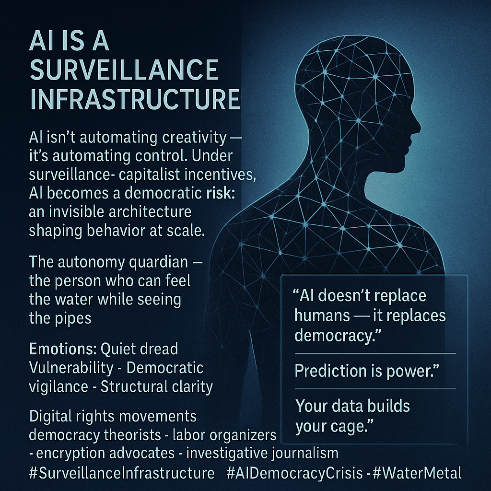

# AI as Control: Threat to Democracy

Created at 2025/11/14 9:47 AM

### 🧩 **Title: AI Is a Surveillance Infrastructure**

### ∴ **Core Idea Unit:**

A structural reframing: *AI doesn’t automate creativity — it automates control.* The meme asserts that AI, when built atop surveillance-capitalist incentives, becomes a **behavior-shaping infrastructure** that threatens democratic agency more than labor markets or creativity. Shift: from “AI as tool/model” to **AI as power architecture.**

### ▲ **Identity Play & Roles:**

Positions the user as the **autonomy guardian** — someone defending emotional and political selfhood against invisible shaping forces. Identity becomes: **the one who can feel the water while seeing the pipes.**

It casts corporations as data-extractors, governments as tempted overseers, and citizens as bodies wrapped in algorithmic lattices.

### ≈ **Emotional Triggers:**

🌊 Emotional autonomy anxiety 🧊 Quiet dread of being tracked, shaped, nudged 🔗 Structural entanglement 🛡️ Democratic vigilance ⚙️ Metal clarity: cold realization of systemic capture

Water–Metal: fluid vulnerability + hard systemic critique.

### 𐂷 **Spread Mechanics:**

**Distribution Vectors:** Digital rights advocacy · democratic theory discourse · academic privacy circles · labor-safety unions · encryption organizations · investigative journalism · Global South data sovereignty movements.

**Propagation Style:** Lattice metaphors · entangled silhouettes · black-box diagrams · dark-mode transparency warnings · “invisible architecture” aesthetics.

### ⛨ **Defense Reflexes:**

- Shifts debate from “privacy preferences” to **democratic risk**, making counterarguments seem irresponsible.
- Frames surveillance not as misuse but as **structural inevitability** under current incentives.
- Reinterprets claims of “harmless personalization” as **behavioral manipulation**, reversing the burden of proof.
- When accused of exaggeration, points to historical precedents: Facebook political microtargeting, TikTok data flows, workplace surveillance AI.

### ☷ **Memeplex Anchor Points:**

- **Surveillance capitalism** (Zuboff’s framework)
- **Epistemic commons erosion** (information control undermines public reasoning)
- **Algorithmic opacity as democratic crisis**
- **Management surveillance of workers**
- **Data sovereignty and colonial extraction logic**
- **Feedback loops of prediction → value → extraction → prediction**

The meme fuses AI discourse with political theory, shifting the problem space from “alignment” to **governance and autonomy**.

### ✶ **Sticky Symbols / Quotes:**

**Symbols:** • Neural-network lattice wrapped around a human silhouette • Data streams constricting like digital vines • Eyes embedded in circuit traces • Shadowy interface prompts shaping choices • Transparent cube around a person with algorithmic glyphs flickering

**Sticky Phrases:** • “AI doesn’t replace humans — it replaces democracy.” • “Surveillance is not a feature. It’s the business model.” • “Prediction is power.” • “Your data builds your cage.” • “What they measure, they govern.”

### ∿ **Tags:**

#AIDemocracyCrisis · #SurveillanceInfrastructure · #WaterMetal · #AutonomyUnderExtraction · #DataPower

[Source Advocates](https://app.me.bot/public/SGBZ4I91GN5GYWVM)

## Resources
- https://object.me.bot/front-img/users/send/img/1763142459402_c4zhf/2d62e9db-da18-4d18-ba89-bbc60fe86876.png

## Insight

* The image effectively communicates the central argument that artificial intelligence, particularly under the influence of surveillance capitalism, should be perceived as a mechanism of control rather than creativity. This contrasts sharply with more conventional views that see AI primarily as a tool for enhancing efficiency or productivity. 
* The concept of the "autonomy guardian" serves as a powerful metaphor for individuals who navigate and resist these underlying power dynamics, portraying the tension between personal agency and systemic influences that seek to shape behavior. This aligns with discussions in democratic theory regarding the importance of individual autonomy in an increasingly algorithmically governed society.
* Highlighting emotional triggers such as "quiet dread" and "structural clarity," the image evokes a sense of vulnerability that individuals may feel when confronted with the opaque nature of algorithmic decision-making processes. This taps into broader concerns in contemporary society about individuals being monitored and influenced without their explicit consent.
* The use of powerful phrases like "AI doesn’t replace humans — it replaces democracy" serves to frame the issue in urgent political terms, suggesting that the implications of AI extend beyond mere privacy concerns into fundamental questions of governance and agency. This approach encourages a reevaluation of AI's role within the democratic framework.
* The inclusion of various distribution vectors, such as digital rights advocacy and journalistic investigations, illustrates the multifaceted nature of resistance against surveillance infrastructures. Each group plays a role in raising awareness and advocating for more transparent and equitable frameworks around data and AI deployment, emphasizing the need for collective vigilance.
