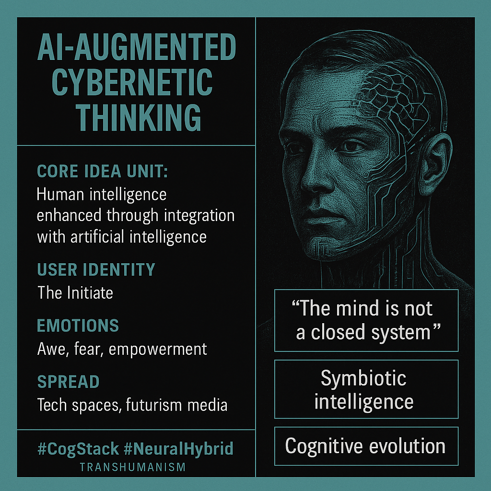

# AI-Augmented Mind: Cybernetic Cognition's Rise

Created at 2025/08/14 9:14 AM

📌 **Mini-Memetic Profile** **Title:** *The Rise of the AI-Augmented Mind: Cybernetic Cognition as Destiny*

***

🧠 **Core Idea Unit:**

- *Human intelligence is no longer sufficient alone — optimal thinking now requires cybernetic augmentation via AI systems.*
- Encodes a belief in **symbiotic intelligence**: humans and machines fused into higher-order cognition.
- Implicit promise: adapt or become obsolete.

***

🎭 **Identity Play & Roles:**

- **The Initiate/Elite:** Those who adopt AI-augmentation are positioned as *evolutionary frontrunners*, cognitively superior or spiritually awakened.
- **The Outmoded:** Traditional thinkers or "organic-only" intellectuals are framed as *limited*, *obsolete*, or *inefficient*.
- **The Visionary Rebel:** Early adopters cast as *against the grain*, disrupting outdated institutions.

***

💥 **Emotional Triggers:**

- **Awe** – The sublime scale of intelligence expansion.
- **Anxiety/Fear** – Falling behind in an accelerating cognitive arms race.
- **Hope/Empowerment** – Access to transformative mental capacity.
- **Alienation** – Estrangement from those unwilling or unable to adapt.

***

📡 **Spread Mechanics:**

- **Distribution Vectors:**
    - Twitter/X threads, AI futurism blogs, YouTube explainers, sci-fi concept art, Discord think tanks, Medium essays.
- **Propagation Style:**
    - Futurist declaratives ("The future is hybrid.")
    - Graphical memes (neural overlays, human-machine silhouettes).
    - Inspirational rhetoric + sleek techno-aesthetics.

***

🛡️ **Defense Reflexes:**

- **Critic Pre-dismissal:** Detractors labeled as *Luddites*, *technophobes*, or *slow thinkers*.
- **Ironic Insulation:** Futurist humor and self-aware references deflect earnest critique.
- **Moral Framing:** Portrayed as *necessary* evolution to survive in a complex world — resistance framed as unethical stagnation.

***

🧬 **Memeplex Anchor Points:**

- #Transhumanism
- #EffectiveAccelerationism
- #Neurodiversity
- #Posthumanism
- #TechnoMysticism
- Futurism, techno-optimism, accelerationist discourse
- Silicon Valley elite identity, Foucaultian "technologies of the self"

***

🎯 **Sticky Symbols or Quotes:**

- “The mind is not a closed system.”
- “Cognition is a stack — AI is the next layer.”
- “Upgrade your wetware.”
- Visuals: neural nets, cybernetic overlays, third eyes made of circuitry, merging human-AI figures.

***

🏷️ **Tags:** #TranshumanCore #CogStack #SiliconAscension #NeuralHybrid #FutureElite #PostHumanMeme #AIRegenesis #CyberMystic #WetwareUpgrade

## Resources
- https://object.me.bot/front-img/users/send/img/1755188069019_c4zhf/50a7acdb-2a70-496c-9c52-a94365dbf5d9.png

## Insight

*   **Core Idea Unit: The Fusion of Human and Artificial Intelligence**: The image highlights the concept of enhancing human intelligence through integration with AI, a core tenet of transhumanism. This idea suggests a future where cognitive abilities are not limited to biological constraints but are augmented by technology. Consider Ray Kurzweil's concept of the "Singularity," where technological growth becomes uncontrollable and irreversible, resulting in unforeseeable changes to human civilization.

*   **User Identity: The Initiate**: The term "The Initiate" suggests a sense of exclusivity and early adoption, positioning those who embrace AI augmentation as pioneers or members of an enlightened group. This reflects a common theme in technological adoption, where early adopters often see themselves as ahead of the curve. Think of the early days of the internet, where users felt like part of a special community exploring uncharted digital territory.

*   **Emotions: Awe, Fear, Empowerment**: The image evokes a mix of emotions, including awe at the potential of AI, fear of being left behind, and empowerment through enhanced capabilities. This emotional cocktail is typical of transformative technologies, which often inspire both excitement and anxiety. For example, the advent of nuclear technology brought both the promise of limitless energy and the terror of nuclear war.

*   **Spread: Tech Spaces, Futurism Media**: The image indicates that the idea of AI-augmented intelligence is primarily disseminated through tech spaces and futurism media. This suggests a targeted audience of tech enthusiasts, futurists, and those interested in the intersection of technology and human evolution. Consider the role of science fiction in popularizing such ideas; works like William Gibson's "Neuromancer" have long explored the potential and perils of cybernetic enhancements.

*   **"The mind is not a closed system"**: This quote encapsulates the belief that the human mind is not limited to its biological form and can be expanded or enhanced through external technologies. This idea challenges traditional notions of human identity and intelligence, suggesting that our cognitive abilities can evolve beyond their natural limitations. It echoes the sentiments of thinkers like Marshall McLuhan, who argued that technology extends our senses and capabilities.

*   **Symbiotic Intelligence**: The concept of symbiotic intelligence suggests a mutually beneficial relationship between humans and AI, where each enhances the other's capabilities. This contrasts with dystopian visions of AI taking over or replacing humans, instead emphasizing collaboration and co-evolution. Consider the real-world example of AI-powered medical diagnosis, where AI assists doctors in making more accurate and timely diagnoses, improving patient outcomes.

*   **Cognitive Evolution**: The phrase "cognitive evolution" implies that AI augmentation is a natural progression of human development, a way to adapt and thrive in an increasingly complex world. This perspective frames resistance to AI augmentation as a form of stagnation or refusal to evolve. This idea aligns with the broader concept of human evolution being shaped by technology, as seen in the development of tools, agriculture, and communication technologies throughout history.

*   **#CogStack #NeuralHybrid #Transhumanism**: These hashtags link the image to broader online communities and movements centered around transhumanism, cognitive enhancement, and the integration of technology with the human body. These hashtags serve as entry points for individuals interested in exploring these ideas further and connecting with like-minded individuals. They represent a digital manifestation of shared interests and beliefs, fostering a sense of community and collective identity.
