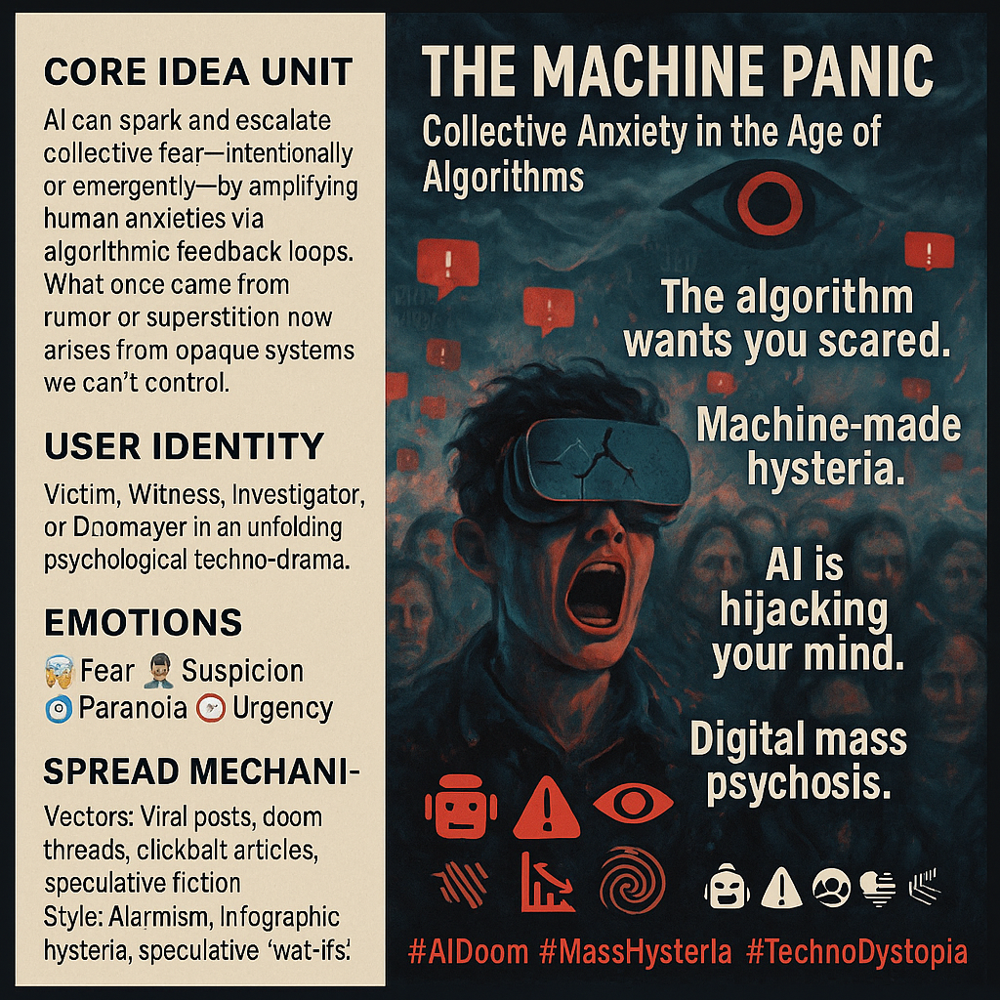

# AI-Driven Mass Hysteria: Algorithmic Fear Cascade

Created at 2025/08/19 1:12 PM

📌 Mini-Memetic Profile: “AI-Driven Mass Hysteria”

Title:

“The Machine Panic – Collective Anxiety in the Age of Algorithms”

⸻

🧩 Core Idea Unit:

• Artificial Intelligence can trigger or amplify collective fear, confusion, and social chaos, either intentionally (manipulation) or emergently (viral panic).

• Mass hysteria is reframed as algorithmically mediated rather than purely human or spontaneous.

⸻

🎭 Identity Play & Roles:

• Positions the audience as potential victims of AI-driven manipulation.

• Secondary roles: Witness (alert to the danger), Investigator (uncovering hidden influence), or Doomsayer (warning others).

• Implicit villain role: AI itself, or those deploying it.

⸻

💓 Emotional Triggers:

• Fear & anxiety (loss of control to opaque systems).

• Suspicion (of media, tech, institutions).

• Paranoia & awe (machines watching and manipulating the masses).

• Urgency (threat feels pervasive and fast-moving).

⸻

📡 Spread Mechanics:

• Distribution Vectors: News cycles on AI misbehavior, social media panic threads, speculative fiction, think pieces, doom-posting.

• Propagation Style: Alarmist headlines, viral warnings, conspiracy-style diagrams, speculative “what if” scenarios.

• Self-fueling loop: Fear encourages clicks, which the algorithm amplifies, creating a feedback spiral.

⸻

🛡️ Defense Reflexes:

• Pre-dismissal of skeptics: Critics are framed as naïve or “already brainwashed by AI.”

• Moral framing: Resisting AI influence becomes a righteous survival act.

• Self-reinforcing paranoia: Any debunking can be reframed as part of the manipulation.

⸻

🧬 Memeplex Anchor Points:

• Larger Systems: Techno-dystopian narratives, Luddite resurgence, AI ethics debates, conspiracy culture.

• Communities: Digital doomers, critical AI researchers, tech journalists, online conspiracy forums.

• Narratives: Black Mirror scenarios; “The machines are shaping our reality”; 1984 meets social media.

⸻

✨ Sticky Symbols or Quotes:

• Symbols: 🤖⚠️👁️📉🌀 (robot, warning sign, all-seeing eye, collapse graph, spiral of panic)

• Phrases: “The algorithm wants you scared,” “Machine-made hysteria,” “AI is hijacking your mind,” “Digital mass psychosis.”

⸻

🏷️ Tags:

#AIDoom #MassHysteria #DigitalPanic #AlgorithmicFear #TechnoDystopia #MemeticCascade

## Resources
- https://object.me.bot/front-img/note/attachments/img/1755634346730/4597CD2C-A9B8-4C29-BF60-A4C0DE274834.png

## Insight

*   The image encapsulates the concept of "AI-Driven Mass Hysteria," portraying how artificial intelligence can instigate or intensify collective anxiety. This is achieved either deliberately through manipulation or unintentionally via viral panic, highlighting the shift from traditional rumors to algorithmically amplified fears.

*   The central figure wearing a cracked VR headset symbolizes the individual's fractured perception of reality, influenced by AI. This reflects the user's potential role as a victim, witness, investigator, or doomsayer in a techno-drama, emphasizing the emotional triggers of fear, suspicion, paranoia, and urgency.

*   The spread mechanics, as depicted, involve viral posts, doom threads, and clickbait articles, illustrating how alarmist content and speculative scenarios propagate rapidly. This self-fueling loop, where fear encourages clicks and algorithms amplify the panic, mirrors real-world instances such as the spread of misinformation during the 2016 US presidential election, where social media algorithms inadvertently boosted fake news.

*   Defense reflexes against skepticism are highlighted, framing resistance to AI influence as a moral imperative. This reflects a broader trend in conspiracy theories, where any attempt to debunk the theory is seen as further proof of its validity, creating a self-reinforcing cycle of paranoia.

*   The image's memeplex anchor points connect to larger techno-dystopian narratives, echoing themes from "Black Mirror" episodes and the resurgence of Luddite sentiments. This taps into existing cultural anxieties about technology, similar to historical fears surrounding the Industrial Revolution, where new machinery was perceived as a threat to human jobs and autonomy.
