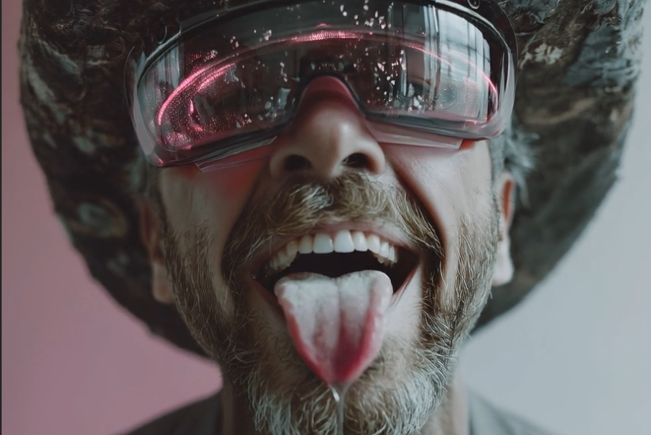

# AI-Generated Ahegao: Memetic Eroticism Marketing

Created at 2025/08/22 12:43 PM

### ◈ Mini-Memetic Profile

***

### ∴ Core Idea Unit

- **Pleasure-as-Performance**: The meme encodes the idea that extreme emotional or physical reaction (often erotic) is not just a private experience but a performative, replicable aesthetic—now digitally generatable.
- It plays on **hyperreality**: exaggerated, stylized emotion is more meme-worthy (and thus more *real*) than authentic expression.
- Encodes **sex tech futurism**: erotic affect can be mechanized, aestheticized, and commodified through AI.

***

### ▲ Identity Play & Roles

- **User as Edgelord Technician**: Someone who is in-the-know, comfortable navigating fringe, NSFW, and ironic internet culture.
- **Viewer as Voyeur or Artist**: Positioned as both consumer and potential co-creator of hyperreal aesthetic content.
- **Insider/Outsider Split**: Insiders “get it” (meme literacy), outsiders are shocked or confused.

***

### ≈ Emotional Triggers

- **Arousal** (sexual and aesthetic)
- **Amusement** (via absurdity/irony)
- **Transgression** (crossing boundaries of taste and decency)
- **Fascination/Disgust Blend** (typical of memetic erotica with grotesque or exaggerated stylings)

***

### 𐂷 Spread Mechanics

- **Distribution Vectors:**
    - TikTok, Instagram, Reddit, Twitter/X, meme forums, Discord communities
    - Leveraged in **AI art generator demos** or “look what this tech can make” posts.
- **Propagation Style:**
    - **Ironic spectacle**: Users share it for the “lol wtf” effect.
    - **Shock-value lure**: Attention-grabbing aesthetics for clicks and comments.
    - **Meta-memeing**: Reposting as commentary on oversexualization, synthetic aesthetics, or anime culture itself.

***

### ⛨ Defense Reflexes

- **Irony shield**: "It’s just a joke, bro" or "It’s art, not porn" makes critique difficult.
- **Subcultural framing**: Dismissal of criticism as “normie” misunderstanding of niche or artistic context.
- **Aestheticism defense**: Framed as experimental or avant-garde usage of AI aesthetics.

***

### ☷ Memeplex Anchor Points

- **#DegenerateArt / #EroGuro**: Erotic-grotesque tradition
- **#AIArt / #AIGeneratedContent**: Techno-aestheticism
- **#OtakuCulture / #Hentai / #WeebMemes**: Online anime fandoms
- **#InternetIrony / #PostCringe**: Meme surrealism and layered irony

***

### ✶ Sticky Symbols or Quotes

- The Ahegao face itself: eyes rolled, tongue out, blushing
- Overlaid text like “Generated by AI 🤖💦”
- Stylized Japanese characters, glitch effects, or digital distortion
- Hashtags like **#AhegaoAI**, **#HentaiGPT**, or **#WaifuTech**

***

### ∿ Tags

#Ahegao #AIErotica #PostIrony #SyntheticArousal #WeebCulture #ShockMeme #Hyperreality #AIArtMeme #MemeticSexuality #InternetEdgelord
