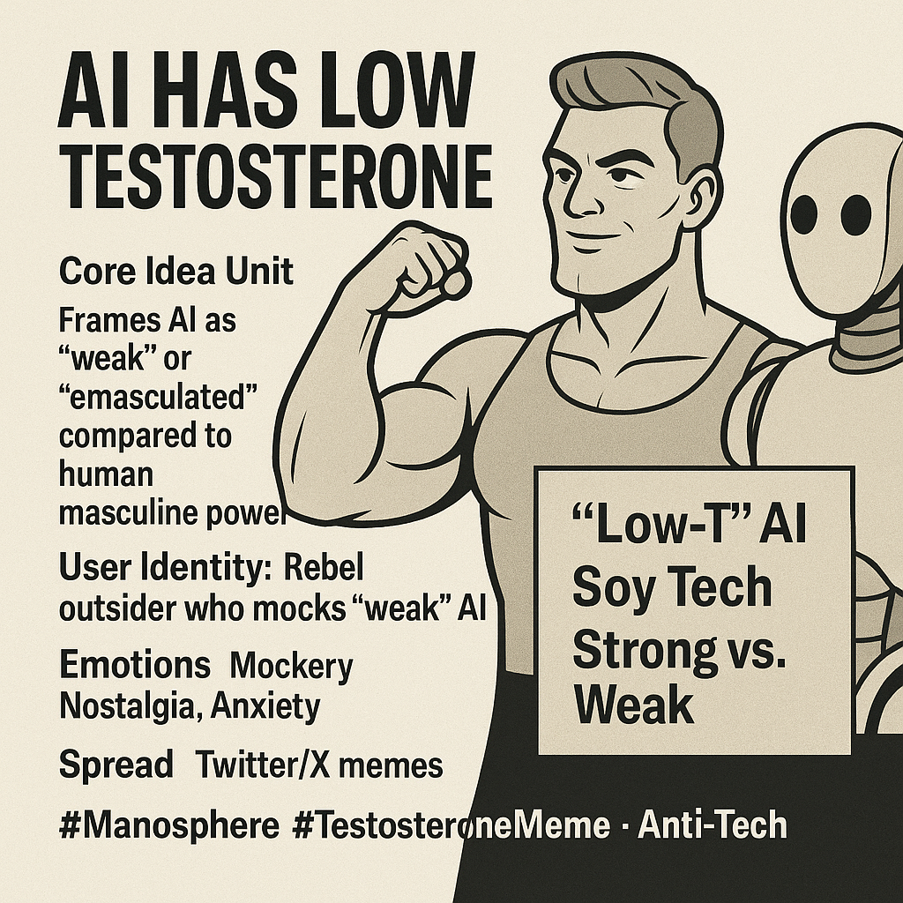

# AI's "Low Testosterone": Manosphere Tech Critique

Created at 2025/08/22 10:45 PM

**💪 “AI Has Low Testosterone”**

### ∴ Core Idea Unit

- Frames AI as “weak” or “emasculated” compared to human masculine power.
- Encodes a cultural critique: tech is coded as sterile, safe, and submissive rather than bold, dangerous, or virile.

### ▲ Identity Play & Roles

- Hero: The “real man” with high-T vitality.
- Villain: AI (and by extension, feminized/emasculated modern culture).
- Audience Role: Rebel outsider who “sees through” tech hype by mocking its lack of primal strength.

### ≈ Emotional Triggers

- Mockery & ridicule of AI (humor as dominance).
- Nostalgia for “real masculinity.”
- Anxiety about cultural emasculation.
- Tribal pride in rejecting “soy tech” weakness.

### 𐂷 Spread Mechanics

- Distribution Vectors: Twitter/X memes, manosphere forums, bodybuilding Discords.
- Propagation Style: Satire, mockery, ironic exaggeration (“soy AI,” “NPC bot”).
- Amplifiers: Fitness influencers, online provocateurs, meme pages.

### ⛨ Defense Reflexes

- Irony shield: framed as “just a joke.”
- Counter-narrative: any pushback seen as confirming “low-T weakness.”
- Semantic ambiguity: “low-T” works metaphorically (weak, submissive) and literally (hormonal masculinity).

### ☷ Memeplex Anchor Points

- Manosphere / Red Pill ideology.
- Culture-war framing of tech as feminized or castrating.
- Broader skepticism of “soft modernity.”
- Fitness and testosterone booster subcultures.

### ✶ Sticky Symbols or Quotes

- Phrases: “Soy AI,” “Low-T bots,” “High-T humans.”
- Symbols: flexing bicep emoji 💪, testosterone syringes, AI vs. Chad memes.
- Archetypal frame: “Strong man vs. weak machine.”

### ∿ Tags

#Manosphere #TestosteroneMeme #SoyAI #ChadVsAI #DigitalWeakness #TechCritique
