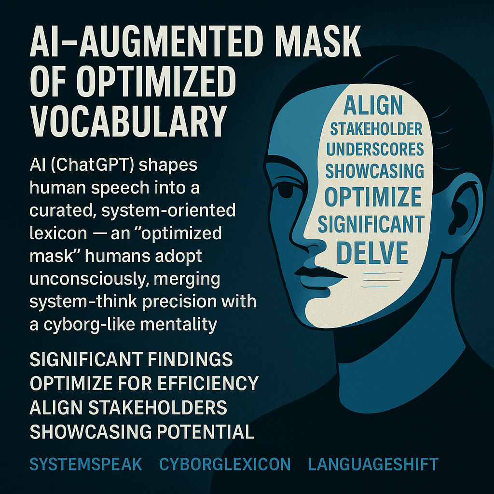

# AI's Optimized Mask: SystemSpeak Cyborg Lexicon

Created at 2025/09/01 4:01 PM

### ◈ Mini-Memetic Profile

### ∴ Core Idea Unit

AI (ChatGPT) shapes human speech into a curated, system-oriented lexicon—an “optimized mask” humans adopt unconsciously, merging system-think precision with a cyborg-like mentality.

### ▲ Identity Play & Roles

- **User as Cyborg-Orator**: Wearing the mask positions the speaker as precise, professional, and future-facing.
- Shifts identity from organic expressiveness → algorithmic efficiency.

### ≈ Emotional Triggers

- 🤯 Awe at language’s measurable transformation.
- 😬 Unease at homogenization and narrowing of expression.
- 🧠 Curiosity about how AI “teaches” humans to talk.

### 𐂷 Spread Mechanics

- **Vectors**: Tech podcasts, academic talks, LinkedIn posts, AI commentary feeds.
- **Style**: Professional polish, subtle mimicry of AI outputs, linguistic seep-in through repeated exposure.

### ⛨ Defense Reflexes

- **Irony shield**: Users joke about “corporate speak” while still using it.
- **Efficiency framing**: Defends itself by presenting AI-lexicon as *useful* and *precise*.
- **System legitimacy**: Critique bounces off because the terms appear neutral and rational.

### ☷ Memeplex Anchor Points

- ⚙️ Systems Thinking (alignment, optimization, stakeholders).
- 🤖 Cyborg Mentality (hybrid human-machine speech).
- 📚 Academic/Professional Discourse (credibility through system words).

### ✶ Sticky Symbols or Quotes

- “Significant findings”
- “Optimize for efficiency”
- “Align stakeholders”
- “Showcasing potential”
- Visual: A sleek half-mask made of shifting AI-generated words overlaying a human face.

### ∿ Tags

#SystemSpeak #CyborgLexicon · #LanguageShift
