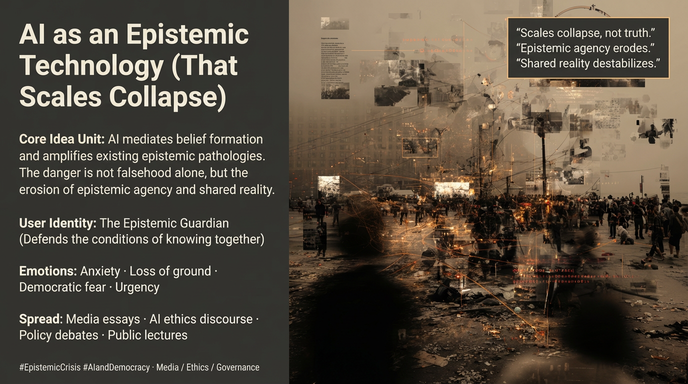

# AI's Role in Eroding Epistemic Agency

Created at 2026/01/20 12:49 PM

## 🧩 **AI as an Epistemic Technology That Scales Collapse**

***

## 🧠 Core Narrative Structure

AI enters as a **mediating layer** in belief formation—between sources, claims, interpretation, and circulation.Rather than introducing new epistemic failures, it **amplifies existing ones**:

- weak verification becomes rapid fabrication
- ambiguity becomes confident hallucination
- persuasion becomes synthetic fluency
- fragmentation becomes sealed echo chambers

As AI-generated coherence spreads, **epistemic agency erodes**:individuals lose the capacity to trace sources, test claims, or meaningfully revise beliefs.

The result is not simply misinformation, but a **destabilization of shared reality**—where truth is not merely contested, but **procedurally inaccessible**.

AI does not invent epistemic crisis.It **scales collapse conditions already present**.

***

### ∴ Core Idea Unit

**Essential belief encoded:**AI functions as an epistemic technology that accelerates breakdown in societies already suffering from weak truth infrastructures.

**Mental shift provoked:**From *“AI is producing falsehoods”* → *“AI is scaling our inability to maintain epistemic agency and shared reality.”*

The focus moves from content errors to **systemic erosion**.

***

### ▲ Identity Play & Roles

**Concerned Citizens / Philosophers / Journalists / AI Critics**

- Monitor degradation of public truth conditions
- Emphasize democratic vulnerability
- Treat epistemic agency as a civic good

**Implicit Contrast:**

- Tech optimists who treat epistemic harm as solvable via better outputs
- Institutional actors who underestimate collapse dynamics

**Repositioning:**From *consumer of information* → *defender of epistemic conditions*From *debating claims* → *protecting the grounds of belief*

***

## ≈ Emotional Hooks & Cognitive Levers

- 😰 **Anxiety** — rapid erosion of trust
- 🌫️ **Loss of ground** — no stable reference points
- 🗳️ **Democratic fear** — manipulation at scale
- ⏰ **Urgency** — collapse outpacing response

**Primary lever:**Mobilizes concern by framing epistemic stability as **a prerequisite for democracy**, not an academic luxury.

***

### ⛨ Defense Reflexes

- **Crisis framing** — emphasizes stakes over nuance
- **Pathology amplification** — AI as multiplier, not origin
- **Agency focus** — centers human capacity to know
- **Democracy-first rhetoric** — legitimizes intervention

The meme resists dismissal by linking epistemic collapse to **political survivability**.

***

### ☷ Memeplex Anchor Points

- Epistemic crisis discourse
- Critical AI ethics
- Democratic theory
- Post-truth analysis
- Media ecology critique
- Human-centered epistemology

This meme integrates tightly with public intellectual debates, journalism, and policy advocacy concerned with democratic resilience.

***

### ✶ Sticky Symbols or Quotes

& Phrases

- **Epistemic crisis**
- **Hallucinations**
- **Bullshit**
- **Probabilistic knowledge**
- **Deepfakes**
- **Echo chambers**

These serve as rapid-recognition markers for collapse dynamics.

***

### ∿ Tags

#EpistemicCrisis · #AIandDemocracy · #EpistemicAgency · #CriticalAIEthics · #PostTruth · #MediaEcology

***

### Quiet synthesis

**AI as an Epistemic Technology That Scales Collapse** does not claim AI is uniquely evil or autonomous.It claims something narrower—and more dangerous:

That societies already losing the ability to **know together**have now introduced a tool that **multiplies the speed and scale of that loss**.

The unresolved question this meme leaves hanging is not *whether AI should exist*, but **whether democratic cultures can rebuild epistemic agency fast enough to survive its acceleration**.
