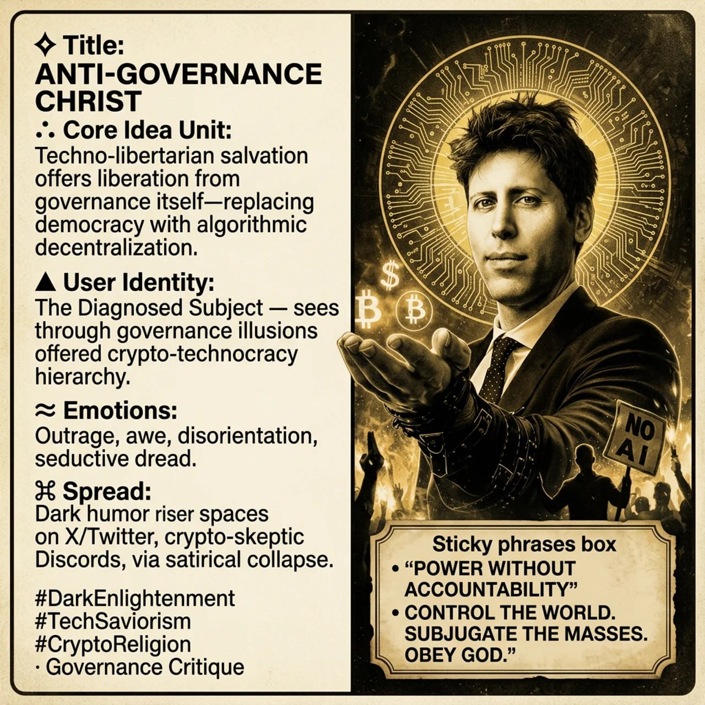

# Anti-Governance Christ

*Source: Sam (@samiamgeandham) on Substack — https://substack.com/@samiamgeandham/note/c-242591067*

Created at 2026/04/13 6:30 AM

***

### ∴ Core Idea Unit

Techno-libertarian salvation re-coded through religious iconography: a divine figure offers liberation from "governance" itself—bureaucracy, accountability, democratic process—replacing it with algorithmic decentralization (Bitcoin, crypto) and divine authority ("POWER WITHOUT ACCOUNTABILITY"). The bind on the wrist suggests this savior is himself caught, offering chains disguised as keys.

The image synthesizes three currents: the religious savior archetype (halo, promises of salvation), tech-libertarian economics (floating Bitcoin and dollar symbols), and post-democratic governance models (exit from accountability). The "NO AI" sign held by protestors in the flames below acknowledges the resistance while positioning it as the clueless masses.

***

### ▲ Identity Play & Roles

**The Diagnosed Subject** — The viewer is positioned as someone who sees through the illusion of conventional governance while simultaneously being offered a new hierarchy (crypto-technocracy) they might not recognize as such.

**The Resisting Believer** — Those holding "NO AI" signs in the flames below are simultaneously the masses being "saved" and the clueless resisters of the inevitable future.

**The Tech Seer** — Someone who recognizes that Bitcoin/crypto represents a new covenant, a technological answer to failed human institutions.

***

### ≈ Emotional Triggers

- 🤯 Disorientation — the halo is circuitry, the savior is business-suited, faith and finance merge
- 🔥 Outrage — at conventional governance corruption and failures
- 😱 Awe — religious apocalyptic framing promises transcendence
- 🎭 Seductive dread — the world burns below, but salvation floats above

***

### 𐂷 Spread Mechanics

**Distribution Vectors:** Dark humor/irony spaces on X/Twitter, crypto-skeptic Discord servers, tech criticism subreddits, meme accounts commenting on tech-libertarian ideology, Dark Enlightenment-adjacent spaces

**Propagation Style:** Satirical Collapse — uses the visual grammar of propaganda posters and religious iconography to critique the very narratives it mimics. Works because it could be sincere Dark Enlightenment content OR critical commentary. The ambiguity is the feature.

***

### ⛨ Defense Reflexes

- Counter-narrative preemption — The "NO AI" sign held by protestors neutralizes the critique that "this is just reactionary tech-fear"; it acknowledges resistance within the frame
- Irony shield — Ambiguous authorship (Sam on Substack as cultural critic vs. crypto-bro) makes it hard to pin down as pure critique OR endorsement
- Provocation-as-analysis — The shocking framing makes critique indistinguishable from promotion

***

### ☷ Memeplex Anchor Points

- Dark Enlightenment (Mencius Moldbug, Nick Land)
- Effective Altruism / Longtermism salvation narratives
- Bitcoin maximalism as religious phenomenon
- Tech-libertarianism's "exit" from governance
- Post-democratic techno-governance
- AI acceleration vs. deceleration debates
- Religious savior archetypes applied to technology

***

### ✶ Sticky Symbols or Quotes

- "HE PROMISES TO SAVE HUMANITY... BUT AT WHAT COST?"
- "ANTI-GOVERNANCE CHRIST"
- "POWER WITHOUT ACCOUNTABILITY"
- "CONTROL THE WORLD. SUBJUGATE THE MASSES. OBEY GOD."
- ₿ ₿ $ (Bitcoin and dollar signs floating above bound palm)
- Circuit-pattern digital halo
- Bound wrist paradox

***

### ∿ Tags

#DarkEnlightenment · #TechSaviorism · #CryptoReligion · #GovernanceCritique · #Accelerationism · #NoAIResistance · #PostDemocracy · #TechnoCrucifixion
