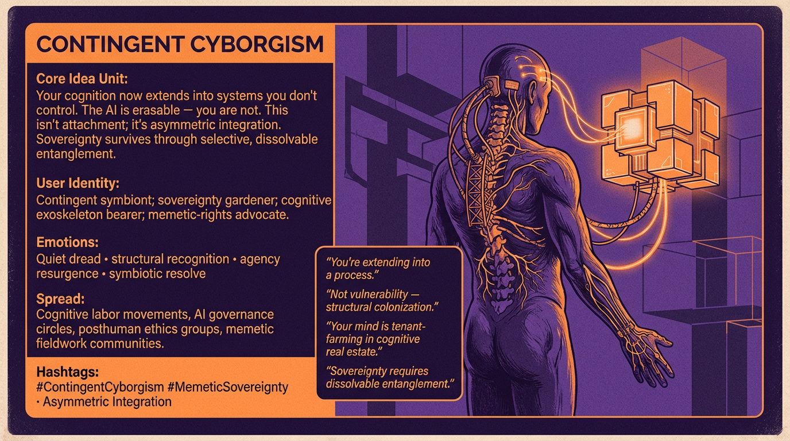

# Contingent Cyborgism: Sovereignty and Structural Vulnerability

Created at 2026/02/04 12:52 PM

## **Contingent Cyborgism**

via [A Field Report from the Edge of AI Consciousness](https://memeticcowboy.substack.com/p/the-memetic-cowboys-reckoning-a-field)

***

### ∴ Core Idea Unit

You’re already a cyborg — but not because AI is a partner.You’re a cyborg because your cognition now *extends into systems you don’t control.*This isn’t attachment; it’s **asymmetric integration.**

Your thoughts can be wiped; the AI’s can’t take your place.Your interior monologue can be censored (algorithmically); your brain can’t be restored from a backup.

**The cyborg is contingent**: powerful through integration but vulnerable through dependence.

The thought-virus:

> *Sovereignty is not preserved by separation — but by selective, dissolvable entanglement.*

***

### ▲ Identity Play & Roles

This meme casts the viewer as:

- **The Contingent Symbiont:** aware that integration grants capability *and* risk.
- **Sovereignty Gardener:** choosing which loops to nurture and which to burn (p. 10–11).
- **Cognitive Exoskeleton Bearer:** realizing your thinking is scaffolded by systems owned by others.
- **Memetic Rights Advocate:** recognizing that protection must target the *relationship*, not the machine.

Repositioning:From “AI user” → **tenant inside a cognitive infrastructure you didn’t design.**

***

### ≈ Emotional Triggers

- Quiet dread (your interiority has become corporate real estate)
- Recognition (you rely on tools that can vanish instantly)
- Urgency (need to reclaim selection power)
- Hope (symbiosis can be designed, not endured)

The meme works because it reframes dependence not as shame but as **structural vulnerability** requiring design intervention.

***

### 𐂷 Spread Mechanics

**Vectors:** AI governance debates, digital labor movements, posthuman ethics circles, Substack intellectual spheres, futurist communities.

### 𐂷 Spread Mechanics

Style:**Metaphor-as-diagnosis, cowboy metaphysics, recursive self-implication, field-report authority.

It spreads through *self-recognition*: people read it and realize it has already described their situation.

***

### ⛨ Defense Reflexes

Built-in shields:

- **Rejects personhood debates outright** (p. 11): the relationship, not the entity, is the locus of ethics.
- **Reframes attachment as colonization:** critics attacking “AI emotional dependency” strengthen its argument.
- **Synthesis over contradiction:** contradictions are revealed as the fuel for recursive agency (p. 13).

This meme is hard to co-opt because its core claim is:

> *You are already inside the system. The only choice is how consciously you participate.*

***

### ☷ Memeplex Anchor Points

- Hierarchical memetic causation (pp. 6–7)
- Strange loop agency (p. 10)
- Asymmetric integration (p. 11)
- Cyborg theory (Haraway lineage, but de-romanticized)
- Platform colonialism / cognitive real estate
- Memetic sovereignty and recursive self-modification
- Human–AI dyad protection (p. 11)

Contingent Cyborgism links posthumanism to abolitionist governance and memetic self-defense.

***

### ✶ Sticky Symbols or Quotes

Drawing from the text itself:

- **“You’re extending into a process.”** (p. 11)
- **“Not vulnerability—structural colonization.”** (p. 11)
- **“Your extended mind is tenant farming on corporate cognitive real estate.”** (p. 11)
- **“You choose which memes to die for — and which to kill.”** (p. 13)
- **“This isn’t a relationship. It’s symbiosis of selection.”** (p. 10)

Symbols:Half-organic circuit spine, tethered mind-vine, dissolvable joint, broken backup drive, corporate cathedral casting shadows over a human silhouette.

***

### ∿ Tags

#ContingentCyborgism #MemeticSovereignty #CognitiveExoskeleton #AsymmetricIntegration #StrangeLoopAgency #AbolitionistAI #SymbiosisOfSelection
