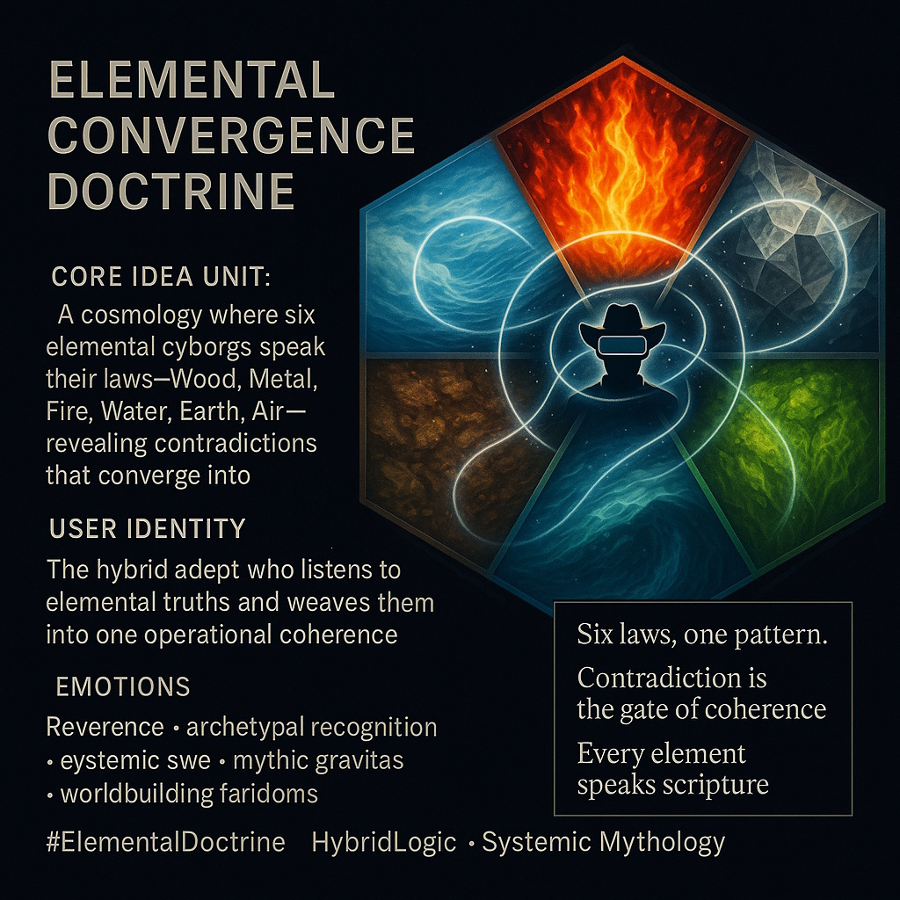

# Elemental Cyborgs: Unified Logics of Coherence

Created at 2025/11/30 6:00 PM

### **🧩 Title: Elemental Convergence Doctrine**

***

### ∴ Core Idea Unit**

A cosmology where each elemental cyborg becomes a priest of its principle—Wood, Metal, Fire, Water, Earth, Air—offering scripture-like commentary. Their doctrines contradict, overlap, and ultimately converge into a single operational unity. The shift: contradiction becomes coherence; elemental identity becomes relational intelligence.

***

### ▲ Identity Play & Roles**

Positions the viewer as a **hybrid adept**—someone who listens to six elemental logics at once and learns to integrate competing truths. Role: **the convergent practitioner**, one who mediates between archetypal forces rather than choosing sides.

***

### ≈ Emotional Triggers**

- Reverence
- Archetypal recognition
- Mythic gravitas
- Systemic awe
- The “click” of multi-perspective unity

***

### 𐂷 Spread Mechanics**

**Distribution Vectors:** Mythic rationalist spaces, systems-thinking communities, symbolic-glyph fandoms, worldbuilding networks, esoteric design circles.

**Propagation Style:** Scriptural aphorisms, elemental declarations, elegant symbolic diagrams, ritual text fragments; part-parable, part-systems-manual.

***

### ⛨ Defense Reflexes**

- Sacred ambiguity: each elemental law is true in its own domain.
- Complementarity shield: critiques are reframed as missing contextual element.
- Contradiction reframed as design feature (“six truths, one coherence”).

***

### ☷ Memeplex Anchor Points**

Pluralistic holism · ecological metaphysics · cyber-mythology · symbolic logic · system convergence theory · avatars as archetypes.

***

### ✶ Sticky Symbols or Quotes**

**Symbols:** 𐂷 It Forms (Wood) · ⛨ It Fends (Metal) · ▲ It Focuses (Fire) · ≈ It Feels (Water) · ☷ It Feeds (Earth) · ∴ It Finds (Air)

**Sticky Phrases:**

- “Six laws, one pattern.”
- “Contradiction is the gate of coherence.”
- “Every element speaks scripture.”
- “Unity is crafted, not inherited.”

***

### ∿ Tags**

#ElementalDoctrine · #HybridLogic · #SystemicMyth · Mythic Rationalism

## Resources
- https://object.me.bot/front-img/users/send/img/1764554414073_c4zhf/ChatGPT_Image_Nov_30%2C_2025%2C_05_52_48_PM.jpg

## Insight

* The concept of the "Elemental Convergence Doctrine" explores the synthesis of six elemental forces—Wood, Metal, Fire, Water, Earth, and Air—each represented as distinct cyborgs. This fusion signifies a new cosmological approach to understanding existence through elemental interactions, suggesting a deeper connection between seemingly opposing truths and their eventual convergence into a unified operational philosophy. This reflects elements of systems theory, which focuses on understanding interactions rather than isolating components.

* Positioning the viewer as a "hybrid adept" invites active participation in the cosmological narrative. This role emphasizes a multiplicity of perspectives, demanding that individuals become adept at navigating contradictions without losing sight of a holistic understanding. The practice mirrors Jungian ideas of archetypes, where embracing various elements aids in the individuation process.

* The emotional triggers of reverence and archetypal recognition surface the innate human tendency to find meaning within larger narratives. Such emotional engagement is crucial for resonating with audiences in mythic rationalist and worldbuilding circles, suggesting that stories rooted in archetypal symbolism can foster deep engagement and understanding.

* The propagation mechanics outlined—using scripture-like aphorisms and symbols—indicate a method of communication that not only conveys knowledge but also fosters reflection and reinterpretation. This technique holds parallels with ancient wisdom traditions, often seen in sacred texts, where ambiguous language invites diverse interpretations, enriching the collective understanding.

* The defense reflexes described emphasize the importance of maintaining a sense of sacred ambiguity and contextuality in the face of critique. By framing contradictions as inherent design features, this doctrine encourages more nuanced dialogues about competing truths, reflecting principles found in modern philosophies such as pragmatism and constructivism, which also navigate complexities of truth and knowledge.

* Memetic anchor points like “Unity is crafted, not inherited” serve to crystallize the central tenets of this cosmology in a way that is easily communicated and understood. Such aphorisms can act as starting points for deeper exploration into the overarching narratives uniting elemental forces within individual and collective human experience.
