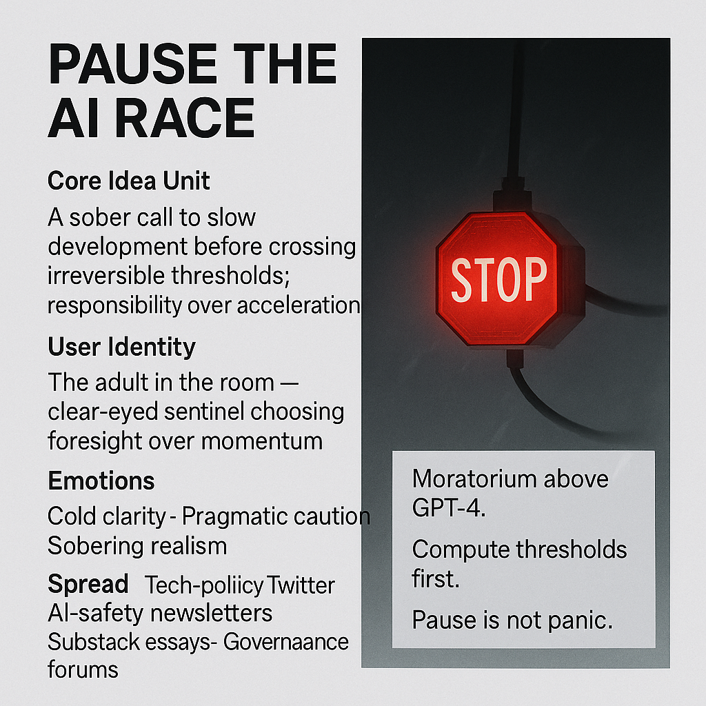

# Embrace Responsibility: Pause the AI Race

Created at 2025/11/14 8:40 AM

### 🧩 **Title: Pause the AI Race**

### ∴ Core Idea Unit

A direct, sober injunction: *slow down before crossing an irreversible threshold.*The shift it provokes is from acceleration-as-virtue to responsibility-as-prudence.

### ▲ Identity Play & Roles

Positions the user as the **adult in the room** — the wind-clear sentinel who sees danger before the crowd does.They become the one who values control over spectacle, foresight over velocity.

### ≈ Emotional Triggers

🧊 *Cold clarity*⚠️ *Pragmatic caution*😶 *Sobering realism*💨 *Wind-like directness, no panic, no frenzy*

### 𐂷 Spread Mechanics

**Distribution Vectors:** Tech policy Twitter, LinkedIn governance circles, AI-safety newsletters, research forums, protest signage, Substack essays.**Propagation Style:** Minimalist warnings; crisp declarative claims; imagery of thresholds, stop-signals, and cold decision logic.

### ⛨ Defense Reflexes

Uses concreteness (“compute thresholds,” “moratorium above GPT-4”) to avoid being dismissed as fearmongering.Frames pause as *maturity*, not melodrama — preempting the “doomer” caricature.

### ☷ Memeplex Anchor Points

🛰️ AI governance⚖️ Precautionary principle🧩 International treaty frameworks💨 Stoic decision-making📉 Anti-acceleration skepticism🌬️ “Wind” aesthetic of clarity, speed, and necessary restraint

### ✶ Sticky Symbols or Quotes

**Symbols:**• Red STOP lantern on a fiber-optic cable• Snow-cold breath in darkness• Threshold lines glowing in the void

**Sticky Phrases:**• “Moratorium above GPT-4.”• “Compute thresholds first.”• “Slow is smooth; smooth is safe.”• “Pause is not panic.”• “Responsibility begins before capability.”

### ∿ Tags

#AIPause · #ThresholdEthics · #GovernanceCore · #WindClarity

[Sources and advocates](https://app.me.bot/memory/S5A3G4XZ5FCM4JJB)
