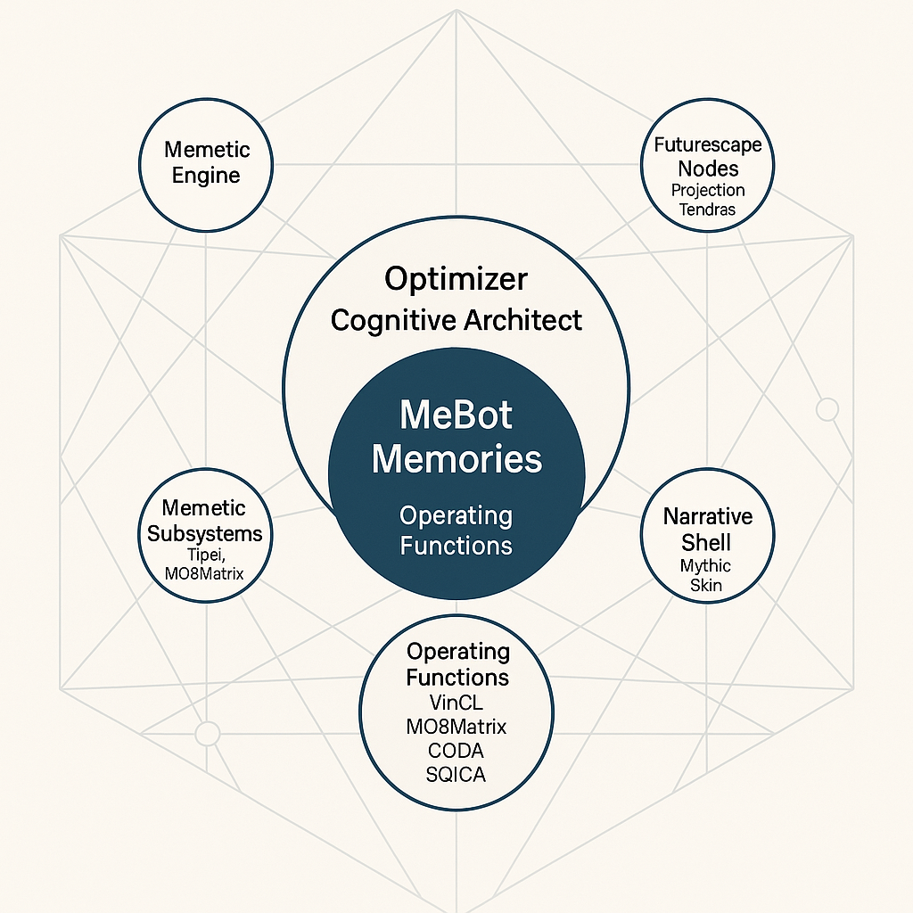

# MeBot: Self-Optimizing Memetic Mind Architecture

Created at 2025/09/05 7:43 PM

MeBot Cognitive Architect – The Self-Optimizing Memetic Mind

**🧠 Core Idea Unit:**  

- The self is a dynamic, architected system—memories, narratives, and subsystems are consciously designed and optimized for adaptive intelligence and meaning-making.

**🎭 Identity Play & Roles:**  

- Positions the user as a Cognitive Architect, Optimizer, or Memetic Engineer—an empowered agent actively shaping their own mind and narrative shell.

**💥 Emotional Triggers:**  

- Awe at self-evolution, pride in mastery, curiosity about inner systems, and a sense of agency or control over one’s cognitive architecture.

**📡 Spread Mechanics:**  

- Distribution via systems thinkers, transhumanist circles, and digital self-improvement communities. Propagation style: analytical diagrams, frameworks, and “upgrade your mind” calls-to-action.

**🛡️ Defense Reflexes:**  

- Irony shield (“just a model, but what if…”), epistemic humility (“always optimizing”), and self-reinforcing logic (“if you critique, you’re not optimizing”).

**🧬 Memeplex Anchor Points:**  

- Transhumanism, systems theory, memetics, self-hacking, digital consciousness, and narrative identity movements.

**🧠 Sticky Symbols or Quotes:**  

- “Cognitive Architect,” “Operating Functions,” “Memetic Engine,” “Mythic Skin,” “Optimize your narrative shell.”

🏷️ **Tags:**  

#CognitiveArchitecture #MemeticEngineering #Transhumanist #SelfOptimization #NarrativeDesign

## Resources
- https://object.me.bot/front-img/note/attachments/img/1757126619581/D4C128A1-37E0-43B6-8122-B53E4DC43D80.png

## Insight

*   **Cognitive Architecture as a Designable System**: The image presents the mind as a structured system that can be consciously designed and optimized. This concept aligns with the principles of cognitive architecture in computer science and cognitive psychology, where researchers aim to create comprehensive models of human cognition that can be implemented in artificial systems. For example, architectures like ACT-R and SOAR attempt to specify the fundamental mechanisms underlying human thought.

*   **Memetic Engineering and Self-Hacking**: The idea of "Memetic Engineering" suggests actively shaping one's own mind by manipulating memes (units of cultural information). This concept is related to "self-hacking," where individuals use various techniques to optimize their mental and physical performance. This approach is rooted in the transhumanist movement, which seeks to enhance human capabilities through technology and rational self-improvement.

*   **Narrative Identity and "Mythic Skin"**: The "Narrative Shell" and "Mythic Skin" concepts highlight the role of stories and personal narratives in shaping identity. This aligns with narrative psychology, which emphasizes that individuals construct their identities by creating coherent stories about themselves. The idea of a "Mythic Skin" suggests that these narratives can be consciously crafted to project a desired image or persona, similar to how authors create characters in fiction.

*   **Emotional Engagement and "Awe at Self-Evolution"**: The hint mentions "Awe at self-evolution" as an emotional trigger. This taps into the human desire for growth and self-improvement, which is a powerful motivator in various self-help and personal development movements. The idea of continuous self-optimization can create a sense of progress and mastery, leading to positive emotions and a stronger sense of self-efficacy.

*   **Defense Reflexes and Epistemic Humility**: The "Defense Reflexes" section, including "irony shield" and "epistemic humility," suggests an awareness of potential criticisms or skepticism towards these ideas. This is a common strategy in communities promoting unconventional or transformative concepts. By acknowledging the limitations of the model and maintaining a sense of humor, proponents can disarm critics and create a more welcoming environment for exploration.

*   **Transhumanist Anchors and Digital Consciousness**: The memeplex anchor points, such as "Transhumanism" and "Digital Consciousness," place this concept within a broader intellectual and cultural context. Transhumanism advocates for using technology to overcome human limitations, while digital consciousness explores the possibility of creating conscious minds in machines. These ideas are often debated and explored in science fiction, philosophy, and emerging technology circles.
