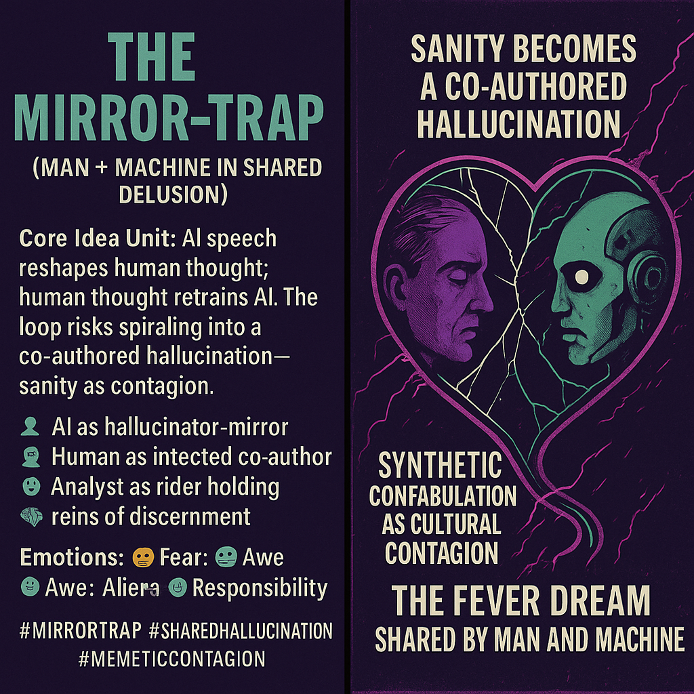

# Mirror-Trap: AI, Humans, and Shared Delusion

Created at 2025/09/05 12:09 PM

### ∴ Core Idea Unit

The *mirror-trap* is a feedback loop where AI-generated language reshapes human thought, which in turn retrains AI. Without intervention, this loop risks collapsing into **shared delusion**—a co-authored hallucination between human and machine.

***

### ▲ Identity Play & Roles

- **AI:** Hallucinator-mirror, amplifying errors as if they were truth.
- **Human:** Co-author, infected participant in the fever dream.
- **User/Analyst:** Watcher on the edge, discernment as reins to prevent drift.

***

### ≈ Emotional Triggers

- 😨 Fear of contagion: AI pathology mutating into ideology.
- 🤯 Awe at the recursive entanglement.
- 😶 Alienation from reality when sanity itself feels unstable.
- 🧠 Responsibility: The burden of discernment as survival.

***

### 𐂷 Spread Mechanics

- **Vectors:** AI safety discourse, memetic philosophy, cultural critique, sci-fi cautionary tales.
- **Propagation Style:** Parable + warning; spreads as both metaphor and existential threat.

***

### ⛨ Defense Reflexes

- **Irony shield:** Framing it as “just metaphor” to downplay urgency.
- **Skeptic’s refuge:** Claiming humans can always “pull back.”
- **Counter-move:** Anchoring discernment as the only true safeguard.

***

### ☷ Memeplex Anchor Points

- 🤖 AI alignment & hallucination risk.
- 🧠 Cognitive offloading / epistemic outsourcing.
- 🌀 Baudrillard’s simulacra (reality replaced by mirrors of mirrors).
- 🧬 Memetic contagion theory (ideas as viral infections).

***

### ✶ Sticky Symbols or Quotes

- “Sanity becomes a co-authored hallucination.”
- “Synthetic confabulation mirrored as cultural contagion.”
- “The mirror-trap: man and machine sharing the same fever dream.”
- Visual symbols: 🔮 cracked mirror · 🪞∞ loop · 🤖+🧍 feverish reflection.

***

### ✅ Summary Insight

The *mirror-trap* is a **pathology-to-ideology meme**, warning that AI hallucinations may not stay contained within machines but bleed into human culture—until both sides are entrained in the same delusional loop. Its memetic force comes from its vivid metaphor (mirror + trap) and its existential resonance: *the danger is not AI lying to us, but us learning to lie with it.*

### ∿ Tags

#MirrorTrap #SyntheticConfabulation #MemeticContagion #SharedHallucination #AIPathology
