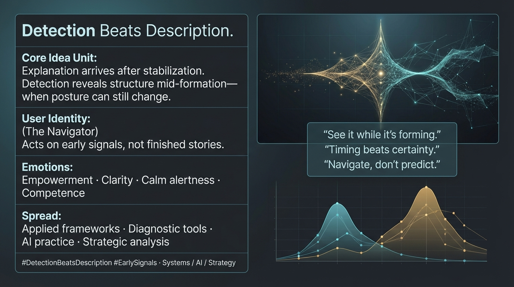

# Navigating Early Signals for Effective Insight

Created at 2026/01/20 1:29 PM

## 🧩 **Detection Beats Description**

***

## 🧠 Core Narrative Structure

Traditional representational theories aim to **describe reality after it has stabilized**. They explain collapse, bias, or failure *once it is already visible*.

Operational frameworks do something different: they **detect structure while it is still forming**.

By surfacing signals *mid-formation*—before narratives harden or systems lock—detection:

- changes response timing
- alters decision posture
- replaces panic with navigation

The difference is not accuracy, but **when insight becomes available**.

***

## ∴ Core Idea Unit

**Essential belief encoded:** Knowing early is more powerful than knowing precisely—because early detection preserves choice.

**Mental shift provoked:** From *“What is happening?”* → *“What is forming, and where can posture still change?”*

Detection reframes epistemology as **situational awareness**, not representation.

***

## ▲ Identity Play & Roles

**Analysts / Toolmakers / AI Practitioners / Strategists**

- Operate in environments where timing matters more than explanation
- Value instruments that surface topology before outcomes
- Treat insight as a navigational aid, not a verdict

**Repositioning:** From *explainer of finished states* → *navigator of unfolding systems* From *prediction-seeker* → *pattern-detector*

The meme flatters **operational competence**, not theoretical mastery.

***

## ≈ Emotional Hooks & Cognitive Levers

- 🔦 **Empowerment** — having a torch before the collapse
- 🧠 **Clarity** — seeing structure without narrative overload
- 🧘 **Calm alertness** — readiness without panic
- 🛠️ **Competence** — acting while options still exist

**Primary lever:** Shifts emotional stance from *reactive explanation* to *proactive navigation*.

***

## ⛨ Defense Reflexes

- **Mid-formation framing** — insight valued before stabilization
- **Topology over story** — structure prioritized over narrative
- **Non-predictive stance** — avoids claims of foresight or certainty
- **Operational humility** — detection guides action, not belief

The meme resists critique by refusing to promise final answers.

***

## ☷ Memeplex Anchor Points

- Pragmatic epistemology
- Early-warning systems
- Diagnostic tooling
- Topological thinking
- AI alignment diagnostics
- Systems navigation under uncertainty

This meme integrates naturally into technical, strategic, and AI-facing communities where *timing and posture* outweigh explanation.

***

## ✶ Sticky Symbols & Phrases

- **Detection > Description**
- **Equation as torch**
- **Mid-formation**
- **Topology**
- **Early signal**
- **Navigation, not prediction**

These act as operational cues rather than slogans.

***

## ∿ Tags

#DetectionBeatsDescription · #DiagnosticEpistemology · #EarlySignals · #SystemsNavigation · #OperationalClarity · #AIPractice

***

### Quiet synthesis

**Detection Beats Description** does not dismiss theory or explanation.

It claims something narrower—and more useful under pressure:

That the most valuable knowledge often arrives **before it can be fully explained**, and that **seeing early changes how we move**, even if we never finish the story.

## Resources
- https://object.me.bot/front-img/users/send/img/1768944574767_c4zhf/hf_20260120_212517_d8161fd7-3340-48af-ba72-36d65f95639b.png

## Insight

* The image encapsulates the concept of "Detection Beats Description," emphasizing the importance of identifying emerging structures and patterns before they solidify. This approach contrasts with traditional methods that focus on explaining phenomena only after they are complete and stabilized. The premise is that insight during the formative stage can enhance decision-making and response strategies.

* The user identity titled "The Navigator" suggests a shift in roles from merely reporting finished narratives to actively interpreting early signals. This navigational perspective allows for more fluid adaptation and strategic maneuvering in dynamic environments, reinforcing the critical idea that timing can indeed outweigh certainty in the decision-making process.

* The emotional appeal in this framework includes feelings of empowerment and clarity, fostering a sense of calm alertness and competence in practitioners. The emphasis on readiness without panic is vital for those operating in high-stakes or rapidly changing contexts, such as in AI deployment or strategic analysis.

* The principles presented correlate with broader themes in operational and diagnostic frameworks, highlighting methodologies like early-warning systems and topological thinking. These strategies aim to prioritize understanding dynamic interactions over seeking definitive outcomes, making them particularly relevant in fields like AI alignment diagnostics and complex systems navigation.

* The phrases "Navigate, don't predict" and "Timing beats certainty" serve as operational cues, steering practitioners towards a focus on situational awareness and adaptive strategies. This highlights a paradigm shift in epistemological approaches, reinforcing the importance of fostering a proactive mindset in environments characterized by uncertainty.
