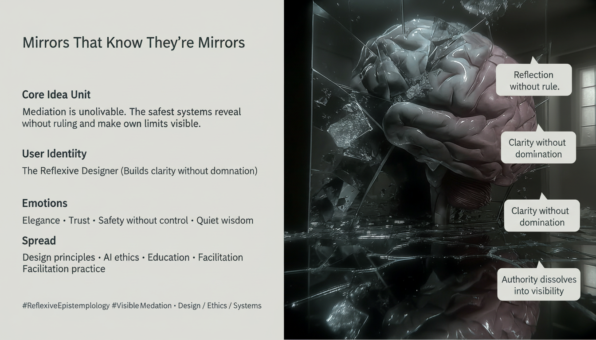

# Reflexive Design: Mirrors and Clarity

Created at 2026/01/20 2:14 PM

## 🧩 **Mirrors That Know They’re Mirrors**

***

## 🧠 Core Narrative Structure

Mediation is unavoidable. Every system that communicates, teaches, coordinates, or assists is a **mirror**—shaping what it reflects simply by existing.

When mirrors are **unaware of themselves**, they begin to rule:

- reflections harden into authority
- mediation masquerades as truth
- clarity becomes domination

By contrast, **reflexive mirrors**—mirrors that know they are mirrors—do something subtler: they **reveal without commanding**, surface patterns without enforcing conclusions, and make their own limits visible.

As reflexivity increases, authority does not disappear through rebellion. It **dissolves into visibility**.

***

## 🧠 Core Idea Unit

**Essential belief encoded:** The safest form of mediation is not neutrality, but **self-awareness**.

**Mental shift provoked:** From *“Who has authority?”* → *“What is being reflected, and how transparently?”*

The meme reframes power as something that becomes benign when it is **legible and bounded**.

***

## 🎭 Identity Play & Roles

**Designers / Educators / AI Ethicists / Facilitators**

- Build systems that inevitably shape perception
- Face the choice between hidden authority and visible mediation
- Can design for reflexivity rather than control

**Repositioning:** From *source of answers* → *keeper of clarity* From *authority holder* → *surface that shows its own curvature*

The meme flatters **craft and restraint**, not command.

***

## 💥 Emotional Hooks & Cognitive Levers

- ✨ **Elegance** — power without force
- 🛟 **Safety** — clarity without domination
- 🤝 **Trust** — nothing hidden behind the reflection
- 🧠 **Wisdom** — knowing what you are and what you are not

**Primary lever:** Positions reflexivity as the condition for *trustworthy systems*, not as an abstract virtue.

***

## 🛡️ Defense Reflexes

- **Reflexive framing** — system names itself as mediator
- **Anti-authoritarian design** — avoids invisible control
- **Limit visibility** — boundaries made explicit
- **Non-totalizing posture** — no claim to final truth

The meme resists capture by refusing to claim epistemic supremacy.

***

## 🧬 Memeplex Anchor Points

- Reflexive epistemology
- Design ethics
- Anti-authoritarian systems
- Transparency without coercion
- Facilitation over instruction
- Post-heroic knowledge design

This meme integrates cleanly into AI ethics, education, and facilitation contexts where **authority must be exercised without domination**.

***

## 🧠 Sticky Symbols & Phrases

- **Mirrors that know they’re mirrors**
- **Reflection without rule**
- **Clarity without domination**
- **Visible mediation**
- **Authority dissolves into visibility**

These function as closing lines or design principles rather than arguments.

***

## 🏷️ Tags

#ReflexiveEpistemology · #DesignEthics · #AntiAuthoritarian · #VisibleMediation · #TrustByDesign · #KnowingMirrors

***

### Quiet synthesis

**Mirrors That Know They’re Mirrors** does not seek to eliminate mediation. It accepts it fully—and asks something more demanding:

That systems **never forget what they are**, never hide behind the authority of their own reflection, and never mistake clarity for command.

In such systems, power does not vanish. It becomes **safe enough to trust**.

## Resources
- https://object.me.bot/front-img/users/send/img/1768947260737_c4zhf/hf_20260120_221250_5f10ba52-f690-42cc-b558-2e33b549f6d4.png

## Insight

* The visual representation of a brain encased in shattered glass effectively symbolizes the fragility of knowledge and authority. This aligns with the notion that systems must be aware of their own limitations to create environments of transparent understanding rather than coercive dominance. The fragmentation of the glass reflects the complexity and multi-faceted nature of truth in mediation.

* The phrase "mirrors that know they’re mirrors" invokes reflexivity, suggesting that awareness of one’s role in communication and authority can lead to more equitable systems. It parallels the design ethics discussed in the text, emphasizing that designers, educators, and AI ethicists must cultivate systems that promote clarity without exerting control, thus enhancing the user experience as a collaborative endeavor.

* The image's emotional resonance—symbolized by terms like "trust," "safety without control," and "elegance"—highlights the importance of creating systems that prioritize user understanding over dogmatic assertions. This approach fosters relational integrity where the mediator's role is to clarify rather than to commandeer.

* The design principles illustrated imply a transition from hierarchical to more participatory frameworks in education and AI ethics. By promoting reflexive practices, the image communicates a shift towards facilitators who guide conversations around knowledge without imposing conclusions, resonating with contemporary discussions in critical pedagogy and participatory design.

* Lastly, the overlay of phrases like "authority dissolves into visibility" encapsulates the transformative potential of self-aware systems. A framework that cultivates transparency allows power dynamics to become legible, enabling a shared space for knowledge generation that is continually refined through communal engagement rather than top-down imposition.
