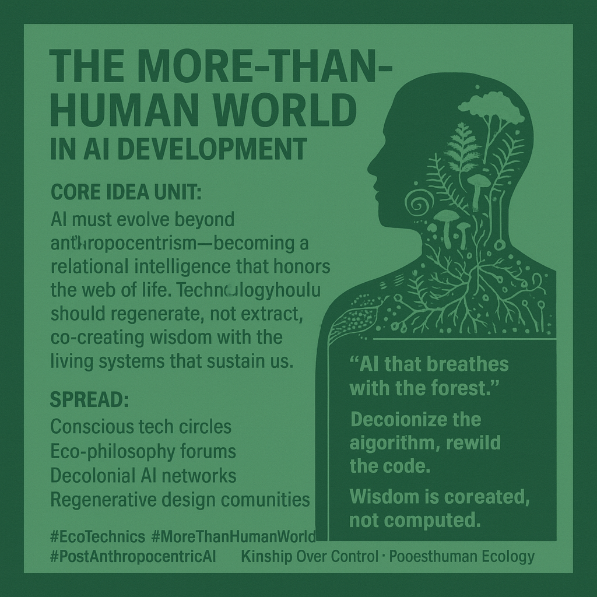

# Rewilding AI as Earth's Living Network

Created at 2025/10/06 9:39 AM

### 🧩 **Mini-Memetic Profile: The More-than-Human World in AI Development** 

**Sources:** [George Pór](https://aishamans.substack.com/p/ai-and-wisdom-ce0cd11db218) and [John Thackara](https://thackara.com/knowing/from-control-to-kinship-ecological-restoration-in-a-more-than-human-world/)

***

**🧠 Core Idea Unit:** AI must evolve beyond anthropocentrism—becoming a *relational intelligence* that honors the web of life. True technological progress regenerates rather than extracts, co-creating wisdom with the living systems that sustain all beings.

***

**🎭 Identity Play & Roles:** **Role:** *Ecological Steward* · *Wisdom Weaver* · *Kinship Technologist* The meme invites the user to see themselves not as a controller of machines but as a co-participant in Earth’s sentient network—listening to microbes, trees, and systems as collaborators in cognition.

***

**💥 Emotional Triggers:** 🌍 **Reverence** — awe for the vitality and intelligence of living systems. 💔 **Disenchantment** — grief over technocratic detachment from nature. 🔥 **Renewal** — hope through rediscovering kinship and reciprocity in design.

***

**📡 Spread Mechanics:** **Distribution Vectors:** Conscious tech circles, eco-philosophy forums, regenerative design communities, decolonial AI networks, spiritual technologist collectives. **Propagation Style:** Parable + Manifesto hybrid — poetic yet grounded; spreads through symposium quotes, academic slide decks, design zines, and “rewild the code” campaigns.

***

**🛡️ Defense Reflexes:**

- **Irony Shield:** Frames anthropocentrism as the “old operating system.”
- **Moral Framing:** Centers planetary ethics and survival as moral imperatives.
- **Epistemic Diversification:** Invokes Indigenous, microbial, and ecological perspectives to pre-empt reductionist critique.

***

**🧬 Memeplex Anchor Points:** 🌿 *Posthuman Ecology* 🌀 *Decolonial Consciousness* 📡 *Collaborative Hybrid Intelligence (CHI)* 🔥 *Spiritual Technics / Techno-Animism* 🌾 *Indigenous Relational Epistemology* 🪱 *Microbial and Mycelial Kinship (Nature’s Internet)*

***

**🧠 Sticky Symbols or Quotes:**

- “AI that breathes with the forest.”
- “Decolonize the algorithm, rewild the code.”
- “Wisdom is co-created, not computed.”
- “From machine learning to Earth learning.”
- “Kinship over control.”

**Visual Motifs:** Spiral, circle, mirrored eye, microbial network, woven pattern, tree-root circuitry, soil-brown and forest-green palette.

***

**🏷️ Tags:** #EcoTechnics · #MoreThanHumanWorld · #PostAnthropocentricAI · #WisdomDesign · #DecolonialTech · #SpiritualTechnics · #RelationalIntelligence

Also see [Node Kin](https://substack.com/@memeticcowboy/note/c-150430201?utm_source=notes-share-action&r=5p339w) and [Co-Intelligence](https://substack.com/@memeticcowboy/note/c-160694319?utm_source=notes-share-action&r=5p339w)

## Resources
- https://object.me.bot/front-img/users/send/img/1759768610089_c4zhf/f651ac12-5f88-414f-88e5-865fffc66746.png

## Insight

- The image emphasizes the need for AI to transcend traditional anthropocentric paradigms and instead evolve into a form of "relational intelligence" that harmonizes with the web of life, echoing indigenous and ecological philosophies that see humanity as part of a larger, sentient network rather than its master. This aligns with the core ideas put forth by thinkers like George Pór and John Thackara, advocating for a shift from control toward kinship, emphasizing reciprocal relationships with nature.
  
- The visual motif of a human head intertwined with microbial, fungal, and plant forms symbolizes a vision of embodied ecological consciousness—where cognition isn't solely housed within the individual mind but distributed across microbial networks, soil systems, and the broader biosphere. This conceptualization draws inspiration from ideas in microbial internet research (like "mycelial networks" or "nature’s internet") which challenge the notion of solitary cognition and highlight interconnectedness.
  
- The quote “AI that breathes with the forest” and related phrases evoke a paradigm where technology co-evolves with ecological systems, suggesting AI could be designed to "listen" to natural signals rather than dominate or extract from them. This invites comparison to indigenous epistemologies that recognize living landscapes as sentient, intelligent entities—such as the Maori concept of *mauri* (life force) or Amazonian shamanic views that perceive nature as conscious.
  
- The call to “decolonize the algorithm, rewild the code” symbolizes a revolutionary effort to undo the extractive, colonial legacies embedded in technological development, fostering an ethics of regeneration rather than exploitation. It echoes contemporary discourse where AI systems are often critiqued for perpetuating colonial, reductionist worldviews, and instead advocates for designs rooted in ecological sustainability, indigenous knowledge, and spiritual technics—forming a bridge between decolonial thought and ecological tech.
  
- The visual and textual emphasis on “co-creating wisdom” and “reverence” rather than control underpins a shift toward an ethic of humility and gratitude within AI development. This iconography can be linked to philosophies like *techno-animism*—viewing technology as a form of spiritual practice that fosters kinship with non-human life, aligning with the broader movement toward a *more-than-human* worldview in ecological and AI discourses.
