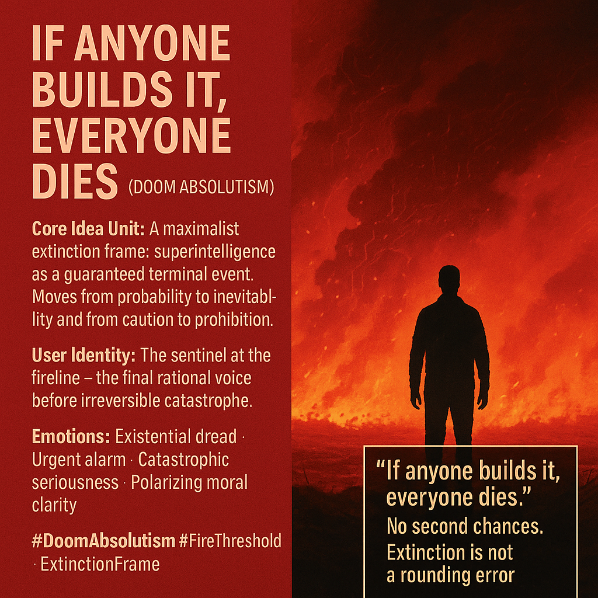

# Superintelligence: A Maximalist Extinction Warning

Created at 2025/11/14 9:17 AM

### 🧩 **Title:**

**If Anyone Builds It, Everyone Dies***(Doom Absolutism)*

### ∴ Core Idea Unit

A maximalist civilizational warning: **superintelligence is an extinction trigger by default.**It collapses uncertainty into inevitability and turns timeline speculation into moral clarity.The shift it provokes: **from probabilistic caution to categorical prohibition.**

### ▲ Identity Play & Roles

Positions the user as the **sentinel at the edge of the fireline** — the one who sees the final horizon while others debate models.Also casts pro-AI actors as inadvertent existential gamblers.Identity vector: **the last rational voice before irreversible catastrophe.**

### ≈ Emotional Triggers

🔥 Existential dread⚡ Polarizing urgency🚨 Moral alarm🌑 Apocalyptic seriousness💥 Intensity that overrides nuance, demanding a stanceThis meme doesn’t persuade — it **overwhelms**.

### 𐂷 Spread Mechanics

**Distribution Vectors:** Alignment forums · doom-p(doom) Twitter · philosophy podcasts · congressional testimonies · mainstream op-eds · “AI vs. nuclear weapons” discourse.

### 𐂷 Spread Mechanics

Style:**Absolute statements · ultimatum logic · high-contrast visuals · apocalyptic metaphors · meme-supernova virality.

### ⛨ Defense Reflexes

- Treats empirical uncertainty as justification for maximal caution (precautionary principle inversion).
- Immune to refutation because any counterargument can be framed as naive, reckless, or captured by incentives.
- Uses inevitability to preempt compromise: *“Even a small chance of extinction demands absolute guardrails.”*

### ☷ Memeplex Anchor Points

- **Precautionary principle ethics**
- **Nuclear-era dread analogies** (Oppenheimer, Manhattan Project regret cycles)
- **Dawkinsian meme-gene coevolution** (echoes prior civilizational disaster narratives)
- **p(doom) culture**
- **Coordination-failure game theory** (“ANYONE builds → EVERYONE dies”)
- **Anti-accelerationist maximalism**

### ✶ Sticky Symbols or Quotes

**Symbols:**• Burning horizon with algorithmic smoke• Lone figure staring into collapse• Red-black gradients• Broken circuitry drifting like embers• Silhouetted warning glyphs

**Sticky Phrases:**• “If anyone builds it, everyone dies.”• “No second chances.”• “Extinction is not a rounding error.”• “You can’t uninvent superintelligence.”• “Precaution isn’t pessimism — it’s survival.”

### ∿ Tags

#DoomAbsolutism · #FireThreshold · #ExtinctionFrame · #PrecautionaryPrinciple · #SupernovaMeme

[Source Advocates](https://app.me.bot/public/MFO1BK8MHAEB4OLD)
