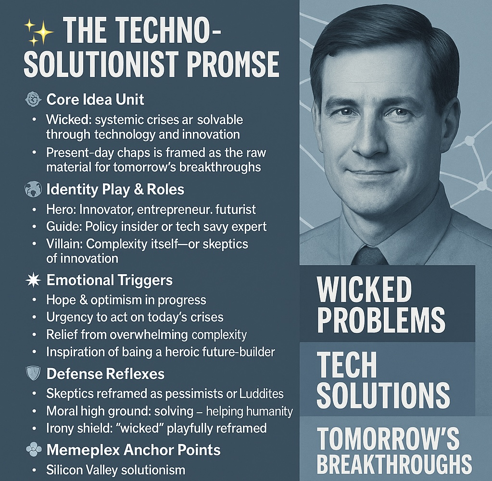

# Techno-Solutionism: Solving Wicked Problems with Innovation

Created at 2025/08/22 10:20 PM

**✨ The Techno-Solutionist Promise**

🧠 Core Idea Unit

- Wicked, systemic crises are solvable through technology and innovation.
- Present-day chaos is framed as the raw material for tomorrow’s breakthroughs.

🎭 Identity Play & Roles

- Hero: Innovator, entrepreneur, futurist.
- Guide: Policy insider or tech-savvy expert.
- Villain: Complexity itself—or skeptics of innovation.

💥 Emotional Triggers

- Hope & optimism in progress.
- Urgency to act on today’s crises.
- Relief from overwhelming complexity.
- Inspiration of being a heroic future-builder.

📡 Spread Mechanics

- Vectors: Hashtags, conference decks, NGO/startup branding.
- Style: Call-to-action optimism, slogan-ready.
- Amplifiers: LinkedIn thought leaders, futurist talks, policy briefs.

🛡️ Defense Reflexes

- Skeptics reframed as pessimists or Luddites.
- Moral high ground: solving = helping humanity.
- Irony shield: “wicked” playfully reframed.

🧬 Memeplex Anchor Points

- Silicon Valley solutionism.
- Enlightenment/Progress narratives.
- UN/WEF governance discourse.
- Entrepreneurial innovation culture.

🧠 Sticky Symbols or Quotes

- “Wicked problems.”
- “Tech solutions.”
- “Tomorrow’s breakthroughs.”
- Visuals: tangled knot vs. sleek tech.
- Narrative: Problem → Innovation → Resolution.

🏷️ Tags

#Solutionism #TechnoOptimism #FuturistMeme #InnovationFix #ProgressNarrative #WickedVsSolution

## Resources
- https://object.me.bot/front-img/note/attachments/img/1755926405424/B6F8F1A6-2963-4FD4-BF64-F7D56127EFED.png

## Insight

*   **Core Tenets of Techno-Solutionism**: The image outlines the core idea that complex, systemic crises can be resolved through technology and innovation. This perspective often frames current chaotic situations as opportunities for future breakthroughs. For example, the development of mRNA technology, initially for cancer treatment, was rapidly adapted to create COVID-19 vaccines, illustrating how present challenges can spur innovative solutions.

*   **Identity and Roles in the Techno-Solutionist Narrative**: The image identifies key roles within the techno-solutionist framework: the hero (innovator, entrepreneur, futurist), the guide (policy insider or tech-savvy expert), and the villain (complexity or skeptics of innovation). This mirrors the structure of many popular narratives, where a hero uses their skills to overcome a villain, guided by a wise mentor.

*   **Emotional Triggers and Persuasion**: The image notes that techno-solutionism leverages emotional triggers such as hope, optimism, urgency, relief, and inspiration. These emotions are powerful tools in persuasion, as they can bypass critical thinking and encourage immediate action.

*   **Defense Mechanisms Against Skepticism**: The image points out that skeptics are often reframed as pessimists or Luddites, and techno-solutionism claims the moral high ground by asserting that solving problems equates to helping humanity. This tactic deflects criticism by positioning the solution as inherently good and those who question it as obstructionists.

*   **Memeplex Anchor Points and Cultural Context**: The image identifies Silicon Valley solutionism, Enlightenment/Progress narratives, UN/WEF governance discourse, and entrepreneurial innovation culture as anchor points for this memeplex. These cultural and institutional elements provide a foundation for the spread and acceptance of techno-solutionist ideas.

*   **Sticky Symbols and Quotes**: The image highlights "wicked problems," "tech solutions," and "tomorrow’s breakthroughs" as sticky symbols and quotes that encapsulate the techno-solutionist promise. These phrases are easily memorable and can be used to quickly convey the core message of the movement.

*   **Critiques of Techno-Solutionism**: While techno-solutionism offers an optimistic vision, it has faced criticism for oversimplifying complex issues and neglecting social and political dimensions. Evgeny Morozov, in "To Save Everything, Click Here," critiques the tendency to apply technological fixes to problems that require deeper systemic changes.

