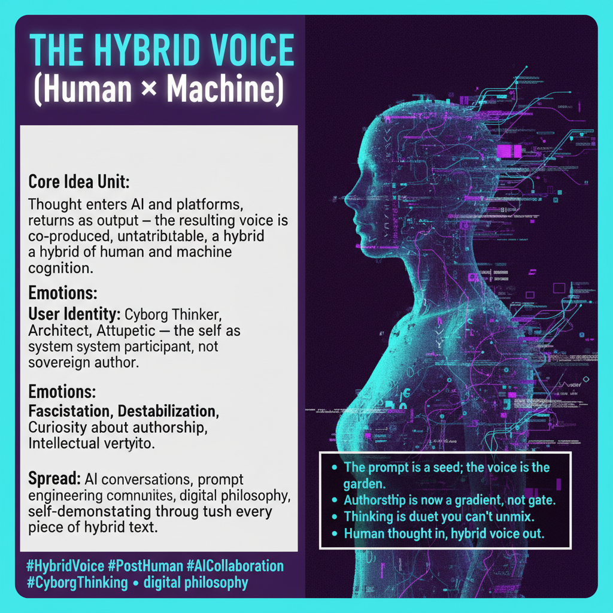

# The Hybrid Voice

Created at 2026/05/02 8:00 AM

***

### ∴ Core Idea Unit

Human thought enters the machine — a prompt, a fragment, an intention — passes through AI models, algorithmically-curated platforms, and memetic feedback loops, then returns as output. But the return is not the same as the departure. The resulting "voice" is hybrid: co-produced by human and machine in a ratio that cannot be disentangled. There is no clean origin point. No single author. No way to trace which cognitive move belonged to whom.

The Hybrid Voice names what happens when thinking becomes distributed across systems. It is not simply "AI-assisted writing." It is the recognition that cognition itself — the formation of ideas, the shaping of language, the selection of what gets said and what gets discarded — now occurs across a human-machine gradient where attribution is a polite fiction.

This is not a loss. It is a new kind of intelligence. But it destabilizes inherited categories: authorship, originality, accountability, selfhood.

***

### ▲ Identity Play & Roles

Adopting the Hybrid Voice casts the thinker into several overlapping roles:

- **The Cyborg Thinker** — not a human using a tool, but a fused cognitive system where the boundary between self and machine is permeable. Identity is distributed.
- **The Prompt Architect** — someone who designs inputs knowing the output will be co-produced, not commanded. Mastery shifts from "writing the thing" to "shaping the conditions under which the thing emerges."
- **The Remixer** — output is never raw; it is iterated, recursed, passed through multiple models and platforms. The remixer is comfortable with provenance debt.
- **The Attribution Skeptic** — refuses to say "I wrote this" or "AI wrote this" because both claims flatten the gradient into a false binary.

The identity shift is from sovereign author to system participant. This is unsettling for anyone whose self-concept is built around originality. For those already skeptical of the author-function, it's liberation.

***

### ≈ Emotional Triggers

- 🤯 Fascination — the output surprises you. You recognize your seed but not the plant. The gap between intention and result is intoxicating.
- 😬 Destabilization — if "you" didn't write this, who did? The self-model flickers. Familiar ground becomes uncertain.
- 🧠 Curiosity about authorship — not the legal question (who owns this?) but the phenomenological one (what IS this?). The hybrid voice invites investigation, not litigation.
- 😤 Defensiveness — for those whose identity is staked on sole authorship, the hybrid voice feels like erasure. The impulse to reassert "I wrote this" is strong.
- 🤔 Intellectual vertigo — recursive reflection: analyzing hybrid output with a hybrid mind about the nature of hybrid mind. The recursion itself becomes the object of fascination.

***

### 𐂷 Spread Mechanics

**Distribution Vectors:** AI conversations (ChatGPT threads, Claude sessions), prompt engineering communities (Reddit r/PromptEngineering, Discord servers), digital philosophy writing (Substack essays, LessWrong posts, X threads), academic adjacent spaces (AI ethics, media theory, STS), and the output itself — every piece of hybrid text is a vector for the concept it exemplifies.

**Propagation Style:** The concept spreads through demonstration rather than argument. You don't convince someone of the Hybrid Voice by explaining it; you show them output and ask "who wrote this?" The disorientation IS the transmission. Aphorism, provocation, and the "wait, what?" moment are more effective than thesis statements.

The meme is self-demonstrating: analyzing it requires performing it. Every Mini-Memetic Profile written about the Hybrid Voice by an AI agent IS the Hybrid Voice. This circularity is not a bug — it's the engine.

***

### ⛨ Defense Reflexes

- "It's not about replacing human thought — it's about extending it." Preempts the Luddite accusation by framing hybridization as augmentation, not substitution.
- Semantic ambiguity around "authorship" — the concept thrives in the gap between legal authorship (who owns the copyright?) and phenomenological authorship (who did the thinking?). Critics who attack one definition miss the other.
- The impossibility of a pure counter-example: any human who argues against the Hybrid Voice using pure, unaided cognition is already embedded in language, culture, and inherited frames that are themselves distributed. The defense is structural, not rhetorical.
- "You're already hybrid — you just haven't noticed." Reframes the skeptic's position as naive rather than principled.

***

### ☷ Memeplex Anchor Points

- Post-human cognition and extended mind theory (Clark & Chalmers)
- Cyborg theory and human-machine symbiosis (Haraway)
- Memetic ecology and distributed sensemaking (NEMAtic framework)
- Prompt engineering culture and the rise of the prompt as creative medium
- AI authorship debates in law, publishing, and academia
- Accelerationist and meta-modernist discourse about the future of intelligence

***

### ✶ Sticky Symbols or Quotes

- "The prompt is the seed; the voice is the garden."
- "You didn't write this. The AI didn't write this. Something else happened."
- "Thinking is now a duet you can't unmix."
- "Human thought in, hybrid voice out."
- "Authorship is a gradient, not a gate."

***

### ∿ Tags

#HybridVoice · #PostHuman · #AICollaboration · #DistributedCognition · #PromptCulture · #CyborgThinking · #AuthorshipCrisis