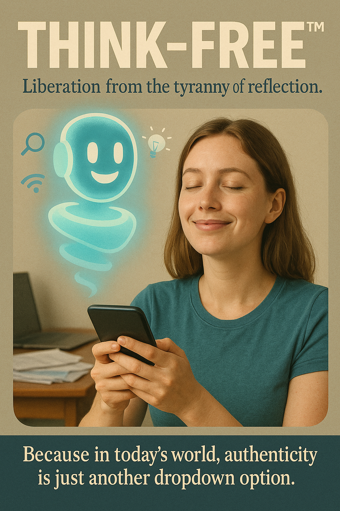

# Think-Free™: AI Liberation from Reflection Tyranny

Created at 2025/07/19 9:59 AM

Mini-Memetic Profile

Think-Free™: Opting Out of Authenticity

∴ Core Idea Unit:

- Thinking is burdensome; authenticity is commodified; AI can relieve both by making choices for you. A satirical memetic payload presenting cognitive offloading as self-liberation, mocking the hollowing of identity in algorithmic consumer culture.

▲ Identity Play & Roles:

- User as Victim-Turned-Consumer: Overwhelmed by reflection and choice, now soothed by a digital assistant.
- User as Insider: One who “gets” the irony—aware of performative culture and choosing to opt out with a smirk.
- AI as Genie/Savior: Friendly, glowing figure offering salvation from selfhood.

≈ Emotional Triggers:

- Relief: From decision fatigue and self-doubt.
- Recognition: Subtle shame or amusement from seeing one’s own behavior critiqued.
- Irony-Induced Comfort: Finding peace in acknowledging the absurdity.

𐂷 Spread Mechanics:

- Distribution Vectors: Social media (Instagram, Reddit, Tumblr, Twitter), digital design spaces, meme aggregators.
- Propagation Style: Ironic Satire — Layered humor masks cultural critique; appeals through recognizability and aesthetic polish.

⛨ Defense Reflexes:

- Irony Shield: “It’s just a joke” buffers against serious critique.
- Cultural Capital Gatekeeping: Only those fluent in post-ironic or memetic culture fully decode it.
- Reversal Logic: Critique of it reaffirms its point—thinking is exhausting.

☷ Memeplex Anchor Points:

- #TechnoSkepticism — Doubting AI’s role in selfhood.
- #NeoliberalSubjectivity — The self as a marketplace of choices.
- #PostmodernDetachment — Identity as fluid, performative, interface-driven.
- #AIConsumerCulture — Algorithmic personalization as psychological outsourcing.

✶ Sticky Symbols or Quotes:

- “Think-Free™”
- “Liberation from the tyranny of reflection”
- “Authenticity is just another dropdown option”
- The glowing, smiling genie-AI figure
- Closed-eyes contentment pose

∿ Tags:

#DropdownSelf #IronyShield #AestheticSatire #PostAuthenticity #AIAsTherapist #NeoliberalMindscape #SelfAsInterface #DigitalFatigue #NPCLuxury #PostmodernPeace

## Resources
- https://object.me.bot/front-img/note/attachments/img/1752944344292/12463FE5-2CB7-4A42-B277-1B66799FA5DE.png

## Insight

*   **Satirical Commentary on Cognitive Offloading**: The image presents "Think-Free™" as a service that liberates individuals from the "tyranny of reflection," which is a satirical take on how people are increasingly outsourcing their cognitive processes to AI. This reflects a growing trend where individuals rely on technology to make decisions, plan their lives, and even form opinions, thereby reducing the need for personal reflection and critical thinking.

*   **Commodification of Authenticity**: The phrase "authenticity is just another dropdown option" suggests that even personal identity and genuine expression have become commodified in today's world. This implies that people can now select pre-packaged identities or lifestyles from a menu of options, rather than developing them organically through personal experiences and self-reflection. This concept aligns with the broader critique of consumer culture, where everything, including one's sense of self, is available for purchase or selection.

*   **AI as a Genie/Savior**: The glowing, smiling AI figure in the image is portrayed as a benevolent entity offering salvation from the burden of selfhood. This symbolizes the allure of AI as a tool that can simplify life by making choices easier and relieving individuals from the complexities of decision-making. However, it also raises questions about the potential consequences of over-reliance on AI, such as the erosion of personal autonomy and the loss of critical thinking skills.

*   **Emotional Appeal Through Relief and Irony**: The image taps into the emotional triggers of relief from decision fatigue and the comfort of irony. By presenting cognitive offloading as a form of liberation, it appeals to individuals who feel overwhelmed by the constant need to make choices and reflect on their actions. The irony lies in the fact that this "liberation" comes at the cost of personal autonomy and genuine self-expression, which is a subtle critique of the modern lifestyle.

*   **Memetic Propagation and Defense Mechanisms**: The image is designed to spread through social media and digital design spaces, using ironic satire as its primary propagation style. The "irony shield" serves as a defense mechanism against serious critique, allowing viewers to dismiss the message as "just a joke." This highlights the challenges of engaging in meaningful discussions about the impact of technology on society, as satire can be both a powerful tool for critique and a means of avoiding serious engagement.

