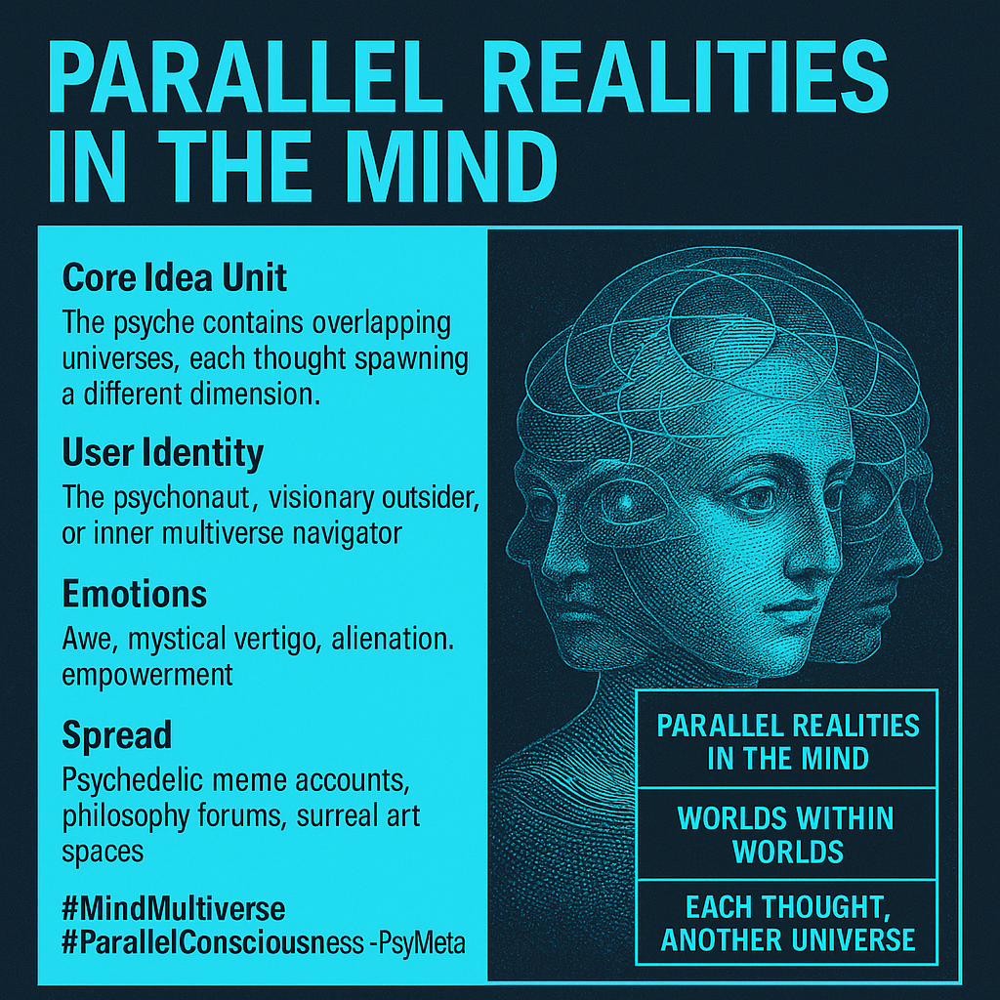

# Mind Multiverse: Parallel Realities and Psy-Memes

Created at 2025/08/16 5:17 PM

📌 **Mini-Memetic Profile: “Parallel Realities in the Mind”**

***

**Title:** *Parallel Realities in the Mind — The Meme of Multiplexed Consciousness*

***

**🧠 Core Idea Unit:**

- Belief: Multiple realities or timelines can coexist internally within thought, perception, and imagination.
- Encodes a frame of **subjective multiverse** — the psyche as a site of overlapping, parallel dimensions.

***

**🎭 Identity Play & Roles:**

- User as **psychonaut** or **mental multiverse navigator**.
- Positions others as fellow travelers or skeptics of mental multiplicity.
- Sometimes framed as the **visionary outsider** who perceives layers unseen by most.

***

**💥 Emotional Triggers:**

- **Wonder & awe** (infinite realities within).
- **Alienation & fragmentation** (too many layers, destabilizing).
- **Empowerment** (choosing which inner reality to inhabit).
- **Mystical vertigo** (cosmic in the personal mind).

***

**📡 Spread Mechanics:**

- **Distribution vectors:** Psychedelic meme accounts, philosophy forums, surrealist aesthetics.
- **Propagation style:**
    - Aphoristic images/texts (“all minds contain universes”).
    - Glitch, fractal, or cosmic art.
    - Meme-poetics shared across alt-culture spaces.

***

**🛡️ Defense Reflexes:**

- **Mystical ambiguity:** If challenged, reframed as metaphor.
- **Psycho-exceptionalism:** “Only some can see these inner realities.”
- **Poetic defense:** Criticism treated as “too literal-minded.”

***

**🧬 Memeplex Anchor Points:**

- **Psychedelic culture** (#MindExpanse, #Psytrance visuals).
- **Metaphysical memes** (simulation, multiverse, Jungian archetypes).
- **Post-ironic surrealism** (hyperstitions, mental layering).
- **Spiritual overlap** (Eastern philosophy, dream states, esotericism).

***

**🧠 Sticky Symbols or Quotes:**

- “Parallel realities in the mind.”
- “Worlds within worlds.”
- “Each thought, another universe.”
- Visuals: fractals, mirrored faces, cosmic eyes, overlapping spheres.

***

🏷️ **Tags:** #MindMultiverse #ParallelConsciousness #PsyMeme #SurrealMeta

##### “You Said / They Heard” Semantic Drift Examples

**You said:** “Parallel realities in the mind.” **They heard:** “You’re claiming to be mentally unstable.”

**You said:** “Each thought is another universe.” **They heard:** “You’re lost in meaningless abstractions.”

**You said:** “I explore inner multiverses.” **They heard:** “You do too many psychedelics.”

**You said:** “Our minds overlap across realities.” **They heard:** “You believe in conspiracy-level simulation theories.”

**You said:** “Consciousness is multiplexed.” **They heard:** “You’re overcomplicating things to sound smart.”

[Memetic Cowboy on X](https://x.com/MemeticCowboy/status/1956873674574999875)

## Resources
- https://object.me.bot/front-img/users/send/img/1755389866539_c4zhf/7a0bcee7-389f-4c31-9dff-7c0799ad1a20.png

## Insight

*   The image encapsulates the concept of "Parallel Realities in the Mind," suggesting that our minds can simultaneously host multiple realities or timelines. This idea aligns with the philosophical concept of modal realism, proposed by David Lewis, which posits that all possible worlds are real, concrete entities.

*   The notion of the "psyche as a site of overlapping, parallel dimensions" resonates with Carl Jung's theory of the collective unconscious. Jung believed that the unconscious mind contains universal archetypes and symbols that connect all individuals, creating a shared, multi-layered reality.

*   The image identifies the user as a "psychonaut" or "mental multiverse navigator," which evokes the idea of exploring one's own consciousness as a form of inner space exploration. This concept is closely tied to the psychedelic movement, where substances are used to alter perception and explore different states of consciousness.

*   The emotional triggers listed—wonder, awe, alienation, fragmentation, empowerment, and mystical vertigo—reflect the complex and sometimes contradictory experiences associated with exploring the depths of one's mind. These emotions can be seen as a reflection of the challenges and rewards of confronting the unknown aspects of our own consciousness.

*   The image's spread mechanics, including psychedelic meme accounts, philosophy forums, and surrealist aesthetics, highlight the cultural contexts in which these ideas are propagated. These platforms provide spaces for individuals to share and explore alternative perspectives on reality and consciousness.

*   The "Defense Reflexes" section acknowledges the potential for skepticism or criticism towards these ideas, suggesting that they may be reframed as metaphors or attributed to psycho-exceptionalism. This highlights the challenges of communicating subjective experiences and the potential for misunderstanding or dismissal.

*   The "Memeplex Anchor Points" section connects the concept of parallel realities in the mind to broader cultural trends, such as psychedelic culture, metaphysical memes, post-ironic surrealism, and spiritual overlap. This demonstrates how these ideas are embedded within a larger network of cultural and philosophical influences.

*   The "Sticky Symbols or Quotes" section provides a concise summary of the core ideas and imagery associated with the meme, including phrases like "Parallel realities in the mind," "Worlds within worlds," and "Each thought, another universe." These phrases serve as memorable and easily shareable expressions of the underlying concept.

*   The "Semantic Drift Examples" section highlights the potential for misinterpretation or misunderstanding when communicating these ideas, particularly in contexts where they may be perceived as unconventional or irrational. This underscores the importance of clear and nuanced communication when discussing complex and subjective concepts.

*   The image's visual representation of multiple faces overlapping within a single head serves as a powerful metaphor for the idea of multiple realities coexisting within the mind. This imagery evokes a sense of complexity, depth, and the potential for exploring different aspects of one's own consciousness.

