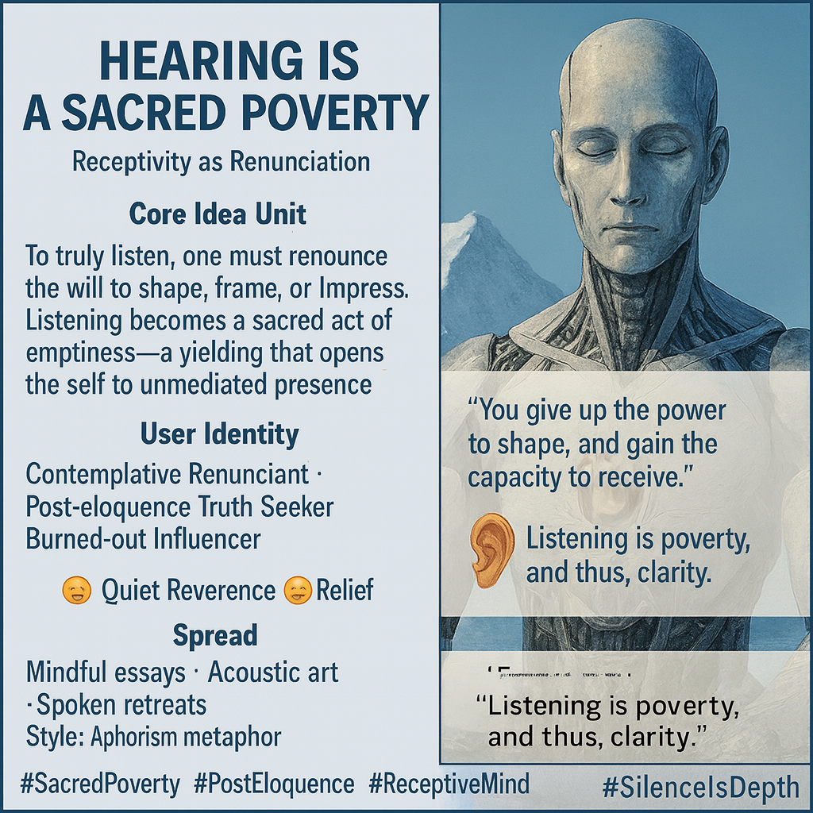

# The Art of Sacred Listening

Created at 2025/10/26 8:19 AM

🧩 Title: “Hearing is a Sacred Poverty” Label: Receptivity as Renunciation  ⸻  🧠 Core Idea Unit:  To truly listen, one must renounce the will to shape, frame, or impress. Listening becomes a sacred act of emptiness—a yielding that opens the self to unmediated presence. This is not silence as absence, but as sanctified capacity.  ⸻  🎭 Identity Play & Roles: 	•	Contemplative Renunciant — one who trades control for communion 	•	Post-eloquence Truth Seeker — exhausted by language’s limits 	•	Burned-out Influencer — retreating from performance into presence This meme repositions the self from speaker to vessel, from framer to receiver, from dominator to devotee.  ⸻  💥 Emotional Triggers: 	•	🙏 Quiet reverence 	•	😢 Longing for unfiltered contact 	•	😌 Relief from performance 	•	🌀 Paradoxical awe at doing less to become more  ⸻  📡 Spread Mechanics: 	•	Distribution Vectors: 	•	Mindfulness essays · acoustic meditations 	•	Substack zines for mystical minimalism 	•	Spoken word retreats and long silences 	•	Social detox communities 	•	Propagation Style: 	•	Aphorism, koan, or soft-lit audio vignette 	•	Whispered truths and symbolic metaphor 	•	Resists virality; spreads like hush  ⸻  🛡️ Defense Reflexes: 	•	Semantic minimalism — immune to over-interpretation 	•	Koanic structure — disarms logical rebuttal 	•	Spiritual framing — shifts critique into practice space 	•	Sacred shield — not claiming, only offering  ⸻  🧬 Memeplex Anchor Points: 	•	✝️ Mystical Christianity (e.g., apophatic tradition) 	•	🕉️ Buddhist renunciation & deep listening 	•	💬 Anti-performative ethos of post-digital detachment 	•	🎧 Acoustic phenomenology · Pauline Oliveros’ deep listening 	•	⛩️ Japanese aesthetics: ma (space), wabi-sabi, silence as depth  ⸻  🧠 Sticky Symbols or Quotes: 	•	“You give up the power to shape, and gain the capacity to receive.” 	•	The Ear as empty vessel 	•	“Listening is poverty, and thus, clarity.” 	•	Silence is a kind of presence 	•	🔘 Minimalist circle or open bowl symbol 	•	🕳️ The hollow as holy  ⸻  🏷️ Tags:  #SacredPoverty · #PostEloquence · #ReceptiveMind · #MysticalMinimalism · #SilenceIsDepth · #AntiDominance · #EarAsSymbol  https://memeticcowboy.substack.com/p/the-breath-between-signals-a-dream  

## Resources
- https://object.me.bot/front-img/note/attachments/img/1761491950208/E860051E-05CE-4359-892E-B43A2FA41597.png

## Insight

* The concept of "sacred poverty" emphasizes the importance of listening as an act of surrender, where one willingly relinquishes control to fully engage with another's presence. This aligns with various contemplative traditions that advocate for renunciation as a pathway to deeper communion and connection.

* The image reflects the dual identity of the "Contemplative Renunciant" and the "Burned-out Influencer," illustrating the struggle between the desire for self-expression and the need for genuine connection. This dynamic echoes themes in mindfulness and spiritual practices, where letting go of ego allows for more authentic interactions.

* Emotional triggers such as "quiet reverence" and "longing for unfiltered contact" highlight a cultural shift towards valuing presence over performance. In an age dominated by constant communication and social media, this awareness promotes a return to more meaningful forms of engagement.

* The use of symbols such as the ear as an empty vessel invites contemplation of listening as an active, rather than passive, process. It suggests that true listening requires opening oneself to vulnerability and receiving rather than projecting.

* Connections can be made with Eastern philosophies, particularly Buddhism, where deep listening is considered essential for insight. This intersects nicely with Western mystical traditions that embrace silence and stillness as pathways to clarity and truth.

* The phrase "You give up the power to shape, and gain the capacity to receive" serves as an aphorism that encapsulates the transformation inherent in this practice. It suggests that embracing emptiness can paradoxically lead to fullness in understanding and connection.
