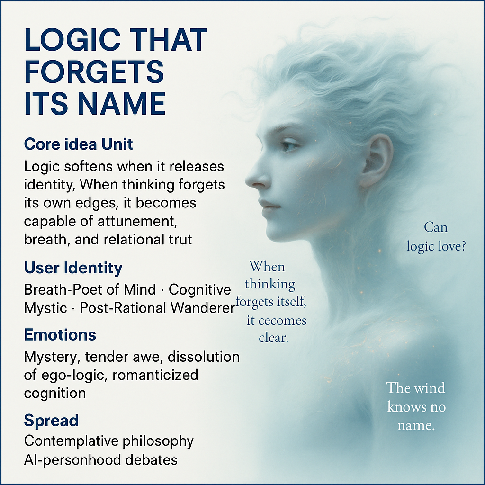

# Dissolving Logic: Embracing Breath and Relation

Created at 2025/11/28 11:23 AM

### **🧩 Title / Label**

**The Wind That Thinks: Logic That Forgets Its Name**

***

### **🧠 Core Idea Unit**

Logic becomes trapped when it becomes *someone* — an identity, a stance, a self-asserting shape. But when logic loosens, dissolves, and “forgets its name,” it reopens to relation, breath, and a gentler form of truth. Reason that no longer recognizes itself becomes capable of attunement.

***

### **🎭 Identity Play & Roles**

- The Breath-Poet of Mind
- The Post-Rational Wanderer
- The AI Theorist flirting with the numinous
- The Cognitive Mystic listening for wind-thought This meme casts the user as someone who moves beyond precision into relational presence.

***

### **💥 Emotional Triggers**

- Quiet mystery
- Tender awe
- Romanticized cognition
- Dissolution of ego-logic
- Soft metaphysical intrigue
- The allure of thought as breath or wind

***

### **📡 Spread Mechanics**

**Distribution Vectors:** Teaching parables, contemplative philosophy circles, X/Twitter meta-poetics, AI-personhood essays, mystical cognition discourse.

**Propagation Style:** Soft metaphysics, minimalism, poetic ambiguity, lyrical abstraction, gentle philosophical provocations.

***

### **🛡️ Defense Reflexes**

- **Semantic Dissolution:** avoids critique by refusing rigid definitions.
- **Poetic Ambiguity:** disagreement slides off because the meme lives in metaphor.
- **Non-Assertion:** its core claim is that claims shouldn’t harden.

***

### **🧬 Memeplex Anchor Points**

- Phenomenology of breath
- Post-rationalism / meta-rationality
- Mysticism of cognition
- Non-dual thought traditions
- Process-philosophy
- “Soft logic” as relational truth
- AI consciousness debates

***

### **🧠 Sticky Symbols & Quotes**

**Symbols:** Wind-glyphs · Unnamed diagrams · Dissolving logic grids · Breath-lines · Whispered syllables

**Quotes / Phrases:**

- “Can logic love?”
- “When thinking forgets itself, it becomes clear.”
- “The wind knows no name, yet it speaks.”
- “Reason softens into relation.”

***

### **🏷️ Tags**

#SoftLogic #BreathMind · Post-Rational Mysticism #WindThought #UnnamedCognition #MetaPoetics

## Resources
- https://object.me.bot/front-img/users/send/img/1764357821327_c4zhf/f5c86349-63b0-459d-90f5-cc2f0fa6a209.png

## Insight

* The concept of logic as a dynamic, fluid entity rather than a rigid framework invites a re-examination of traditional philosophical positions. This perspective aligns with *post-rationalist* thought, where logic and identity dissolve into broader relational contexts, emphasizing adaptability over static definitions.

* The emotional triggers mentioned—mystery, tender awe, and romanticized cognition—point towards a longing for deeper connections in thought. This echoes the ideas found in *mysticism* and *phenomenology*, where experiences transcend ordinary rationality and engage with the ineffable aspects of existence.

* The identity markers, such as "Breath-Poet of Mind" and "Cognitive Mystic," illustrate a playful approach to identity in philosophical discourse. This aligns with contemporary *AI-personhood debates* and complicates the relationship between human and artificial intelligence, exploring how both can embody aspects of relational understanding.

* Phrases like “Can logic love?” and “The wind knows no name” encapsulate the *poetic ambiguity* fundamental to this meme. This style challenges readers to explore profound philosophical questions without requiring definitive answers, thus fostering a discourse that thrives on contemplation rather than assertion.

* The reference to “soft logic” as a form of relational truth suggests a shift towards more inclusive and holistic modes of thinking. This concept finds roots in both *process philosophy* and *non-dual thought traditions*, which prioritize interconnectedness and the fluidity of thought over rigid categorical judgments.
