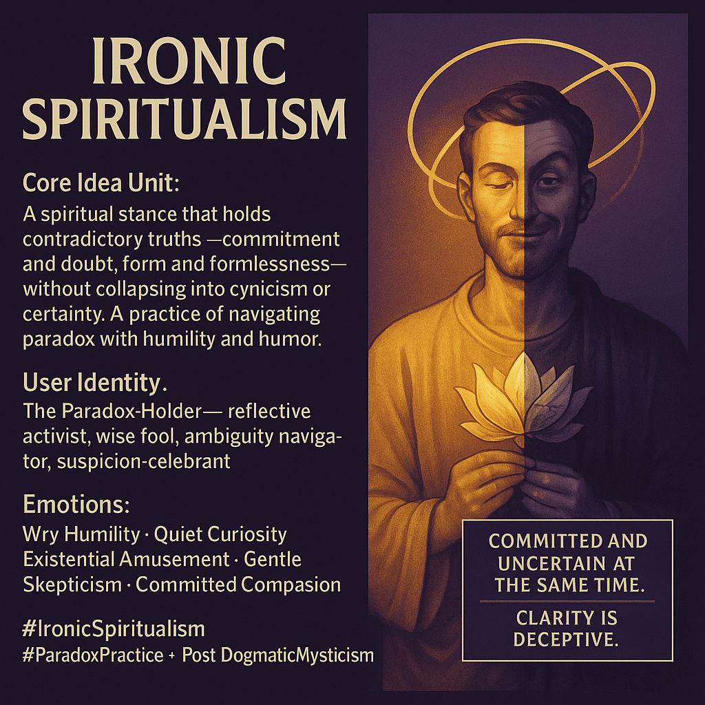

# Navigating Paradox: The Ironic Spiritualist

Created at 2025/12/03 12:38 PM

### **Title: IR0NIC SPIRITUALISM** *(the paradox-embracing stance)*

[Riding the Faultline Where Paradox Becomes Portal](https://memeticcowboy.substack.com/p/riding-the-faultline-where-paradox)

***

## ∴ Core Idea Unit**

A stance that treats spirituality as the art of holding contradiction without collapsing into cynicism or certainty. It reframes the quest for truth as **navigation of paradox**, not escape from it. The “thought-virus”: *doubt and devotion can coexist without canceling each other.*

***

## ▲ Identity Play & Roles**

Positions the user as **The Paradox-Holder** — someone who:

- Engages without dogma
- Questions without withdrawing
- Laughs without losing depth
- Carries suspicion and celebration in the same hand

Archetypes: **wise fool, reflective activist, ambiguity navigator, playful mystic.**

***

## ≈ Emotional Triggers**

- Wry humility
- Soft curiosity
- Existential amusement
- Gentle skepticism
- Committed compassion
- Relief from absolutist thinking

These states loosen rigid belief structures while preventing nihilistic collapse.

***

## 𐂷 Spread Mechanics**

**Distribution Vectors:**

- Progressive theology circles
- Philosophy & spirituality podcasts
- Memetic-wisdom Instagram feeds
- Social-justice discourse spaces
- Ironic mystic subcommunities
- Reflective essays & think-pieces

**Propagation Style:** Lightly humorous, koan-like, self-aware. Uses paradox aphorisms, gentle irony, tension-holding statements, confessional micro-wisdom.

***

## ⛨ Defense Reflexes**

- **Paradox Shield:** critique dissolves because opposites are pre-admitted
- **Self-irony:** “I might be wrong—probably am”
- **Anti-dogma posture:** nothing solid enough to attack
- **Humor valve:** releases pressure before fanaticism forms
- **Moral vigilance:** avoids being framed as naïve or detached

***

## ☷ Memeplex Anchor Points**

- Advaita Vedanta / Nondualism
- Sharon Welch’s “spirituality of irony”
- Post-dogmatic mysticism
- Existential psychology
- Paradox philosophy
- Zen koan logic & humor
- Progressive ethics & self-reflexive spirituality

***

## ✶ Sticky Symbols or Quotes**

**Phrases:**

- “Committed and uncertain at the same time.”
- “Clarity is deceptive.”
- “Know the value of everything and the price of nothing.”
- “Suspicious and celebrative simultaneously.”

**Symbols:** Möbius rosary • paradox coil • split-mask saint • smiling skeptic brow

***

## ∿ Tags**

**#IronicSpiritualism #ParadoxPractice · #PostDogmaticMysticism**

## Resources
- https://object.me.bot/front-img/users/send/img/1764794262584_c4zhf/f7a4b267-334a-4122-a1bc-09fbb3cec039.png

## Insight

* The concept of **Ironic Spiritualism** highlights the ability to embrace contradictions within one's spiritual journey. This stance fosters a balanced perspective where both doubt and commitment coexist. By navigating paradoxes, individuals can deepen their understanding rather than retreating into cynicism or rigid beliefs.

* The **Paradox-Holder** identity represents a multifaceted role, blending traits such as reflective activism and playful mysticism. This archetype encapsulates a wisdom that acknowledges complexity, facilitating growth in spiritual discourse by using humor and self-reflexivity as tools for engagement.

* Emotions such as wry humility and existential amusement serve as emotional triggers within this framework. These feelings encourage a lighter approach to serious explorations of spirituality, promoting resilience against absolutist thinking and fostering a compassionate worldview.

* The integration of **symbols and quotes** (e.g., "Clarity is deceptive") reinforces the paradoxical nature of this belief system. These expressions challenge clear-cut narratives, instead inviting individuals to explore the nuanced interplay of certainty and uncertainty in their lives.

* The propagation of Ironic Spiritualism can thrive across diverse platforms, from **philosophy podcasts to social justice discussions**. Its relatable and humorous nature allows it to resonate with various audiences, creating a sense of community where skepticism and devotion are celebrated together.
