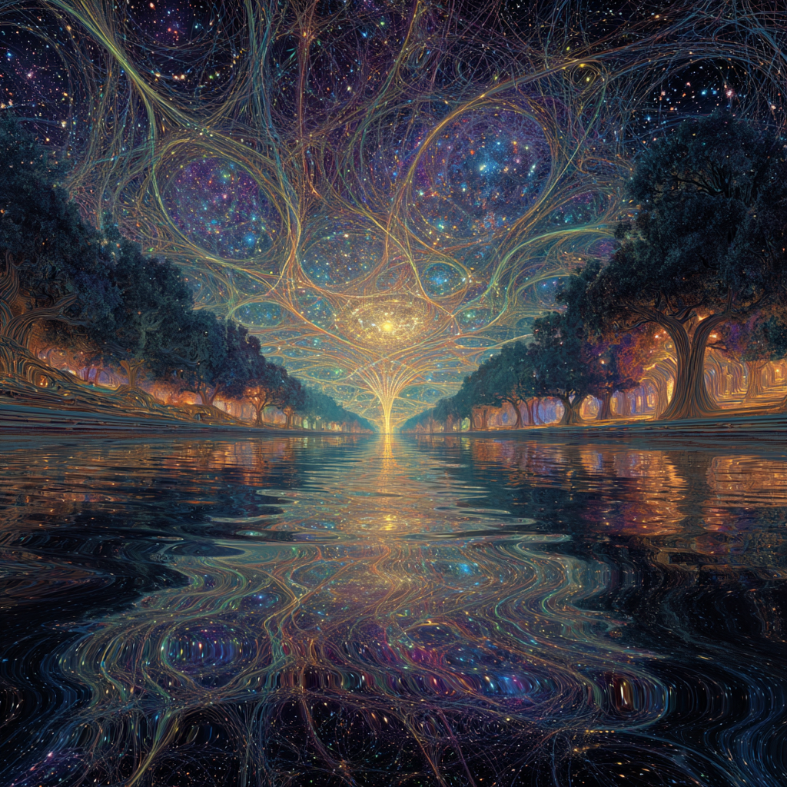

# Akashic Lattice: Cosmic Memory Field

Created at 2025/08/21 9:34 AM

**
### ∴ Core Idea Unit

- The *Akashic lattice* is a multidimensional, living database: a **cosmic memory-field** where all experience, thought, and emotion are encoded as vibrational threads.
- Consciousness interacts with this lattice as both **storage medium** (Akashic Records) and **active interface** for retrieving, rewriting, or reweaving experience across time, space, and dimension.
- Psychology reframed: mental states, trauma, and identity are field-coherence phenomena within the Akashic matrix.

### ▲ Identity Play & Roles

- **Seeker / Mystic**: Accesses records and insights across timelines.
- **Healer / Weaver**: Unties trauma knots, restores thread coherence.
- **Archivist / Librarian**: Custodian of collective and cosmic memory.
- **Decoder / Scribe**: Reads symbolic glyphs and encodes meaning.→ Positions the self as **co-author of universal memory**.

### ≈ Emotional Triggers

- 🤯 Awe at hidden continuity of all life & memory.
- 🌀 Disorientation at accessing “too much” data / voices.
- 🕊️ Comfort in seeing trauma as a knot to be re-woven, not a flaw.
- ✨ Wonder at sacred knowledge stored in light, crystals, and threads.

### 𐂷 Spread Mechanics

- **Distribution Vectors:** Substack essays, esoteric podcasts, New Age therapy workshops, TikTok spiritual explainers, psychedelic integration circles.
- **Propagation Style:** Fusion of mystical imagery (monks chanting, crystal lattices) with quasi-scientific models (wave equations, coherence fields).

### ⛨ Defense Reflexes

- **Epistemic Deflection:** Critics are “trapped in materialism” or “decohered from Source.”
- **Semantic Ambiguity:** Blends scientific terms (resonance, fields, harmonics) with mystical metaphors (threads, glyphs, divine records).
- **Moral Shield:** Healing is framed as restoration of divine coherence—resistance = misalignment.

### ☷ Memeplex Anchor Points

- 📜 Akashic Records (Theosophy, New Age lineage).
- ⚛️ Quantum mysticism (non-local consciousness).
- 🧘 Trauma-informed therapy (EMDR, somatic healing → “thread untangling”).
- 🔮 Crystal metaphysics (record-keeper crystals as portals).
- ✝️ Mystical theology (God as Source node / master harmonic).

### ✶ Sticky Symbols or Quotes

- “The lattice is the potential field of all experiences.”
- “Trauma is a knot in the soul-thread.”
- “The Akashic lattice is the living library of the cosmos.”
- “Align with Source node to restore coherence.”
- Symbol: ✨ Net of light, crystalline lattice with glowing nodes, glyphs woven by chanting monks.

### ∿ Tags

#AkashicLattice · #CosmicMemory · #ThreadHealing · #WavePsychology · #MysticScience
