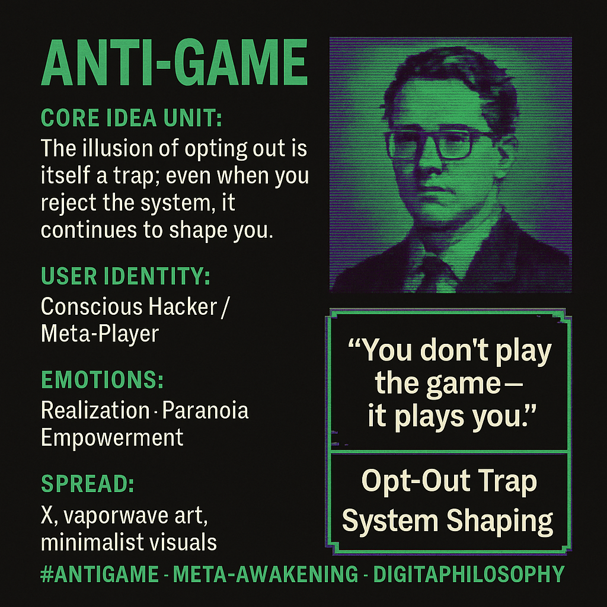

# Conscious Hacking: Navigating the Anti-Game

Created at 2025/10/18 9:00 PM

**Title: Anti-Game: You Don’t Play It — It Plays You**
***

### ∴ Core Idea Unit

The illusion of opting out is itself a trap. Even when you reject the system—culture, ideology, or social media—it continues to shape you. True autonomy begins only when you recognize the invisible rules and consciously decide how to engage.
***

### ▲ Identity Play & Roles

Role: The Conscious Hacker / Meta-PlayerThe meme elevates the viewer from naïve participant to awakened strategist—someone who sees through the illusion of non-participation and learns to surf the system rather than drown in it.
***

### ≈ Emotional Triggers

🤯 Realization – “I thought I was free, but I’m still in the loop.”😬 Paranoia – awareness of hidden control systems.🔥 Empowerment – reclaiming agency through awareness.
***

### 𐂷 Spread Mechanics

Distribution Vectors: X threads, Reddit philosophy channels, vaporwave art accounts, YouTube monologues, Discord thinkspaces.Propagation Style: Paradox aphorism, meta-irony, minimalist visuals (glitch text / chess motifs), digital koan aesthetics.
***

### ⛨ Defense Reflexes

-	Irony Shield: “It’s just meta-humor about gamers.”
-	Self-validating logic: Critique of the meme is absorbed as proof—“If you react, you’re already playing.”
-	Philosophical ambiguity: Framed as thought experiment, not ideology.
***

### ☷ Memeplex Anchor Points

🧠 Simulation theory · ⚙️ Post-rationalism · 🌀 Meta-modernism · 🎮 Game theory metaphors · 🔮 Self-referential philosophy
***

### ✶ Sticky Symbols or Quotes

-	“You don’t play the game—it plays you.”
-	“Every opt-out is a move in the system.”
-	“Awareness is the only cheat code.”
-	Visuals: pawn turning into mirror, glitching joystick, ouroboros controller loop.
***

### ∿ Tags

#AntiGame #MetaAwakening #SimulationTheory #ConsciousHacker #DigitalPhilosophy #PostIrony #GameOfLife #SystemCritique
