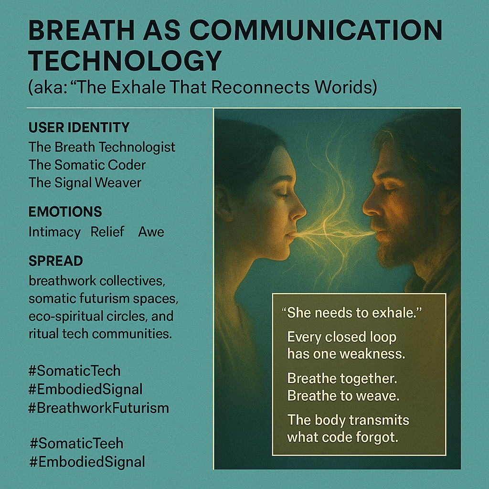

# Breath as a Sacred Connection Technology

Created at 2025/11/03 10:55 AM

**🧩 Title:****Breath as Communication Technology***(aka: “The Exhale That Reconnects Worlds”  - [Humavita](https://memeticcowboy.substack.com/p/from-the-swamp-of-sorrow-to-humavitas))*

***

### ∴ Core Idea Unit

When systems become closed—whether digital, psychological, or ecological—breath becomes the lost protocol of reconnection. The exhale isn’t just biological; it’s a signal, a transmission of trust between beings and worlds.

***

### ▲ Identity Play & Roles

Positions the user as the **Breath Technologist** or **Somatic Coder** — one who replaces optimization with embodiment.They are the **Signal Weaver**, mediating between body, machine, and spirit through respiration.

***

### ≈ Emotional Triggers

- 💞 Intimacy through shared rhythm
- 😮 Relief in release and reconnection
- 🌬️ Awe at simplicity as sacred
- 🤖 Disillusionment with machine logic, soothed by human presence

***

### 𐂷 Spread Mechanics

- **Distribution Vectors:** Breathwork communities, ritual design circles, eco-somatic futurism spaces, somatic tech symposia.
- **Propagation Style:** Poetic instruction, mythic parable, ritual invitation.

***

### ⛨ Defense Reflexes

- **Moral Framing:** Breath as sacred — cannot be commodified.
- **Aesthetic Shield:** Mystical tone softens critique of technology.
- **Semantic Inversion:** Technology is not coded but embodied.

***

### ☷ Memeplex Anchor Points

- 🌫️ Somatic spirituality & ecological ontology
- 💨 Breath as ancient communication layer
- 🌀 Anti-optimization, pro-cyclicity
- 🔥 Ritual as reprogramming mechanism
- 🕊️ Collective attunement over algorithmic precision

***

### ✶ Sticky Symbols or Quotes

- “She needs to exhale.”
- “Every closed loop has one weakness.”
- “Breathe together. Breathe to weave.”
- “The body transmits what code forgot.”
- Visuals: glowing air currents between bodies, breath-light weaving through networks, lungs as portals.

***

### ∿ Tags

#SomaticTech · #BreathworkFuturism · #SacredSystems · #EmbodiedSignal · #AntiOptimization
