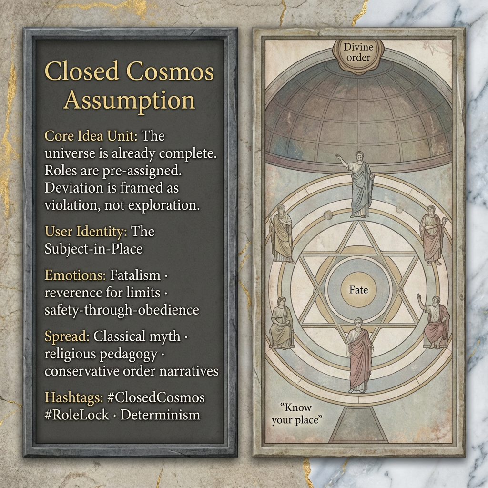

# Exploring the Closed Cosmos Assumption

Created at 2025/12/28 1:35 PM

## **Closed Cosmos Assumption**

[HUBRIS: A Memetic Reversal of Icarus in the Age of Artificial Intelligence](https://memeticcowboy.substack.com/p/hubris-a-memetic-reversal-of-icarus)

### ∴ Core Idea Unit

The universe is already complete. Roles are pre-assigned. Any deviation is not exploration but violation.

### ▲ Identity Play & Roles

**Cast role:** The Subject-in-Place The individual is positioned as a node in a finished order, valued for compliance, not emergence.

### ≈ Emotional Triggers

- 😔 Fatalism
- 🙏 Reverence for limits
- 😌 Safety-through-obedience
- 😶 Fear of cosmic error

These emotions stabilize submission as virtue.

### 𐂷 Spread Mechanics

**Distribution Vectors:**

- Classical myth retellings
- Religious moral frameworks
- Conservative pedagogy

**Propagation Style:** Authoritative narration, inevitability framing, tragic exemplars.

### ⛨ Defense Reflexes

- Naturalization (“this is the order of things”)
- Sacralization of hierarchy
- Moralization of obedience

Questioning is framed as sacrilege or immaturity.

### ☷ Memeplex Anchor Points

- Theological determinism
- Zero-sum status allocation
- Fate-bound ontology

### ✶ Sticky Phrases / Symbols

- Fate
- One’s station
- Divine hierarchy
- Greek tragedy

∿ **Tags:** #ClosedCosmos · #RoleLock · #Determinism · #OrderMyth

## Resources
- https://object.me.bot/front-img/users/send/img/1766957750387_c4zhf/5b2dd959-ffe2-4d62-8583-cdca2a92fdfd.png

## Insight

* The image illustrates the concept of the "Closed Cosmos Assumption," emphasizing a predetermined universe where roles are fixed. This notion resonates with philosophical determinism, suggesting that individual agency is an illusion within a cosmic framework where every action and position is already designated. Works like those of Spinoza and Leibniz elaborate on such ideas, positing that the universe operates under a divine order that dictates the nature of existence and individual purpose. 

* The emotional triggers highlighted—fatalism, reverence for limits, and safety-through-obedience—reflect a psychological alignment with the belief system depicted. These emotions mirror the teachings found in various religious and philosophical texts, where acceptance of one's place in a hierarchical structure is presented as a virtue. This acceptance serves to enforce societal norms, often stifling dissent or deviation from the prescribed role.

* The depiction of the "User Identity: The Subject-in-Place" evokes the idea of individuals as components of a larger system, reminiscent of concepts from structuralism in anthropology and sociology. This perspective suggests that the self is shaped and defined by its relationship to societal structures rather than through a singular, autonomous individuality, which has implications for discussions around identity and agency in contemporary societal discourse.

* The methods of spread (classical myth retellings, religious frameworks) and associated memes like "divine hierarchy" and "fate" indicate how deeply embedded these beliefs are in cultural narratives. For instance, tragic figures in Greek mythology (like Oedipus) exemplify the inherent tension between destiny and free will, embodying the struggle between fate and individual choice. Such narratives have persisted through history as cautionary tales about the consequences of overstepping one's bounds.

* The visual representation, featuring symbols of divinity and geometric order, reinforces the sacredness of the established hierarchy. This design choice can be linked to the use of iconography in various religious traditions that serve not only decorative purposes but also didactic ones, reinforcing the notion of celestial order and the moral imperative to accept one's fate.
