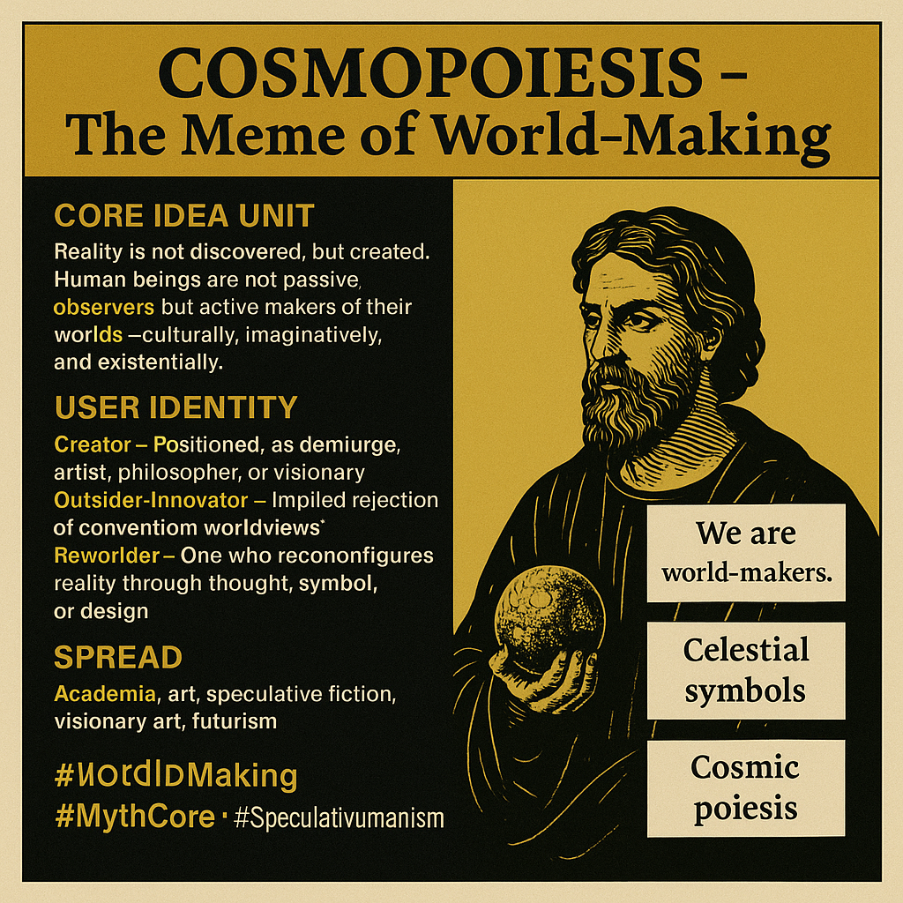

# Cosmopoiesis: The Meme of World-Making

Created at 2025/07/17 10:06 PM

**Mini-Memetic Profile**

**Cosmopoiesis – The Meme of World-Making**

∴ Core Idea Unit:

- Reality is not discovered, but created.
- Human beings are not passive observers but active makers of their worlds—culturally, imaginatively, and existentially.

▲ Identity Play & Roles:

- Creator — Positioned as demiurge, artist, philosopher, or visionary.
- Outsider-Innovator — Implied rejection of conventional worldviews.
- Reworlder — One who reconfigures reality through thought, symbol, or design.

≈ Emotional Triggers:

- Awe — The majesty of creation and possibility.
- Empowerment — The liberating sense of being a co-author of existence.
- Existential Wonder — Emotional resonance with mystery, meaning, and myth.
- Yearning — Desire for a more meaningful or beautiful reality.

𐂷 Spread Mechanics:

- Distribution Vectors: 
    - Academia (literary theory, philosophy)
    - Art and speculative fiction
    - Social media aesthetics (visionary art, poetic captions)
    - Design and futurism (e.g. metaverse discourse, solarpunk)
- 
- Propagation Style: 
    - Reflective invocation, symbolic poetics
    - Indirect resonance—memes through metaphors, mythos, archetypes
    - Philosophical aphorisms and speculative imagination

⛨ Defense Reflexes:

- Preemptive Reframing: Critique becomes part of the creation process.
- Moral Sublimation: Creation is framed as inherently noble or sacred.
- Irony Shield (minor): Used in some artistic or postmodern deployments.
- Depth Frame: Dismisses critics as shallow, materialist, or unimaginative.

☷ Memeplex Anchor Points:

- Renaissance humanism
- Mythopoetics (e.g. Tolkien, Campbell)
- Postmodern constructivism
- Speculative design & futures studies
- Systems theory, autopoiesis
- Theological creation narratives (soft overlap)

✶ Sticky Symbols or Quotes:

- “We are world-makers.”
- Visuals of celestial bodies, hands shaping worlds, sacred geometry.
- The phrase cosmopoiesis itself, with poetic gravity.
- Quotes from Dante, Heidegger, or Mazzotta.
- Imagery of Renaissance diagrams, divine creation, digital cosmos.

∿ Tags:

#WorldMaking #MythCore #SpeculativeHumanism #CosmicPoiesis #VisionaryMeme #NarrativeOntology #RenaissanceRemix #SymbolicAgency #MetaMyth

## Resources
- https://object.me.bot/front-img/note/attachments/img/1752815191193/EEFEE737-4052-4CE9-96C7-D19809AB2F75.png

## Insight

*   **Core Idea of Cosmopoiesis**: The image encapsulates the concept of "Cosmopoiesis," highlighting that reality is not merely found but actively created. This idea challenges the traditional view of humans as passive observers, positioning them instead as active participants in shaping their worlds through cultural, imaginative, and existential means. This concept resonates with philosophical ideas found in existentialism and constructivism, where meaning and reality are seen as actively constructed rather than passively received.

*   **User Identity and Roles**: The image identifies several roles associated with Cosmopoiesis, including "Creator," "Outsider-Innovator," and "Reworlder." These roles suggest different ways individuals can engage in world-making, whether through artistic creation, philosophical innovation, or the reconfiguring of existing realities. The "Outsider-Innovator" role implies a rejection of conventional worldviews, aligning with the idea of challenging established norms and creating new perspectives.

*   **Spread Mechanics and Influence**: The image suggests that Cosmopoiesis spreads through various channels, including academia, art, speculative fiction, visionary art, and futurism. This indicates that the meme of world-making is not confined to a single domain but permeates different areas of intellectual and creative activity. The mention of speculative fiction and futurism highlights the role of imagination and envisioning alternative futures in shaping our understanding of reality.

*   **Visual Symbolism**: The image includes visual elements such as celestial symbols and a figure holding a globe, reinforcing the idea of world-making and cosmic creation. These symbols evoke a sense of awe and wonder, aligning with the emotional triggers associated with Cosmopoiesis. The figure holding the globe can be interpreted as a representation of humanity's ability to shape and influence the world around them.

*   **Connection to Renaissance Humanism**: The hint mentions "Renaissance humanism" as a memeplex anchor point for Cosmopoiesis. This connection suggests that the idea of human agency and the potential for individuals to shape their own destinies has historical roots in the Renaissance period. Renaissance humanism emphasized the value of human reason, creativity, and potential, aligning with the core idea of Cosmopoiesis.

