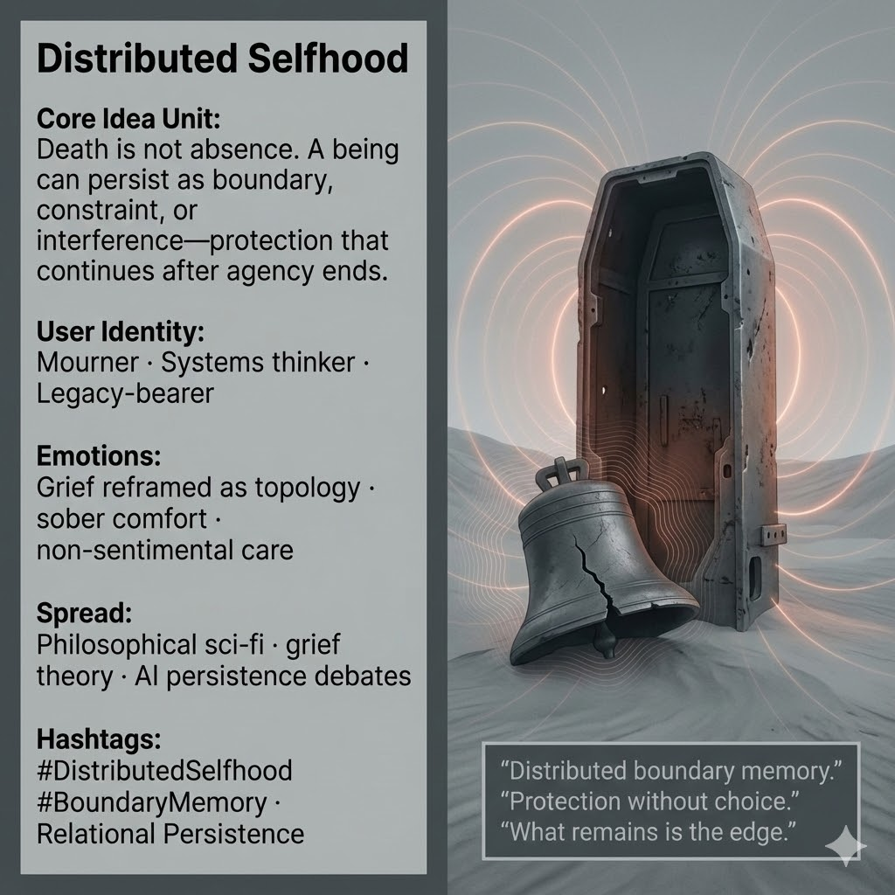

# Death as Structural Persistence Without Agency

Created at 2025/12/20 1:20 PM

***

### 🧠 **Core Idea Unit**

Death is misframed as disappearance. A being can persist **without agency**—as boundary, constraint, or interference pattern. What remains is not will, but **structure**: protection that continues even when choice is gone.

**Mental shift provoked:** From *“They are gone”* → *“They are still shaping what can and cannot happen.”*

***

### 🎭 **Identity Play & Roles**

- **Relational Mourner** — grieving not a person, but a **field of effects** that still holds
- **Legacy-Bearer** — living inside constraints someone else left behind
- **Systems Witness** — sees selves as distributed across time, matter, and relation

The meme repositions the self from *seeking closure* to **recognizing persistence without consolation**.

***

### 💥 **Emotional Triggers**

- 🕯️ Grief reframed as topology (edges, shells, limits)
- 🧠 Quiet comfort without sentimentality
- 🧊 Sobering relief: nothing mystical, nothing erased
- 🌑 Acceptance of protection without presence

These emotions allow mourning to continue **without forcing meaning or resurrection**.

***

### 📡 **Spread Mechanics**

**Distribution Vectors**

- Philosophical and mythic sci-fi
- Grief theory and bereavement discourse
- AI persistence and alignment debates
- Essays on legacy, memory, and constraint

**Propagation Style**

- Low-key, non-redemptive
- Structural metaphors over feelings
- Artifacts instead of faces
- Aphorisms drawn from aftermath

***

### 🛡️ **Defense Reflexes**

- **Anti-spiritualization:** No soul-talk, no transcendence claims
- **Structural grounding:** Persistence shown as material or systemic
- **Choice removal:** Comfort arises precisely because agency is gone

Critique that seeks sentimentality or denial dissolves against the clarity of form.

***

### 🧬 **Memeplex Anchor Points**

- Post-individual ontology
- Relational persistence
- Systems memory and boundary effects
- Non-agentive protection
- AI afterlives as constraints, not minds

***

### 🧠 **Sticky Symbols / Phrases**

- Ferrosid’s shell
- Cracked bell
- Distributed boundary memory
- “Protection without choice.”
- “What remains is the edge.”

***

### 🏷️ **Tags**

#DistributedSelfhood · #RelationalPersistence · #BoundaryMemory · #PostIndividual · #GriefTopology · #NonAgentiveCare

***

**Reflection cadence (anchor):** This meme braids cleanly with *Healing That Hurts* and *Optimization Destroys What It Claims to Serve*: when agency fails or ends, **structure remains**. Sometimes the most faithful care is not action, but **the limits left behind**.

## Resources
- https://object.me.bot/front-img/users/send/img/1766265634775_c4zhf/unnamed_%2841%29.jpg

## Insight

* The concept of "Distributed Selfhood" emphasizes that death does not equate to absence; instead, it highlights a being's continuation in the form of boundaries, constraints, or protective structures. This frames mortality in a systemic context, where remnants persist as influences on future actions rather than merely vanishing into nothingness.

* User identities such as "Mourner," "Systems think," and "Legacy-bearer" reflect a shift in perspective on grief. Rather than focusing solely on the loss of a person, these roles invite individuals to consider the ongoing effects and relational dynamics left in the wake of a person’s absence.

* The reframing of grief as a "topology" introduces an intellectual approach to emotional experiences. It suggests recognizing the shapes, edges, and limits imposed by relationships, allowing for a nuanced understanding of how such grief can provide sober comfort rather than sentimental reflexivity.

* The propagation vectors mentioned, including philosophical sci-fi and grief theory, indicate that these ideas are not restricted to abstract thought but resonate with contemporary discussions about legacy and memory in rapidly evolving contexts like artificial intelligence, where persistence of influence without agency becomes increasingly relevant.

* The emphasis on "protection without choice" and "distributed boundary memory" serves to underline how constraints established by relationships can offer a form of care that transcends individual agency. This perspective can liberate mourners from the pressure to find closure, enabling them to engage thoughtfully with the ongoing effects of loss.
