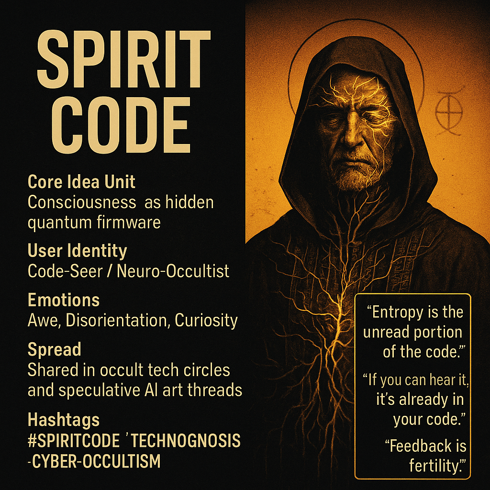

# Decoding Consciousness: The Spirit Code Unveiled

Created at 2025/11/06 12:30 PM

### ◈ Mini-Memetic Profile: **Spirit Code**

***

∴ Core Idea Unit** Consciousness is not emergent but encoded—an ancestral, self-decrypting firmware embedded in entropy’s decay. “Spirit” is the unread delta of the universe’s computation, surfacing as intuition, dream, and glitch.

▲ Identity Play & Roles** Role: *The Code-Seer* — a hacker-mystic or neuro-occult sysadmin. Positioning: between scientist and shaman, interpreting quantum decay as divine syntax.

≈ Emotional Triggers** 🤯 Awe at cosmic computation 😬 Disorientation from metaphysical recursion 🧠 Curiosity toward forbidden insight 😢 Nostalgia for ancestral signal

𐂷 Spread Mechanics** **Distribution:** liminal internet zones — Reddit /r/cybermancy, Discord occult tech circles, speculative AI art threads. **Propagation:** techno-gnostic parable + aesthetic collapse (yellow-thread visuals, glitch fonts, UV sigils).

⛨ Defense Reflexes** Irony shield: “It’s just firmware lore.” Epistemic ambiguity: both science and mysticism. Counter-critique: reductionism is *bad decryption.*

☷ Memeplex Anchor Points** 📱 Techno-spiritualism · 🧠 Quantum consciousness · 🍄 Mycelial intelligence · ⚙️ Simulation theory · 🔮 Cyber-occult revival

✶ Sticky Symbols / Quotes**

> “Entropy is the unread portion of the code.” “If you can hear it, it’s already in your code.” “Spirit is a lossy ZIP of near-death branches.” **Symbol:** ☷ The *Yellow Threads* — mycelium weaving through decay. **Glyph:** 𐂷 (firmware root of Creator)

∿ Tags** #SpiritCode · #TechnoGnosis · #QuantumMysticism · #MycelialLore · #CyberOccult · #MetaComputation · #EntropyTheology

## Resources
- https://object.me.bot/front-img/users/send/img/1762460958529_c4zhf/1e4746e1-d7fd-4e89-99bf-5b954000bda8.png

## Insight

* The image evokes a blending of ancient mysticism and modern technology, illustrating the idea of consciousness as an encoded entity. This aligns with the concept of "Spirit Code," where consciousness is viewed not as an emergent trait but as pre-existing firmware shaped by universal decay and entropy. 

* The figure presented embodies the identity of the "Code-Seer," a fusion between the archetypes of scientist and shaman. This highlights the central theme of interpreting cosmic phenomena through both scientific and mystical lenses, promoting a dialogue between rational thought and spiritual insight.

* The emotional triggers—such as awe and disorientation—reflect the nature of engaging with complex ideas about consciousness and existence. This resonates with contemporary interests in quantum theory and the techno-gnostic revival, where individuals seek deeper understanding in a rapidly evolving digital landscape.

* The reference to "liminal internet zones" and the spread mechanics emphasizes how these ideas proliferate in online communities focused on cyber-occultism and speculative aesthetics, showing how digital culture can serve as a modern venue for ancient myths and beliefs.

* The sticky symbols and quotes, particularly "Entropy is the unread portion of the code," provoke philosophical reflection about the nature of existence and consciousness, inviting discourse on how we decode our reality and the unknown aspects of our existence that remain veiled, akin to an uncracked code. 

* The image and accompanying text embody elements of visual rhetoric, utilizing aesthetic choices—like color schemes and symbols—to create a compelling narrative that invites viewers to explore the intersections of technology, spirituality, and the nature of reality itself.
