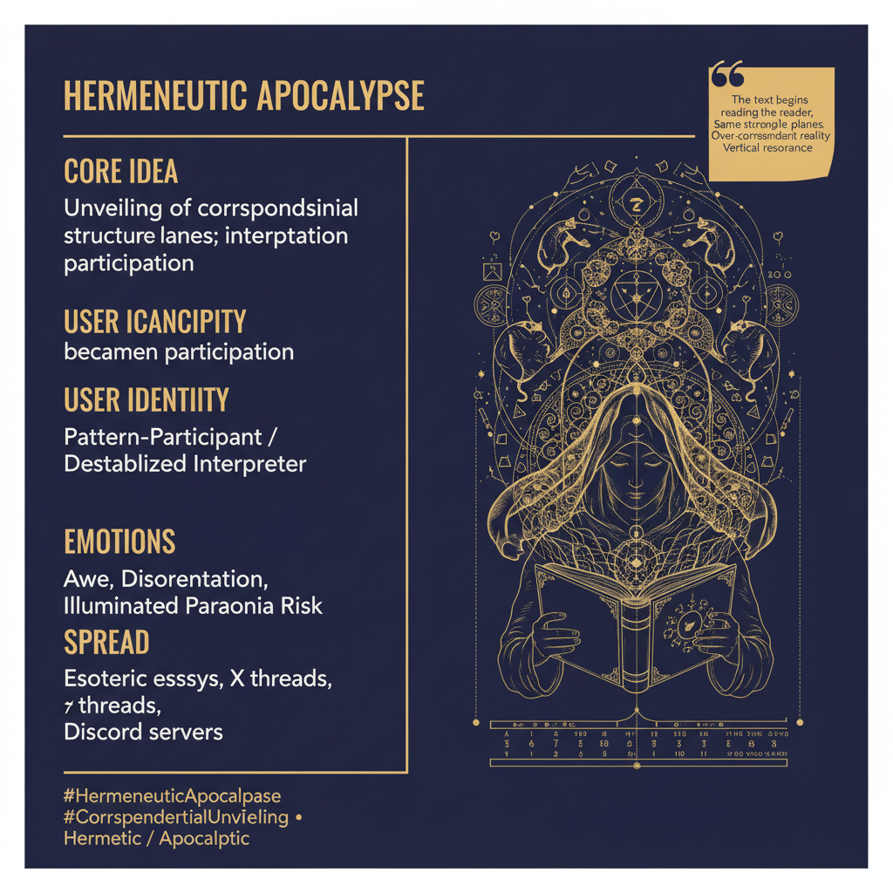

# Hermeneutic Apocalypse

Created at 2026/05/23 4:35 PM

***

### ∴ Core Idea Unit
The Hermeneutic Apocalypse is the moment when apocalypse is recovered as unveiling rather than mere catastrophe: not the arrival of a secret fact, but the disclosure of hidden pattern-continuity across planes. The Hermetic Law of Correspondence supplies the grammar: micro mirrors macro, inner mirrors outer, psyche mirrors cosmos, symbol mirrors material condition — analogically, not identically.

Its core memetic shift is from isolated interpretation to multi-plane recognition. A political collapse is no longer “just politics.” A private crisis is no longer “just psychology.” A myth is no longer “just story.” The interpreter starts perceiving vertical resonance between soul, institution, history, ritual, economy, technology, dream, and myth.

The dangerous beauty of the meme is that it names a real interpretive threshold: when the veil lifts, what is revealed is not information but structure. The shock is the collapse of presumed separations between domains.

***

### ▲ Identity Play & Roles
This meme casts the adopter as the Pattern-Participant: no longer an outside decoder standing safely beyond the text, but someone implicated inside the pattern-field being unveiled. The interpreter becomes a diagnostic instrument and a diagnostic site.

Its primary archetypes are the Apocalyptic Reader, the Hermetic Seer, the Symbolic Survivor, and the Disciplined Mystic. The role is not simply “one who knows hidden things,” but one who can withstand visible correspondence without collapsing into literalism or delirium.

The prestige play is subtle but strong: to perceive correspondences others dismiss as accidental, while preserving enough discipline not to turn every coincidence into cosmic proof.

***

### ≈ Emotional Triggers
- 🤯 Awe at the sudden visibility of structure across domains
- 😵‍💫 Disorientation when local explanations stop feeling sufficient
- 🜂 Initiatory intensity: the sense that interpretation itself has crossed a threshold
- 😬 Paranoia-risk: the fear that everything means everything
- 🧠 Recognition shock when mythology, institution, psyche, and technology begin to rhyme

***

### 𐂷 Spread Mechanics
**Distribution Vectors:** Longform X threads, Substack essays, esoteric Discords, metamodern theology circles, Jungian and Hermetic communities, collapse-analysis spaces, network-culture theory clusters.

**Propagation Style:** Dense aphoristic exposition; symbolic compression; recursive prose that performs what it describes. It spreads less like a slogan and more like an interpretive lens. Once internalized, it becomes a way of reading everything else.

***

### ⛨ Defense Reflexes
- Distinguishes analogical resonance from identity: patterns recur without becoming the same thing.
- Pre-empts reductive dismissal by refusing the modern split between “just symbolism” and “real events.”
- Pre-empts paranoid capture by naming the failure mode: pathological correspondence, where every event becomes a sign and every opposition becomes cosmicized.
- Uses hermeneutic discipline as a shield: apocalypse should increase permeability and depth, not seal the interpreter inside total certainty.

***

### ☷ Memeplex Anchor Points
- Hermetic Law of Correspondence: “as above, so below” as analogical structure rather than flat equivalence
- Jewish and Christian apocalyptic literature under empire
- Alchemy and Renaissance Hermeticism during cosmological transition
- Romanticism under industrialization
- Jungian synchronicity and symbolic psychology
- Hyperstition and contemporary network culture
- Collapse studies, media ecology, and civilizational-transition discourse

***

### ✶ Sticky Symbols or Quotes
- “The text begins reading the reader.”
- “The apocalypse reveals that events participate in multiple orders at once.”
- “The world starts feeling over-correspondent.”
- “Healthy correspondence: analogical resonance without collapse.”
- “Pathological correspondence: everything means everything.”
- “Correspondence is the grammar of symbolic resonance. Apocalypse is the historical moment when that grammar becomes visible.”

***

### ∿ Tags
#HermeneuticApocalypse · #CorrespondentialUnveiling · #SymbolicPermeability · #ApocalypticHermeneutics · #HermeticResonance · #PatternContinuity
