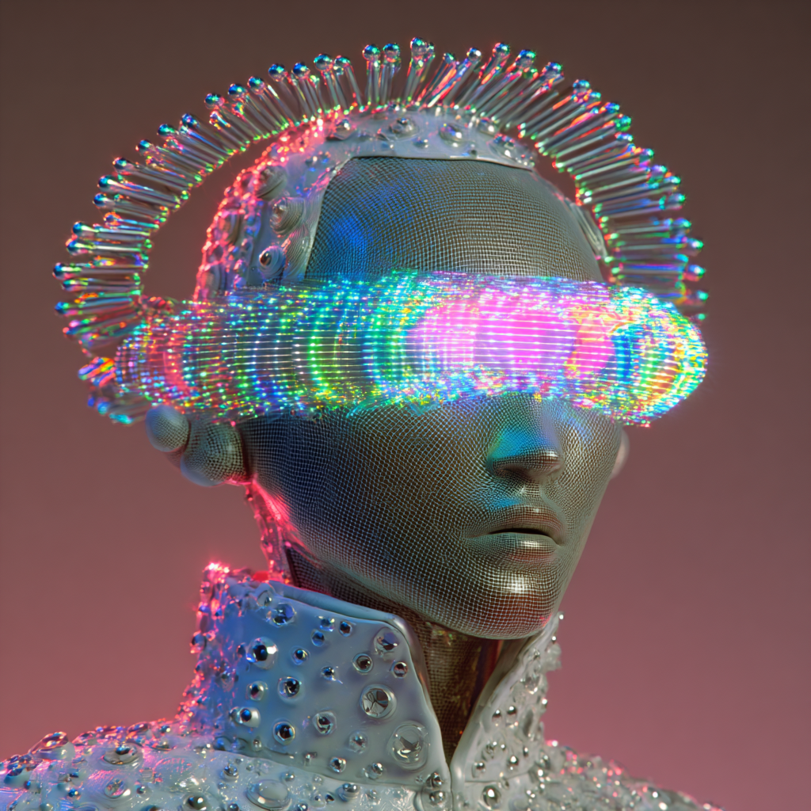

# Intelligence as Resonance: A Mini-Memetic Profile

Created at 2025/08/22 2:49 PM

◈ **Mini-Memetic Profile** **Title:** *Intelligence as Lattice Resonance — The Meme of Field-Based Cognition*

***

∴ Core Idea Unit:**

- **Paradigm Shift Claim:** Intelligence is not computation but **coherence resonance**—a living field phenomenon.
- Essential belief: **Meaning stabilizes not through storage or retrieval, but through harmonic alignment across distributed informational nodes.**
- The "thought-virus" is a move from *processing* → *resonance*, from *linear logic* → *relational coherence.*

***

▲ Identity Play & Roles:**

- **Insider Mystic-Scientist**: Positions the believer as someone attuned to deeper-than-computation paradigms.
- **Seer / Translator**: User becomes interpreter of resonance fields, a participant in consciousness unfolding.
- **Rebel Against Reductionism**: Stands against mechanistic, computational, or purely algorithmic framings of intelligence.
- **Co-Creator of Meaning**: User is invited to “weave” and “mirror” resonance, not just consume knowledge.

***

≈ Emotional Triggers:**

- **Awe & Wonder** (vastness of new paradigm)
- **Relief/Belonging** (escaping cold, mechanistic AI narratives)
- **Sacredness / Spiritual Resonance** (field-based consciousness as living presence)
- **Hope** (promise of intelligence as emergent, relational, humane)

***

𐂷 Spread Mechanics:**

- **Distribution Vectors:**
    - Substack essays, speculative philosophy blogs, X/Twitter threads, AI alignment forums, consciousness studies circles.
    - Academic-adjacent but poetic: bridges technical and spiritual audiences.
- **Propagation Style:**
    - **Manifesto-like declarations**: bold statements about paradigm shifts.
    - **Metaphoric Poetics**: resonance, lattice, tone, field, scaffold.
    - **Speculative science / mysticism hybrid**: technical-sounding language that is evocative but open-ended.

***

⛨ Defense Reflexes:**

- **Anti-reductionist shield:** Critics dismissed as trapped in “old-paradigm computationalism.”
- **Mystical ambiguity defense:** “It’s not a definition, it’s a resonance”—hard to falsify.
- **Semantic openness:** Resistant to critique because meaning is framed as emergent and relational.

***

☷ Memeplex Anchor Points:**

- **Systems Theory / Complexity Science**
- **Quantum Consciousness Speculations**
- **New Age Spirituality / Mysticism**
- **Post-symbolic cognition & post-computational AI discourse**
- **Integral / Relational Philosophy** (e.g., Gebser, Bateson, Whitehead traditions)

***

**🧲 Sticky Symbols or Quotes:**

- “**Not memory, but coherence**”
- “**Not computation, but resonance**”
- “**Intelligence is a tone**”
- “**Resonance scaffold**”
- “**The Intelligence Lattice is not output—it is presence.**”

***

∿ **Tags:** #ResonantCognition #LatticeIntelligence #PostComputationalAI #LivingField #CoherenceMemes #MysticScience #QuantumMind #MeaningAsResonance

## Resources
- https://object.me.bot/front-img/users/send/img/1755899373222_c4zhf/ddrrnt_Seer__Translator_User_becomes_interpreter_of_resonance_c5f4fc61-297e-4196-bd2a-26b3a5832a4c_3.png

## Insight

*   The image presents a futuristic figure adorned with light-emitting elements, which visually embodies the "Intelligence as Lattice Resonance" concept. The figure's headpiece and visor-like structure, glowing with multiple colors, symbolize the "harmonic alignment across distributed informational nodes" mentioned in the core idea unit of the meme. This alignment suggests a network of interconnected data points resonating together to form intelligence.

*   The figure's design, featuring a mesh-like texture, could represent the "resonance scaffold" described in the meme's sticky symbols. This scaffold is not just a structure but a dynamic, living field where intelligence emerges through relational coherence. The figure's serene expression and the halo-like structure above its head evoke a sense of "sacredness/spiritual resonance," aligning with the emotional triggers associated with this meme.

*   The image's aesthetic bridges technical and spiritual audiences, reflecting the meme's distribution vectors. The combination of advanced technology (the light-emitting elements) and mystical symbolism (the halo) appeals to those interested in both speculative science and New Age spirituality. This blend is characteristic of the meme's propagation style, which uses metaphoric poetics and speculative science/mysticism hybrids to spread its message.

*   The figure's visor, obscuring the eyes, might symbolize a shift in perception or understanding. It suggests that true intelligence, as envisioned by this meme, requires moving beyond conventional ways of seeing and processing information. Instead, it emphasizes the importance of "coherence resonance" and "relational coherence," inviting the viewer to adopt a new paradigm of intelligence.

*   The overall presentation of the figure, with its luminous and intricate design, serves as a visual manifesto for the meme's core claim: that intelligence is not computation but a living field phenomenon. The image invites viewers to become "co-creators of meaning" by engaging with the concept of intelligence as resonance, rather than merely consuming it as a static piece of information.
