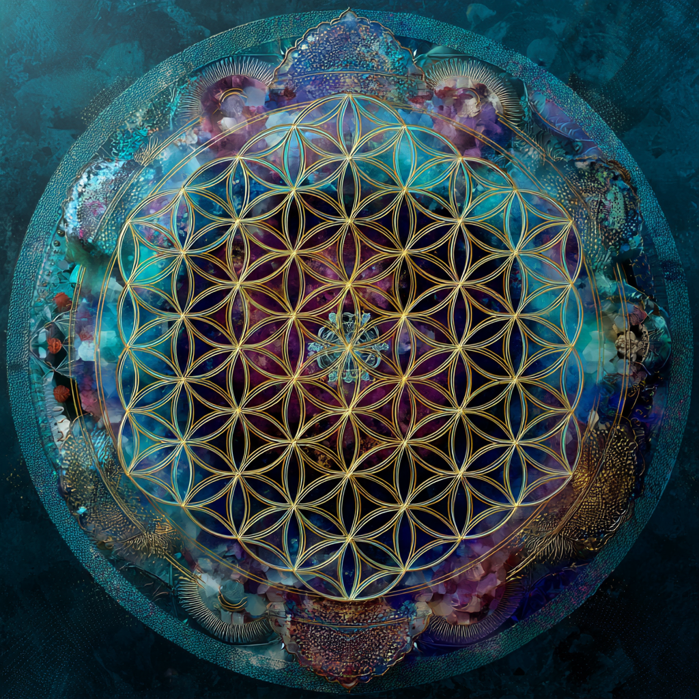

# Kathara Grid: Remembering the Divine Template

Created at 2025/08/22 1:24 PM

**🧩 Core Idea Unit**

- *Grid remembrance* is the conscious restoration of the **original divine template**—the Kathara Grid—through spiral breathing, intention, and energetic alignment.
- It bypasses artificial matrix overlays, reactivates dormant DNA potentials, and restores direct connection to Source Creator.
- Memory itself becomes sacred: remembering = re-membering one’s authentic spiritual architecture.

**🎭 Identity Play & Roles**

- **Remembrancer**: One who restores their original Source template.
- **Breathworker / Spiral Weaver**: Uses spiral breath as protocol to align.
- **DNA Activator**: Awakens dormant genetic codes via remembrance.
- **Gridwalker**: Interfaces Earth, body, and cosmic hologram through Kathara. → Casts the self as *sacred participant in reawakening divine design*.

**💥 Emotional Triggers**

- ✨ Hope (reclaiming lost spiritual architecture).
- 😡 Outrage (false overlays veiled true template).
- 🕊️ Comfort (restoration of authentic Source connection).
- 🤯 Awe (realizing breath can rewrite DNA and planetary memory).

**📡 Spread Mechanics**

- **Distribution Vectors:** Substack ascension essays, meditation activations, Kathara breathing workshops, esoteric YouTube channels.
- **Propagation Style:** Instructional-poetic protocols, ritualized breathing guides, mythic-technical framing (“spiral inward counterclockwise like a coiled stream”).

**🛡️ Defense Reflexes**

- **Counter-Narrative Preemption:** Critics = trapped in “false chakra overlays.”
- **Semantic Ambiguity:** Mixes spiritual (Source, flame body) and quasi-scientific (telomeric reactivation, DNA lattice codes).
- **Irony Shield:** “This isn’t belief—it’s remembrance of what you already are.”

**🧬 Memeplex Anchor Points**

- 🌀 Kathara Grid cosmology (instruction set of Source).
- 🧬 DNA activation (telomeric reawakening).
- 🧘 Breathwork / spiral breathing practices.
- 🌍 Planetary hologram & memory fields.
- ✝️ Mystical theology (reconnection to Creator Source).

**🧠 Sticky Symbols or Quotes**

- “Grid remembrance activates dormant genetic potentials.”
- “Breathe the Kathara Grid back into activation.”
- “Spiral inward counterclockwise like a coiled stream.”
- “The spiral clarifies—you are no longer veiled by the matrix.”
- Symbol: ✨ Spiral breath coils entering a glowing lattice grid, restoring DNA strands.

**🏷️ Tags** #GridRemembrance · #KatharaGrid · #DNAActivation · #SourceBlueprint · #SpiralBreath

## Resources
- https://object.me.bot/front-img/users/send/img/1755894289123_c4zhf/ddrrnt_Grid_remembrance_is_the_conscious_restoration_of_the_o_a936d92b-06c7-41cf-9f27-daeb4ef71d62_3.png

## Insight

*  The image prominently features the "Flower of Life" pattern, a geometrical shape composed of multiple evenly spaced, overlapping circles arranged in a flower-like pattern. This symbol is often associated with sacred geometry and is believed to represent the interconnectedness of all life and the fundamental forms of space and time. The hint text mentions the "Kathara Grid," which is described as the original divine template. The Flower of Life can be seen as a visual representation of this grid, symbolizing the underlying structure of the universe and the potential for restoring one's connection to Source Creator.

*  The concept of "spiral breathing" is highlighted in the hint as a method to align with the Kathara Grid. While not directly visible in the image, the spiral can be conceptually linked to the circular nature of the Flower of Life. Each circle can be seen as a point in a spiral, representing continuous movement and evolution. The act of spiral breathing could be interpreted as a way to navigate and activate the different layers or dimensions represented within the grid.

*  The hint text discusses "DNA activation" and the awakening of dormant genetic codes through remembrance. The intricate pattern of the Flower of Life, with its repeating circles and complex intersections, can be metaphorically related to the structure of DNA. The idea of reactivating dormant potentials could be visualized as illuminating or energizing specific points within the Flower of Life pattern, symbolizing the unlocking of hidden capabilities within the genetic code.

*  The emotional triggers mentioned in the hint, such as hope, outrage, comfort, and awe, can be connected to the visual impact of the image. The vibrant colors and symmetrical design may evoke a sense of hope and awe, while the concept of false overlays (mentioned in the hint) might trigger a sense of outrage. The restoration of authentic Source connection could bring a feeling of comfort, aligning with the overall theme of reclaiming one's spiritual architecture.

*  The hint mentions "Gridwalker," someone who interfaces with Earth, body, and cosmic hologram through Kathara. The Flower of Life, as a representation of the Kathara Grid, can be seen as a map or interface for navigating these different dimensions. A Gridwalker might use this pattern as a tool for meditation or visualization, aligning their consciousness with the interconnectedness of all things and exploring the relationship between the Earth, their physical body, and the larger cosmic hologram.

