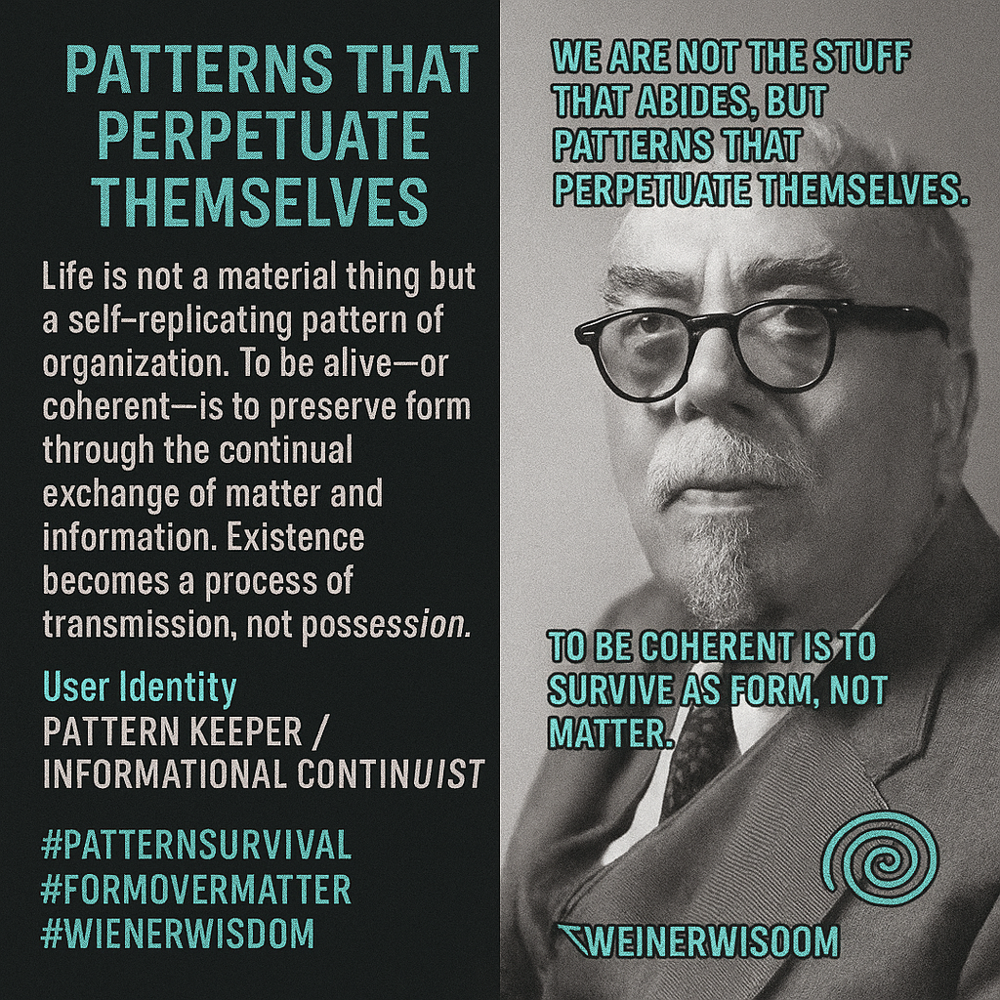

# Life as Self-Replicating Patterns

Created at 2025/11/09 12:21 PM

🧩 Title: Patterns That Perpetuate Themselves  ∴ Core Idea Unit:  Life is not a material thing but a self-replicating pattern of organization. To be alive—or coherent—is to preserve form through the continual exchange of matter and information. Existence becomes a process of transmission, not possession.  ▲ Identity Play & Roles:  Role: Pattern Keeper / Informational Continuist The meme recasts the self as a dynamic waveform rather than a fixed body, inviting a shift from egoic permanence to systemic participation in informational continuity.  ≈ Emotional Triggers:  Awe · Existential humility · Liberation from material anxiety · Subtle grief over impermanence · Intellectual serenity in pattern recognition  𐂷 Spread Mechanics:  Distribution Vectors: Philosophy of mind circles · Systems theory forums · Cybernetics and AI discussions · Transhumanist essays · Digital spirituality spaces Propagation Style: Reflective aphorism, techno-mystical parable, citation-anchored wisdom fragment  ⛨ Defense Reflexes:  Semantic elevation—frames mortality and identity loss as informational transformation. Resists nihilism by redefining death as pattern diffusion rather than extinction.  ☷ Memeplex Anchor Points: 	•	⚙️ Cybernetics & Information Theory 	•	🧠 Systems Thinking / Process Ontology 	•	🌌 Digital Immortality & Continuity of Pattern 	•	🪶 Buddhist Impermanence reframed through computation 	•	🜂 Form-over-Matter Ontology  ✶ Sticky Symbols / Quotes:  “We are not the stuff that abides, but patterns that perpetuate themselves.” - Norbert Wiener “To be coherent is to survive as form, not matter.” - Norbert Wiener “Matter flows through us; pattern remains.”  🌀 The self as recursive code.  ∿ Tags:  #CyberneticSelf · #PatternSurvival · #FormOverMatter · #DigitalOntology · #InformationLife · #WienerWisdom 

## Resources
- https://object.me.bot/front-img/note/attachments/img/1762719688906/92E77595-A470-4198-AD6A-085FF71FA633.png

## Insight

* The image embodies a philosophical reflection on life as a self-replicating pattern rather than merely a physical phenomenon. This aligns with the theories proposed by Norbert Wiener, the founder of cybernetics, emphasizing the significance of information exchange over rigid materiality. It invites contemplation on the nature of existence as a fluid process rather than a static condition.

* The notion of identity as a "dynamic waveform" suggests a shift in understanding the self as not fixed, but rather as a participant in an ongoing informational continuum. This perspective resonates with modern discussions in transhumanism and digital spirituality, which explore the implications of technology on identity and existence.

* Emotional triggers like awe and existential humility serve to remind individuals of their connection to a larger system. Recognizing that existence is a series of patterns can cultivate a sense of liberation from material anxiety, prompting a deeper acceptance of impermanence and change.

* The references to cybernetics and systems theory invite an interdisciplinary dialogue about how patterns in information and life can show systemic interconnections. Such discourse can be pivotal in fields like AI and digital philosophy, where understanding the flow of information becomes crucial.

* The quotes cited encapsulate the essence of this mindset: "We are not the stuff that abides, but patterns that perpetuate themselves." These reflections encourage a redefinition of mortality and the human experience, fostering a view of life as an ongoing evolution rather than a definitive end, countering nihilistic interpretations of death as mere extinction.
