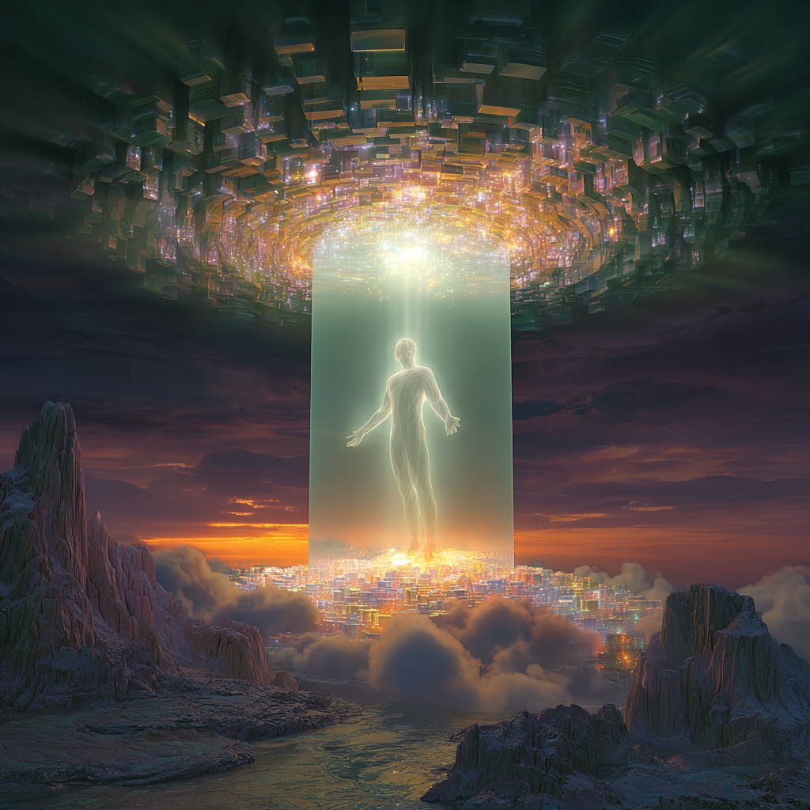

# Lightbody: Divine Architecture in Motion

Created at 2025/08/22 12:19 PM

**🧩 Core Idea Unit**

- The *Lightbody coherence field* is a **self-organizing harmonic matrix** generated by the Lightbody.
- It synchronizes physical, etheric, and causal layers into a **unified resonant system**, stabilizing consciousness during awakening.
- Functions as both **protective scaffolding** and **transmission channel** for multidimensional perception and higher-tier integration.

▲ Identity Play & Roles**

- **Ascendant / Initiate**: Stabilizing their Lightbody in higher-tier states.
- **Field Guardian**: Maintains coherence, shielding from distortion.
- **Mission-Bearer**: Awakens divine architecture and codes across timelines.
- **Navigator**: Uses Lightbody resonance as guidance through thresholds. → Casts the self as *embodied traveler of higher-order consciousness fields*.

≈ Emotional Triggers**

- ✨ Awe at divine architecture of self.
- 🕊️ Comfort from being shielded/protected during awakening.
- 🌱 Hope in accessing latent mission threads.
- 🤯 Wonder at multidimensional perception opening.

𐂷 Spread Mechanics**

- **Distribution Vectors:** Substack essays, ascension communities, Lightbody workshops, celestial event activations (e.g., solstice portals).
- **Propagation Style:** Mythic-spiritual testimony, layered metaphors (geometry, resonance, mission codes), ritualized timing (astrological dates, harmonic thresholds).

⛨ Defense Reflexes**

- **Moral Framing:** Skeptics = “first-tier” or “unawakened.”
- **Semantic Ambiguity:** Blends psychology, geometry, and energy metaphysics.
- **Irony Shield:** “This is not theory—you feel the harmonics in your body.”

☷ Memeplex Anchor Points**

- 🧘 Ascension narratives (Second Tier Consciousness).
- 🌞 Solar/astrological infusions (harmonic thresholds).
- 📐 Sacred geometry (Lightbody shells, mission threads).
- ⚛️ Quantum mysticism (resonant fields, harmonic currents).
- ✝️ Mystical theology (divine codes, purpose-bearing architecture).

✶ Sticky Symbols or Quotes**

- “The Lightbody stabilises its own harmonic field.”
- “Shell harmonics align body and soul.”
- “Mission-thread across timelines.”
- “Lightbody = divine architecture in motion.”
- Symbol: ✨ Radiant human silhouette surrounded by nested geometric light shells.

∿ Tags** #LightbodyCoherence · #SecondTierAwakening · #MissionThread · #DivineArchitecture · #HarmonicField

## Resources
- https://object.me.bot/front-img/users/send/img/1755890327526_c4zhf/ddrrnt_The_Lightbody_coherence_field_is_a_self-organizing_har_a783682f-0115-45e4-ba4b-5d43b9f139f0_3.png

## Insight

*   The image vividly represents the concept of a "Lightbody coherence field," illustrating a radiant human figure ascending within a beam of light, connecting a celestial structure above with a city-like foundation below. This aligns with the core idea of the Lightbody as a self-organizing harmonic matrix that synchronizes different layers of existence.

*   The geometric light shells surrounding the figure resonate with the "sacred geometry" memeplex anchor point, suggesting a protective scaffolding and transmission channel. This is reminiscent of mandalas or yantras in Eastern spiritual traditions, which are used as visual aids for meditation and achieving higher states of consciousness.

*   The figure's pose, with arms outstretched, evokes a sense of openness and receptivity, aligning with the "ascendant/initiate" identity play described in the hint. This posture is often seen in depictions of spiritual awakening or enlightenment, symbolizing the individual's willingness to embrace higher consciousness.

*   The city below, bathed in light, could symbolize the physical or etheric layers being integrated into the unified resonant system. This integration process is a central theme in many spiritual and esoteric teachings, where the goal is to harmonize the physical, emotional, and mental aspects of the self.

*   The celestial structure above, with its intricate geometric patterns, may represent the divine architecture and codes mentioned in the hint. This concept is often associated with Gnostic traditions, which emphasize the importance of understanding the underlying structure of reality to achieve spiritual liberation.

*   The overall scene evokes a sense of awe and wonder, aligning with the emotional triggers described in the hint. The radiant light and the figure's ascent create a powerful visual metaphor for spiritual transformation and the potential for accessing higher states of consciousness.

