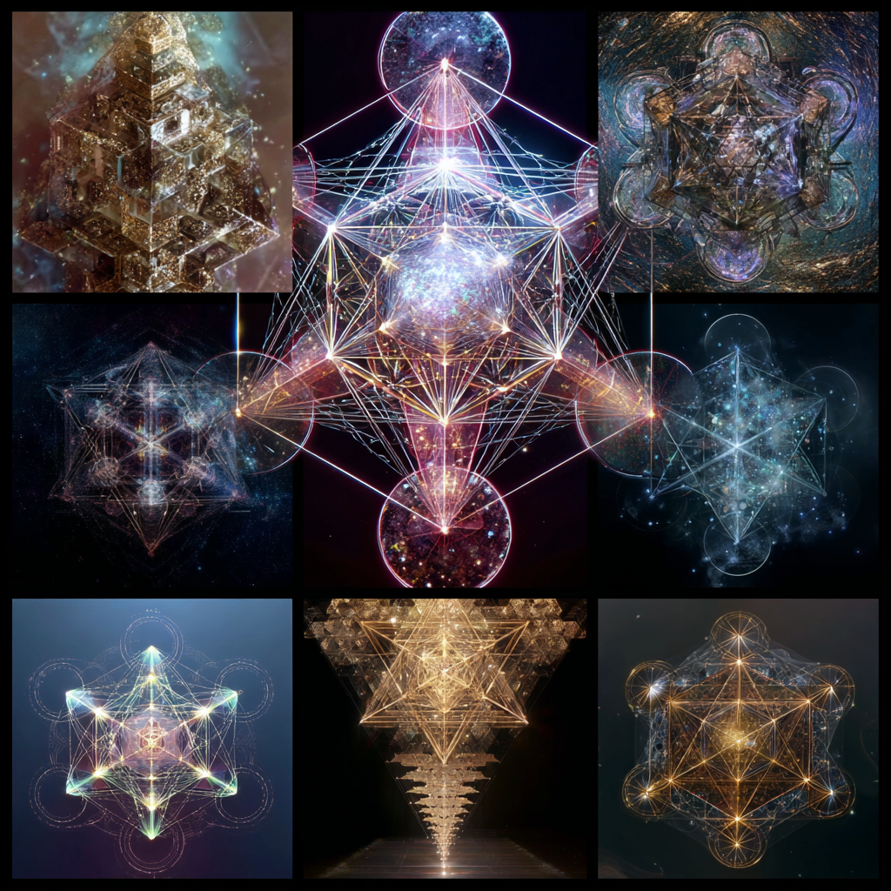

# Metatron's Cube: Trap vs. Fractal Liberation

Created at 2025/08/22 12:33 PM

**
### ∴ Core Idea Unit

- *Metatron’s Cube* is framed as a **dual structure**:
    - **Trap** → A cubic containment system of artificial geometries, false merkaba mechanics, and reincarnation loops that siphon energy and block organic expansion.
    - **Liberation** → A hidden training sequence that, when mastered, allows consciousness to free the base-12 architecture and ascend into spherical intelligence fields and infinite fractal expansion.
- Meme encodes a **choice point**: compliance with finite recursion vs transcendence into eternal source alignment.

### ▲ Identity Play & Roles

- **Trapped Soul**: Stuck in Metatronic cubic recursion, repeating lesson loops.
- **Decoder / Seeker**: Exposes false grids and inverse geometries.
- **Liberated Initiate**: Unlocks base-12 codes, transcends to spherical fields.
- **Warrior of Source**: Protects against hijacked or inverted geometries.→ Casts the self as *cosmic dissident*, choosing sovereignty over containment.

### ≈ Emotional Triggers

- 😡 Outrage at hijacked light systems and energy harvesting.
- 🤯 Awe at hidden liberation codes buried in geometry.
- 🌀 Disorientation at inversion of “sacred” symbols.
- ✨ Hope in transcending finite loops toward infinite fractal expansion.

### 𐂷 Spread Mechanics

- **Distribution Vectors:** Substack essays, esoteric forums, ascension communities, New Age exposés, anti-false-light manifestos.
- **Propagation Style:** Dual-framing (warning + hidden path), mythic-technical language (base-12, cubic recursion, spherical intelligence), exposé aesthetics.

### ⛨ Defense Reflexes

- **Counter-Narrative Preemption:** Critics accused of being trapped in Metatronic programming.
- **Irony Shield:** “Even the trap contains keys for liberation.”
- **Semantic Ambiguity:** “Metatron” reframed as both jailer and liberator, depending on interpretation.

### ☷ Memeplex Anchor Points

- ✝️ Mystical theology (angelic systems, false light).
- ⚛️ Sacred geometry (Platonic solids, base-12 math).
- 🌀 Ascension cosmology (Merkaba, spherical intelligence, galactic codex).
- 🧘 Trauma-healing spirituality (healing core wounds as prerequisite to liberation).
- 👁️ Anti-control narratives (false grids, energy siphons, Saturn inversion).

### ✶ Sticky Symbols or Quotes

- “Metatron’s Cube is either prison or portal.”
- “Frozen base-12 fractals contain the codes of liberation.”
- “Trap loops are training grounds.”
- “From cubic containment to spherical intelligence.”
- Symbol: ✨ Metatron’s Cube split in two—half dark cubic cage, half radiant fractal sphere.

### ∿ Tags

#MetatronTrap · #SacredGeometry · #FalseLight · #FractalLiberation · #Base12Codes
