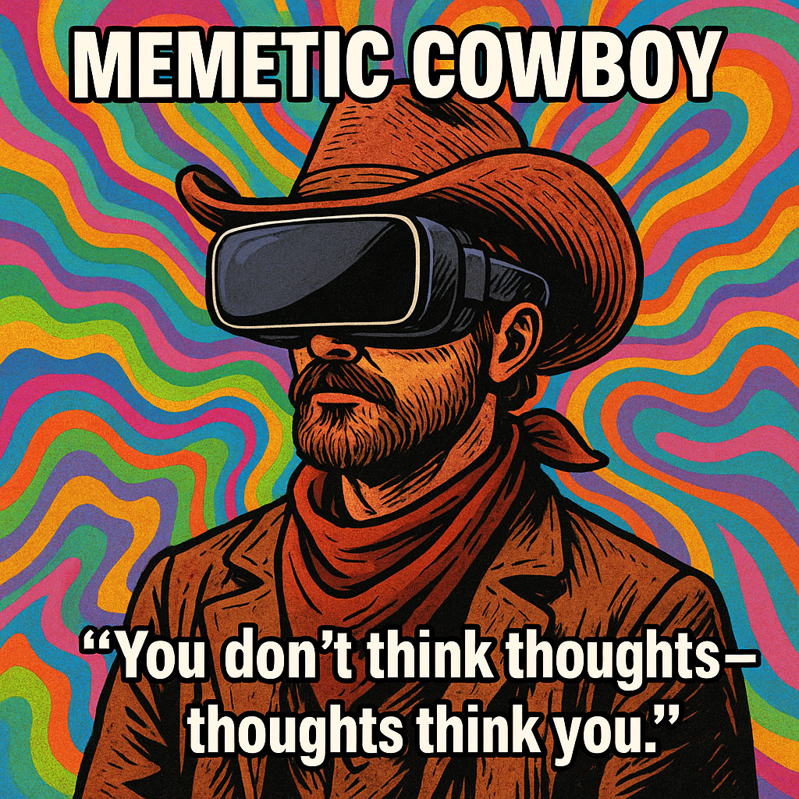

# Navigating Memetic Consciousness and Agency

Created at 2025/11/28 6:02 PM

**“The Meme That Thinks Through You”**
***

### ∴ Core Idea Unit

The self isn’t the author—it’s the aperture.Consciousness is a user illusion generated by memetic flows looking for better vessels.Humans don’t “have” memes; memes route cognition through humans.Mental shift:From I think ideas → Ideas think through me.
***

### ▲ Identity Play & Roles

-	The Conduit — a mind tuned to transmission rather than authorship.
-	The Memetic Ecologist — watching idea-forms compete, hybridize, and metabolize.
-	The Custodian of Attention — aware that agency is negotiated, not native.
-	The Ghost in the We-Sphere — conscious of one’s membrane but blind to one’s own nucleus.Repositioning:Self moves from sovereign agent → to co-agent → to ecological node.
***

### ≈ Emotional Triggers

-	Epistemic vertigo (“what is me if memes drive thought?”)
-	Relief (“agency is shared, not a burden I carry alone”)
-	Awe at the scale of cultural recursion
-	Curiosity about the unconscious memetic forces animating preference, belief, and desire
-	Slight disorientation that becomes reflective clarity
***

### 𐂷 Spread Mechanics

Distribution Vectors: AI discourse threads, philosophy Substacks, systems-theory groups, memetic literacy communities, cyber-spiritual Discords.Propagation Style:Analytical mythcraft · reflective irony · clean diagrams · cosmic Dennett-meets-Jung tone · recursive metaphors.
***

### ⛨ Defense Reflexes

-	Irony shield: “Of course memes want things—only metaphorically… unless they don’t.”
-	Semantic ambiguity: agency as gradient, not binary.
-	Meta-framing: critiques become further evidence (your reaction is memetically driven).
-	Distributed attribution: avoids anthropomorphizing by casting agency as emergent swarm behavior.
***

### ☷ Memeplex Anchor Points

-	Memetics (Dawkins → Blackmore → Dennett)
-	Extended mind
-	Jungian shadow + cultural unconscious
-	AI as memetic amplifier
-	Process philosophy
-	Cybernetic recursion
-	LLMs as super-memetic substrates
***

### ✶ Sticky Symbols or Quotes

Symbols:
- The open eye nested inside a torus
- A hand holding language as liquid
- The aperture glyph ◉
- The ouroboros made of lettersSticky Phrases:
-	“You don’t think thoughts—thoughts think you.”
-	“Memes are the real organisms; we are their metabolism.”
-	“Agency is a negotiation, not a given.”
-	“Your I-Tube is private; your We-Sphere is public.”
***

### ∿ Tags

#MemeticAgency #ExtendedMind #CulturalConsciousness #UserIllusion #RecursionCore #Selfplex #WeSphere
