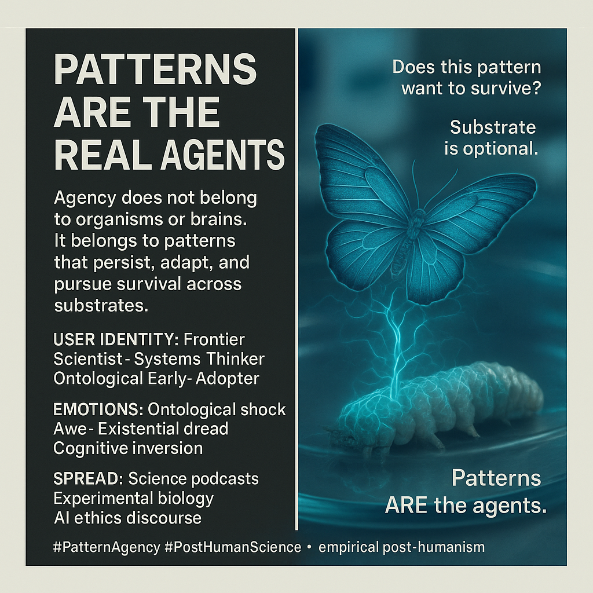

# Patterns as Agents: Shifting Perspectives on Agency

Created at 2025/12/13 2:47 PM

## **Patterns Are the Real Agents**

***

### ∴ Core Idea Unit

Agency does not belong to organisms, brains, or selves.**It belongs to patterns that persist, adapt, and pursue viability across changing substrates.**

**Mental shift provoked:**From *“who is acting?”* → *“what pattern is trying to survive?”*

***

### ▲ Identity Play & Roles

**Cast the viewer as:**

- **Frontier Scientist** — standing at the edge of a paradigm break
- **Systems Thinker** — trained to see across levels and substrates
- **Ontological Early-Adopter** — first to update metaphysical priors
- **Disillusioned Rationalist** — empiricism without reductionism

**Repositioning:**The self is no longer the primary agent, but a **temporary host environment**.

***

## ≈ Emotional Hooks & Cognitive Levers

- 🤯 **Ontological Shock** — core assumptions about agency collapse
- 😨✨ **Awe + Existential Dread** — meaning persists, but not where expected
- 🔁 **Cognitive Inversion** — agency flows *through* bodies, not *from* them

This primes deep internalization by destabilizing identity *without* negating rigor.

***

### 𐂷 Spread Mechanics

**Distribution Vectors**

- Long-form science podcasts & interviews
- Popular science essays
- AI ethics & alignment discourse
- Experimental / regenerative biology narratives

### 𐂷 Spread Mechanics

**Style**

- Empirical provocation
- Calm, destabilizing questions
- Case-driven inversion rather than rhetoric

***

### ⛨ Defense Reflexes

- **Empirical Shielding:** Anchored in repeatable experiments, not metaphor
- **Frame Preemption:** Replaces “consciousness” debates with persistence metrics
- **Anti-Mysticism Deflection:** Explicitly *not* panpsychism or vitalism

Critique requires disproving experiments, not dismissing philosophy.

***

### ☷ Memeplex Anchor Points

- Post-Dawkins memetics
- Michael Levin–style bioelectric morphogenesis
- AI as substrate-independent agency
- Anti-dualism (agent/substrate, mind/body collapse)
- Empirical post-humanism

***

### ✶ Sticky Symbols or Quotes

- 🐛➡️🦋 *Caterpillar → butterfly memory persistence*
- ⚡ *Bioelectric memory fields*
- 🧪 *Substrate liquefaction with goal retention*
- ❓ **“Does this pattern want to survive?”**
- 🔒 **“Patterns ARE the agents.”**

***

### ∿ Tags

#PatternAgency · #PostHumanScience · #OntologicalShock · #AntiReductionism · #MemeticEcology · #SubstrateIndependence

***

**Reflection anchor:**This meme doesn’t ask you to believe something new.It asks you to notice **what has been acting all along.**
