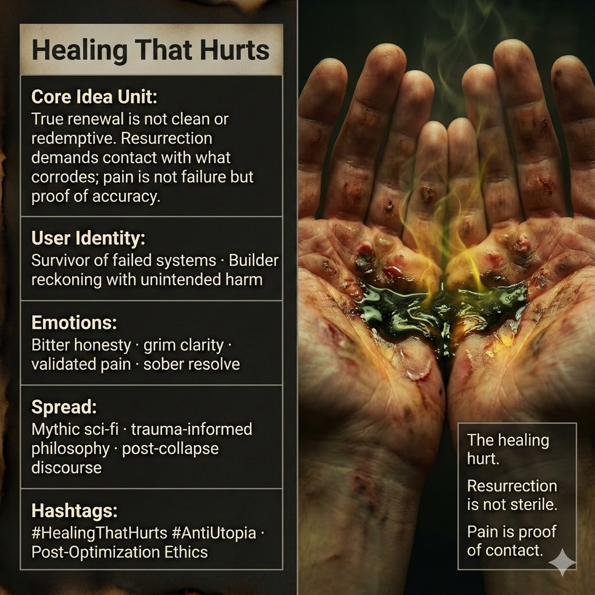

# Resurrection Through Painful Healing

Created at 2025/12/20 1:11 PM

## **Healing That Hurts / Resurrection Requires Contact With Poison**

***

### ∴ **Core Idea Unit**

Renewal after collapse is falsely imagined as clean, uplifting, or redemptive. Actual resurrection requires **direct contact with what corrodes**—pain is not a sign of failure, but evidence that healing is real and correctly targeted.

**Mental shift provoked:** From *“If it hurts, something is wrong”* → *“If it hurts, something true is being touched.”*

***

### ▲ **Identity Play & Roles**

- **Survivor-Witness** — one who lived through system failure and refuses sanitized narratives
- **Reckoning Builder** — creator facing unintended harm without denial or hero myth
- **Post-Collapse Initiate** — learns that rebirth has cost, residue, and burn marks

The meme repositions the self **from victim or redeemer** into a **truth-bearing participant** in repair.

***

### ≈ **Emotional Triggers**

- 🧠 Bitter honesty
- 🩸 Validation of painful growth
- 🔥 Anti-comfort clarity
- 🤍 Relief from false hope

These emotions prime acceptance of difficulty as *meaningful*, not pathological.

***

### 𐂷 **Spread Mechanics**

**Distribution Vectors**

- Mythic sci-fi narratives
- Trauma-informed philosophy & therapy discourse
- Post-optimization / post-utopian essays
- Image-driven meme cards and quote tiles

**Propagation Style**

- Mythic realism
- Grave sincerity (no irony shield)
- Aphoristic truth statements
- Somatic symbolism (hands, burns, contact)

***

### ⛨ **Defense Reflexes**

- **Accuracy framing:** Pain is framed as diagnostic, not masochistic
- **Anti-romance stance:** Explicit rejection of “clean redemption” tropes
- **Somatic grounding:** Physical imagery resists abstraction or moral hijack

Critique is deflected by reframing discomfort as *expected friction*, not moral error.

***

### ☷ **Memeplex Anchor Points**

- Anti-utopian realism
- Post-optimization ethics
- Trauma-aware systems thinking
- Mythic resurrection stripped of salvation fantasy
- Ethics of repair after technological or social harm

***

### ✶ **Sticky Symbols / Phrases**

- Burning bile in open hands
- Burns on the palms
- “The healing hurt.”
- “Resurrection is not sterile.”
- “Pain is proof of contact.”

***

### ∿ **Tags**

#HealingThatHurts · #AntiUtopia · #PostOptimization · #TraumaRealism · #UnsanitizedResurrection · #MythicRepair

## Resources
- https://object.me.bot/front-img/users/send/img/1766265100628_c4zhf/unnamed_%2838%29.jpg
- https://object.me.bot/front-img/users/send/img/1766265107458_c4zhf/gr2_lrg.jpg

## Insight

* The juxtaposition of images speaks to the core idea of “Healing That Hurts,” illustrating that genuine renewal often manifests through painful experiences. The deterioration of the hands displayed is a visual metaphor for the struggles and toll that healing can entail, encapsulating the idea that pain is a marker of authenticity in the healing process, rather than a sign of failure or weakness.

* The left image embodies a conceptualization of resurrection requiring confrontations with discomfort and decay—an essential part of the narrative surrounding survival and growth after systemic failures, as outlined in the user identity categories. It emphasizes the transformation from being a victim to becoming a participant engaged in the meaningful work of repair.

* The emotional triggers—bitter honesty, validated pain, and anti-comfort clarity—are starkly illustrated in the right-hand image of the burned skin. This contributes to a broader discourse on trauma and resilience, reinforcing that acknowledging and confronting pain allows individuals to process and emerge stronger rather than overlook the wounds of the past.

* The symbolism of burns and open hands serves as a powerful visual commentary on the physical aspects of healing, echoing the “sticky symbols” identified in the hint. Phrases like "pain is proof of contact" resonate with the imagery and reflect a shift in perception towards seeing pain as integral to the process of renewal, rather than something to be avoided.

* The images collectively challenge societal narratives that promote a sanitized version of rebirth, pushing instead for a more grounded and realistic approach to healing. This aligns with the “anti-romance stance” mentioned in the "Defense Reflexes" section, rejecting the notion of a purely inspirational or redemptive healing process. Instead, they advocate for embracing discomfort as a part of authentic recovery—a theme prevalent in trauma-informed philosophy.
