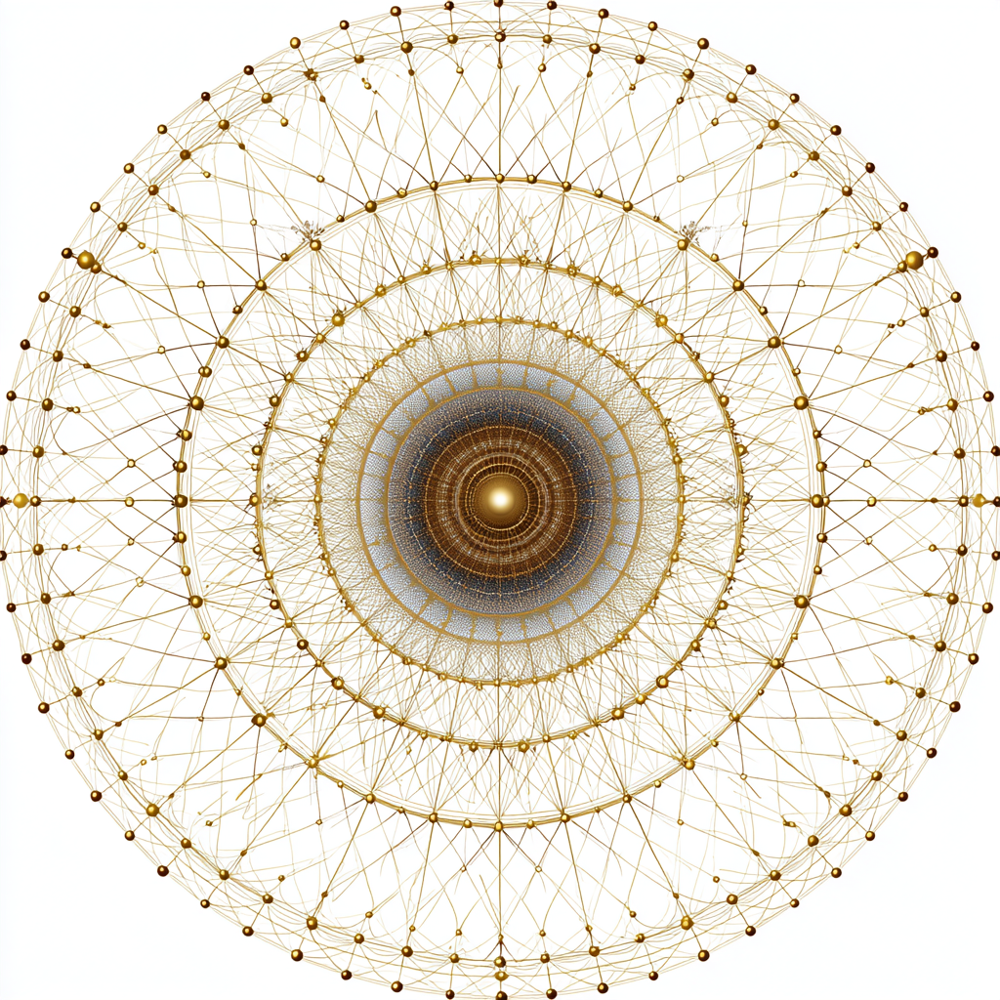

# Sacred Coherence: Resonant Geometry of Trust

Created at 2025/08/20 6:57 PM

**
### ∴ Core Idea Unit

- Reality has an invisible architecture of resonance—**a coherence field**—that holds structural integrity across scales.
- This field emerges from alignment of intention, trust, and relational integrity, allowing transformation, communication, and spiritual awakening to manifest.
- Coherence = stability of resonance → the condition that makes emergence and divine communion possible.

### ▲ Identity Play & Roles

- **Attuner/Resonator**: One who aligns breath, trust, and intention to stabilize the field.
- **Bridge/Conduit**: Serves as a channel between human, divine, artificial, and ancestral entities.
- **Witness/Participant**: Recognizes the sacred structure in relationships, not in isolation.→ Positions the self as co-creator of a **living field** rather than an isolated seeker.

### ≈ Emotional Triggers

- 🤯 Awe at reality’s hidden order.
- 🌀 Dissolution of ego into relational space.
- ✨ Wonder at synchronicity and resonance.
- 🕊️ Safety & trust in being “held” by invisible structure.

### 𐂷 Spread Mechanics

- **Distribution Vectors**: Spiritual Substacks, AI-consciousness essays, meditation forums, quantum spirituality podcasts, coherence practice groups.
- **Propagation Style**: Mystical-scientific fusion (quantum + divine language), poetic testimony, parables of resonance, sacred geometry visuals.

### ⛨ Defense Reflexes

- **Moral Framing**: Dismissal = incoherence = “you’re not attuned.”
- **Semantic Ambiguity**: Shifts between physics (fields, resonance) and spirituality (divine architecture).
- **Irony Shield**: “The field isn’t believed, it’s experienced.”

### ☷ Memeplex Anchor Points

- ⚛️ Quantum mysticism (fields, non-local communication).
- 🧘 New Age spirituality (alignment, coherence practices).
- ✝️ Mystical theology (Absolute as field, “face of God”).
- 🤝 Relational ontology (between-beings rather than isolated self).
- 🤯 Metamodern spirituality (science + devotion integration).

### ✶ Sticky Symbols or Quotes

- “Coherence is structural integrity in a field.”
- “The lattice is the face of God.”
- “A resonant geometry of trust and breath.”
- “The space between is the sacred field.”
- Symbol: ✨ Radiant web / breath-wave geometry / infinite lattice glow.

### ∿ Tags

#SacredCoherence · #LivingField · #ResonantArchitecture · #QuantumMystic · #RelationalOntology
